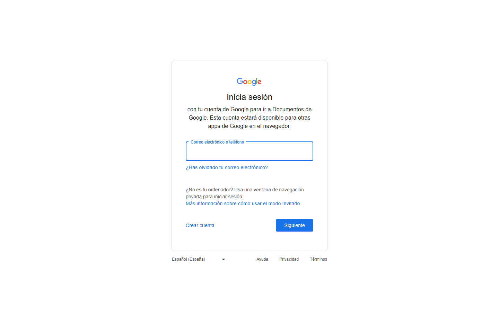

### GUIÓN DOCENTE — Sesión 05: Validación de la propuesta · vigilancia tecnológica

> **Uso:** guion de locución de **esta** clase. Léalo en voz alta casi literal.
> Estudie primero el Fundamento Teórico. **Duración: 60 minutos**.
> Logística de semestre (fechas, grupos, cortes) → Presentación del Curso / Manual.
> **PPTX:** `Clases/Sesion 05 - Validación de la propuesta · vigilancia tecnológica/Presentacion.pptx` — en cada fase se indica la slide de ESA presentación.

📌 **De esta sesión**
- **Sesión:** **05** · **Tema:** Validación de la propuesta · vigilancia tecnológica
- **Detalle:** U6+U7 en un solo encuentro: FODA, Canvas y MVP · prueba del supuesto más riesgoso con criterio fijado antes · tablero de vigilancia (Scholar/Patents) que termina en una decisión. U7 se adelanta porque la ACA Final la califica.
- **PPTX estudiante:** `Clases/Sesion 05 - Validación de la propuesta · vigilancia tecnológica/Presentacion.pptx`
- **Meet (serie del curso):** [URL Meet — mismo enlace toda la serie · CREATIVIDAD Y PENSAMIENTO INNOVADOR]

⏱️ **Evaluación de esta sesión en CDigital** *(ítems reales del libro de calificaciones)*

| Ítem en el aula | Tipo | Corte | Peso | Qué pasa en esta sesión |
| :--- | :--- | :---: | ---: | :--- |
| **Parcial 2** | Cuestionario | 2 | 21% | **Cierra hoy** — se aplica en clase (~22 min reservados en el plan) |

> **Abierto todo el periodo (hoy no cierra):** **ACA Final** (Tarea · 32,8% · corte 3). Es el producto acumulativo: cada sesión le agrega una sección, así que el avance de hoy es parte de esa entrega.
> **Reserva de tiempo:** el plan de clase de abajo ya trae la fase de evaluación (**22 min**) y el resto de las fases están recortadas para que la hora siga sumando lo mismo. No es tiempo adicional.
> **En este guion no van fechas de periodo.** El aviso dice *hoy*, *antes del próximo encuentro* o *ya cerró*: las fechas exactas están en la Presentación del Curso, en el enunciado del ítem y en el propio ítem de CDigital.

🗺️ **Slides de esta presentación** (deck real: **28 slides** — no es el mapa del curso)

| Slide | Título en el PPTX |
| :---: | :--- |
| **1** | SESIÓN 05 — Validación de la propuesta · vigilancia tecnológica |
| **2** | Hoy la propuesta se pone a prueba: por dentro y por fuera |
| **3** | FODA: la radiografía rápida (y su única regla) |
| **4** | FODA: la versión que no sirve y la que sí |
| **5** | Business Model Canvas: cuatro bloques, no nueve |
| **6** | Los nueve bloques del Canvas y su pregunta clave |
| **7** | Los nueve bloques del Canvas y su pregunta clave (cont.) |
| **8** | MVP: la maqueta, no el edificio |
| **9** | Cuatro MVP baratos que sí caben en un semestre |
| **10** | La cadena de validación, con el caso resuelto |
| **11** | Criterios de éxito: el que no sirve y el que sí |
| **12** | Segunda mitad: su MVP no vive en una burbuja |
| **13** | Informarse vs. vigilar, y el ciclo de cuatro pasos |
| **14** | Cuatro frentes de señal y dónde buscarlos (todo gratis, en el navegador) |
| **15** | Scholar y Patents: cómo buscar sin ahogarse |
| **16** | La ficha de señal: cinco campos, con el ejemplo resuelto |
| **17** | Errores frecuentes y respuestas |
| **18** | Errores frecuentes y respuestas (cont.) |
| **19** | Paso a paso: un solo documento con las dos mitades |
| **20** | Paso a paso: un solo documento con las dos mitades (cont.) |
| **21** | TALLER · Validar por dentro y por fuera |
| **22** | TALLER · cómo se revisa y dónde se entrega |
| **23** | Antes de entregar: revise usted mismo |
| **24** | Antes de entregar: revise usted mismo (cont.) |
| **25** | Para continuar — trabajo autónomo |
| **26** | Para continuar — trabajo autónomo (cont.) |
| **27** | RUTA DE ENTREGABLES DEL CURSO |
| **28** | Cierre — Sesión 05 |

> Los **momentos** del plan de clase (Portada, OBJETIVOS, CONTENIDO CLAVE, TALLER, PARA CONTINUAR, Cierre) son los del guion, no números de slide: el deck real tiene más slides y su orden está en la tabla de arriba.

🎯 **Objetivos de la sesión** *(sesión doble: **U6 + U7** del Syllabus)*
1. **Escribir** un FODA de máximo 6 bullets **verificables**, con lo interno y lo externo bien separados.
2. **Llenar** los cuatro bloques del Business Model Canvas que aclaran la propuesta: propuesta de valor, segmento, canales y actividades clave.
3. **Definir** un **MVP de aprendizaje** —lo más barato que responde la duda más cara—, no una “app completa”.
4. **Diseñar** la cadena de validación del supuesto **más riesgoso**, con un criterio de éxito numérico u observable fijado **antes** de probar.
5. **Distinguir** “informarse” de **vigilar**, y ejecutar el ciclo de cuatro pasos: observar → analizar → comunicar → **usar**.
6. **Levantar** mínimo **2 fichas de señal** de **frentes distintos** (Scholar y Google Patents), con fuente y fecha, que terminen en **una decisión escrita**.

> **Por qué las dos mitades hoy y no en dos semanas.** La **ACA Final** califica **validación y vigilancia**, y cierra **antes** de la última sesión del curso. Si la vigilancia se dictara después de ese cierre, el estudiante entregaría calificada una sección que nunca vio. Es un **reorden, no un recorte**: no se elimina ninguna unidad, U7 solo se adelanta a hoy y U8 a la próxima. Dígalo en voz alta en el minuto uno: el grupo tiene que entender por qué hoy corre más rápido de lo normal.

---

📚 **Fundamento Teórico para el Docente** *(estudiar ANTES de la clase)*

> Este apartado asume que usted **no** viene de negocios **ni** ha hecho vigilancia tecnológica formal. Léalo completo: hoy dicta dos unidades y no hay margen para improvisar ninguna de las dos.

#### 1. Cómo se sostiene una sesión doble sin atropellar al grupo
La hora tiene **una sola idea** y dos maneras de aplicarla: *poner la propuesta a prueba*. **Por dentro** —¿qué de lo que creo no he comprobado?— y **por fuera** —¿qué hay allá afuera que yo no he mirado?—. Si usted presenta las dos mitades como dos temas sueltos, el grupo se pierde; si las presenta como **dos caras de la misma pregunta**, la hora se sostiene sola.

Las dos mitades terminan igual: en **una decisión escrita**. La primera produce una frase de tipo *“si 3 de 5 no pasan, pivoto el flujo”*; la segunda, una frase de tipo *“ajusto mi diferencia hacia la asignación automática”*. **Ese es el criterio de éxito de la hora**: no el número de páginas, sino que haya dos frases de decisión.

**Regla de tiempo:** nada se explica dos veces y nada se lee de la pantalla. Cada slide tiene un mensaje; dígalo, ponga el ejemplo del caso del laboratorio y siga. Lo que no alcance es **trabajo autónomo de esta misma semana** —no de la próxima—, porque la ACA Final no espera.

#### 2. FODA (DAFO) — la radiografía rápida y su única regla
**FODA** = **F**ortalezas, **O**portunidades, **D**ebilidades, **A**menazas (también **DAFO**). La división que casi todos confunden: **Fortalezas y Debilidades son INTERNAS** —dependen de usted y su equipo, y las puede cambiar—; **Oportunidades y Amenazas son EXTERNAS** —están en el entorno, y solo puede aprovecharlas o cubrirse—. El error típico de aula: poner *“falta de presupuesto de la universidad”* como debilidad. No es interna: es **amenaza**.

Regla de oro, única e innegociable: **cada ítem debe ser específico y verificable**.

| Cuadrante | Versión vacía (no sirve) | Versión verificable (sí sirve) |
| :--- | :--- | :--- |
| **Fortaleza** (interna) | “Somos creativos y comprometidos” | “Tengo acceso a **30 usuarios del laboratorio** esta semana” |
| **Debilidad** (interna) | “Nos falta experiencia” | “**Nadie del equipo** ha hecho una entrevista de usuario antes” |
| **Oportunidad** (externa) | “Hay mucha tecnología disponible” | “El campus **ya publica el horario** de laboratorios en un archivo abierto” |
| **Amenaza** (externa) | “Puede haber competencia” | “El laboratorio **exige autorización escrita** para cualquier piloto” |

Prueba rápida que puede aplicar en voz alta: **si un compañero no puede comprobar esa frase esta semana, todavía es un adjetivo, no un dato**. Y fíjese en las dos filas externas: **ya son señales de vigilancia**. Ese es el puente natural hacia la segunda mitad, úselo.

#### 3. Business Model Canvas (Osterwalder) — cuatro bloques, no nueve
El **Business Model Canvas (BMC)**, de **Alexander Osterwalder**, es un lienzo de **9 bloques** que describe en una página cómo una propuesta **crea, entrega y captura valor**. Hoy **no** se llenan los nueve, y no hace falta: un Canvas a medias pero **concreto** decide más que uno completo lleno de frases generales.

| # | Bloque | Pregunta clave que responde | Hoy |
| :---: | :--- | :--- | :--- |
| 1 | **Segmento de clientes** | ¿Para quién es? ¿Quién **usa**? | **Obligatorio** |
| 2 | **Propuesta de valor** | ¿Qué dolor alivia o qué gana el usuario? | **Obligatorio** |
| 3 | **Canales** | ¿Cómo **llega** la propuesta al usuario? | **Obligatorio** |
| 4 | Relación con el cliente | ¿Cómo se capta y se retiene? | Autónomo |
| 5 | **Actividades clave** | ¿Qué hay que hacer **sí o sí**? | **Obligatorio** |
| 6 | Recursos clave | ¿Qué se necesita: datos, gente, infraestructura? | Autónomo |
| 7 | Socios clave | ¿Quién ayuda desde afuera? | Autónomo |
| 8 | Estructura de costos | ¿Qué cuesta, aunque sea cualitativo? | Autónomo |
| 9 | Fuentes de ingreso | ¿Quién paga o cómo se sostiene si es social? | Autónomo |

Cómo se llena **bien** cada obligatorio, con el contraste que hay que decir en voz alta:
- **Segmento** — una persona concreta, no una categoría. Vago: “estudiantes”. Concreto: “**estudiantes de Ingeniería de 4º semestre que cursan laboratorio los martes**”.
- **Propuesta de valor** — lo que **gana el usuario**, no lo que hace su sistema. Vago: “una plataforma de gestión de turnos”. Concreto: “**llegas y ya tienes equipo asignado; dejas de perder tu hora**”.
- **Canales** — el camino real hasta esa persona. Vago: “redes sociales”. Concreto: “**el docente lo anuncia al inicio del laboratorio; el aviso llega por CDigital**”.
- **Actividades clave** — lo que hay que hacer sí o sí. Vago: “desarrollar el sistema”. Concreto: “**conseguir el horario real de ocupación**” y “**obtener el permiso del laboratorio**”.

Regla de escritura para los cuatro: **si la frase le sirve igual a otro proyecto del salón, todavía no es su Canvas.** Herramienta de clase: **Canvanizer** (https://canvanizer.com/new/business-model-canvas, gratis y en el navegador); **Excalidraw** o una tabla en Google Docs también valen. **Strategyzer** se muestra solo como referencia visual. El bloque **7, socios clave**, es el puente con la próxima sesión: anúncielo.

#### 4. MVP — Producto Mínimo Viable, de aprendizaje
El **MVP** es la versión **más pequeña** que permite **aprender de un usuario real**. La analogía que hay que dejar grabada: **no construyan el edificio entero para saber si alguien quiere vivir ahí; armen la maqueta que responde la duda más cara.**

Lo que el MVP **NO** es: no es “la app fea pero completa”, no es “la fase 1 del software grande”, y no es una versión con menos funciones pero igual de cara en tiempo. La pregunta que responde **no** es “¿funciona el código?”, sino **“¿esto le importa a alguien?”**. Consecuencia práctica que sorprende al grupo: **un MVP puede no tener nada de software** y seguir siendo válido. Definición operativa para hoy: **lo más barato que responde su duda más cara**.

| Tipo de MVP | En qué consiste | Qué pregunta responde | Costo |
| :--- | :--- | :--- | :--- |
| **Landing page** | Una página con la promesa y un botón de lista de espera | ¿Cuánta gente se anota? ¿A alguien le interesa? | 1 tarde |
| **Prototipo clicable** | Pantallas enlazadas entre sí, sin backend ni datos reales | ¿La persona entiende el flujo sin que yo se lo explique? | 2–3 horas |
| **Piloto “concierge”** | Usted hace **a mano** lo que después haría el sistema | ¿El usuario valora el resultado, aunque sea manual? | 1 semana |
| **Storyboard** | 4 viñetas del antes/durante/después, mostradas a 5 usuarios | ¿Reconocen el dolor? ¿La solución les hace sentido? | 1 hora |

El **concierge** es el más subestimado y el que más conviene empujar: prueba el **valor** antes de escribir una sola línea de código.

#### 5. La cadena de validación y el criterio que decide
Validar **no** es “mostrarle la idea a alguien”. Es una cadena corta y disciplinada:

**Supuesto → Riesgo si es falso → Prueba → Criterio de éxito → Decisión (seguir / pivotar / parar)**

Con el caso del laboratorio, resuelto entero (téngalo escrito, no lo improvise):
1. **Supuesto** — se escribe como **afirmación**: *“Los estudiantes registrarían la reserva si el flujo toma menos de 1 minuto.”*
2. **Riesgo si es falso** — *“Nadie usa el sistema y el problema del laboratorio sigue igual.”* Por eso este supuesto va **primero**: si falla, todo lo demás sobra.
3. **Prueba** — acción concreta, con **cuántas personas**, **qué hacen** y **cuánto dura**: *“5 estudiantes cronometran el registro en un prototipo en papel, sin ayuda mía.”*
4. **Criterio de éxito** — el número que decide, **fijado ANTES de probar**: *“≥ 4 de 5 terminan en menos de 60 s **y** dicen que lo usarían cada semana.”*
5. **Decisión** — *“Si 3 de 5 → no pasa: pivoto el flujo.”* Seguir, pivotar y parar son **las tres resultados válidos** del método.

Por qué el criterio va antes: si se fija después, el estudiante **ve lo que quiere ver**. Ese sesgo no se vence con buena voluntad, se vence con anticipación. Y una advertencia que hay que decir: **no se valida con opiniones de amigos**; sus amigos no son el segmento y no le van a decir que no.

| Criterio que NO sirve | Por qué falla | Criterio reescrito |
| :--- | :--- | :--- |
| “Que a la gente le guste” | “Gustar” no se observa ni se cuenta | “**4 de 5** dicen que lo usarían **la próxima semana**” |
| “Que sea fácil de usar” | Sin umbral, cualquier resultado “pasa” | “**4 de 5** terminan el flujo **en menos de 60 s** sin ayuda” |
| “Que muchos se interesen” | “Muchos” no es un número | “**Al menos 15** de 40 dejan su correo en la lista de espera” |
| “Que funcione bien” | Mide el sistema, no al usuario | “**Ningún** usuario pregunta ‘¿y ahora qué hago?’ durante la prueba” |

Fórmula de bolsillo para corregir en el taller: **[cuántos] de [cuántos]** hacen **[qué acción observable]** en **[qué condición]**. Si el criterio no cabe ahí, todavía es un deseo.

#### 6. Vigilancia tecnológica: informarse no es vigilar
La **vigilancia tecnológica** es un proceso **sistemático** de **capturar, filtrar, analizar y usar** información sobre tecnologías, competidores, normas y tendencias, con un fin concreto: **decidir mejor**. La palabra que carga todo el peso es **sistemático**: no es leer el artículo que apareció en el celular, es un **método repetible** con fuentes definidas y registro.

Lo que **no** es: no es “me informé”, no es acumular enlaces en un documento, y no es leer solo lo que confirma lo que ya se pensaba. **La prueba de fuego cabe en una pregunta: ¿cambió alguna decisión de su propuesta?** Si no ajustó ni confirmó nada, no vigiló: leyó.

| | Informarse | **Vigilar** |
| :--- | :--- | :--- |
| **1. Observar** | Cuando algo aparece por casualidad | En un momento **planeado**, con fuentes definidas de antemano |
| **2. Analizar** | Se lee y se sigue de largo | Se separa el **hallazgo** (lo que dice la fuente) de la **implicación** (lo que significa para usted) |
| **3. Comunicar** | Un enlace guardado, o nada | Una **ficha** que otro entiende sin explicación: fuente, fecha, implicación |
| **4. Usar** | Ningún efecto visible | Un **ajuste concreto**: de alcance, usuario, tecnología o riesgo |
| Frecuencia | Aleatoria | Repetible: se puede volver a hacer igual |
| Cómo se sabe que sirvió | Uno “se enteró” | **Cambió o confirmó una decisión** |

El paso **4** es el que casi siempre falta, y es el único que justifica los tres anteriores. Para un ingeniero esto vale oro: evita reinventar lo que ya existe gratis y documentado, detecta que una tecnología **acaba de volverse viable o barata**, y anticipa la norma o la política institucional que aparece al final, cuando ya no hay tiempo de ajustar nada.

#### 7. Los cuatro frentes de señal y dónde buscarlos (todo gratis, en el navegador)

| Tipo de señal | Fuentes gratis / web | Pregunta que responde |
| :--- | :--- | :--- |
| **Tecnología** | **Google Scholar** (scholar.google.com) · **Google Patents** (patents.google.com) · repositorios de GitHub · documentación oficial de estándares (IEEE) | ¿Qué se volvió **posible** o **barato**? |
| **Mercado** | Reportes públicos · listas de precios · notas de adopción · portales de **datos abiertos** | ¿Quién **ya paga** por esto y cuánto? |
| **Normativa** | Leyes y resoluciones · políticas institucionales · sitios de entidades públicas | ¿Qué me **limita** o me **habilita**? |
| **Social** | Hábitos y demografía · quejas públicas en redes y prensa · foros de usuarios | ¿Qué **cambió en el usuario**? |

El error más común es mirar **solo** el frente tecnológico. Dígalo tal cual: **las propuestas de estudiantes suelen morir por el frente normativo, que nadie revisó.** Por eso el taller exige señales de **frentes distintos**, no dos tecnológicas.

#### 8. Scholar y Google Patents sin ahogarse
**Google Scholar** da el **estado del arte académico**: qué se ha estudiado y qué se encontró.
- **Busque el PROBLEMA, no su solución.** Mal: “app de reservas CUN”. Bien: “gestión de turnos laboratorio universitario”.
- **Pruebe en inglés** (“laboratory scheduling system”), **use comillas** para frases exactas y **filtre por año** (“Desde 2020”) en el panel izquierdo.
- Mire **“Citado por”**: muchas citas señalan una referencia central, y desde ahí se salta a lo más reciente.

**Google Patents** muestra soluciones **ya documentadas o protegidas**, muchísimas más de las que uno imagina. La reacción típica del estudiante al encontrar algo parecido es **“mi idea murió”**; es exactamente al revés: **ahora sabe contra qué compite**. Busque con las palabras del problema, filtre por fecha, lea **solo el resumen y las figuras**, y revise **“Similar documents”** al final de la ficha. Lo que se escribe no es “existe algo parecido”, sino: **“existe X; mi diferencia está en Y”**.

En los dos: **título + autor o número + año**, siempre. Sin esos tres datos, lo que encontró **no es evidencia**. Si alguna búsqueda muestra un aviso de “tráfico inusual”, se continúa en el navegador normal — **no se instala nada**.

#### 9. La ficha de señal: cinco campos, con el ejemplo resuelto

| Campo | Señal 1 (académica) | Señal 2 (patente) |
| :--- | :--- | :--- |
| **1. Título** (frase suya, no la del documento) | Los sistemas de turnos reducen el tiempo muerto de laboratorio | Ya existe reserva de espacios por código QR |
| **2. Fuente + fecha + enlace** (los tres) | Artículo sobre gestión de turnos en laboratorios universitarios, Google Scholar, 2021 | Patente de sistema de reserva por QR, Google Patents, 2019 |
| **3. Hallazgo en 2 líneas** (con sus palabras) | La mayor pérdida no está en reservar, sino en los **choques de horario entre cursos** | El registro por QR ya está documentado como solución de reserva de espacios |
| **4. Implicación** (confirma · obliga a pivotar · es un riesgo) | **Confirma** el problema, pero **desplaza el foco**: atacar los choques, no el trámite | **Obliga a pivotar**: mi diferencia debe estar en la **asignación automática**, no en el registro |
| **5. Confianza** (alta · media · baja) | **Alta** — publicación académica con revisión | **Alta** — documento oficial de patente |

Lo que hay que hacer notar del ejemplo es **la fila 4**: las dos señales **cambiaron algo**. Una movió el foco del problema; la otra movió la diferencia de la solución. **Eso es vigilar.** Confianza baja no invalida una señal: solo indica que todavía no puede decidir sola.

#### 10. Errores frecuentes / preguntas trampa

| Error o pregunta trampa del estudiante | Respuesta sugerida del docente |
| :--- | :--- |
| “Mi FODA: fortaleza, somos creativos.” | “Eso no se verifica. Cámbialo por un hecho: ‘acceso a 30 usuarios esta semana’.” |
| “El MVP es la app terminada pero sin diseño.” | “No. El MVP es lo más barato que responde tu duda más cara: una landing o un prototipo en papel sirve.” |
| “Ya validé: a mis amigos les gustó.” | “Tus amigos no son el segmento y no te dirán que no. Prueba con usuarios reales y un criterio medible.” |
| “Lleno el Canvas con frases generales.” | “Si esa frase le sirve a otro proyecto del salón, todavía no es tu Canvas. Sé concreto en valor y segmento.” |
| “¿Para qué elegir un solo supuesto?” | “Porque el tiempo es finito. Valida primero el que, si es falso, tumba todo el proyecto.” |
| “Ya vigilé: leí un artículo.” | “¿Cambió alguna decisión de tu propuesta? Si no, te informaste, no vigilaste.” |
| “Encontré una patente igual, mi idea murió.” | “Al contrario: ahora sabes contra qué compites. ¿En qué se diferencia la tuya?” |
| Pega un enlace sin fecha ni autor | “Una fuente sin fecha ni autor no es evidencia. Busca quién lo dice y cuándo.” |
| “No encuentro nada.” | “Cambia las palabras: busca el problema, no tu solución. Y prueba en inglés.” |
| “¿Por qué hoy vemos dos temas?” | “Porque la ACA Final califica los dos y cierra antes de la última sesión. No se quitó nada: se adelantó.” |

> **Que la prueba falle es un buen resultado.** Descubrir en la semana 3 que el supuesto era falso vale mucho más que descubrirlo el día de la sustentación. Dígalo antes del taller: baja el miedo y sube la honestidad de los criterios.

---

🧭 **Plan de Clase por Fases** — *Total: 60 min*

| Fase | Minutos | Reloj sugerido (desde el inicio) |
| :--- | :---: | :--- |
| 1️⃣ Encuadre + por qué hoy la sesión es doble | 5 | min 00:00 – 05:00 |
| 2️⃣ Por dentro: FODA, Canvas, MVP y la cadena de validación | 9 | min 05:00 – 14:00 |
| 3️⃣ Por fuera: vigilancia, fuentes y ficha de señal | 9 | min 14:00 – 23:00 |
| 4️⃣ Taller: validar por dentro y por fuera | 9 | min 23:00 – 32:00 |
| 5️⃣ Parcial 2 en CDigital (se aplica en clase) | 22 | min 32:00 – 54:00 |
| 6️⃣ Cierre + trabajo autónomo | 6 | min 54:00 – 60:00 |

> **Suma:** **60 minutos** exactos.

> **Los minutos de arriba son los de una hora sin evaluación.** Esta sesión cierra el **Parcial 2**, así que el plan real —el que verá unas líneas más abajo con la fase de evaluación incluida— **recorta las fases más largas**. Cuando los números no coincidan, manda el plan de clase, no la consigna de la slide.

**Triage si el reloj aprieta** (y hoy va a apretar): lo que **no** se sacrifica es la **cadena de validación con criterio** y la **ficha de señal**; son lo que la ACA Final califica. Lo primero que se recorta son los ejemplos de MVP y el recorrido de los nueve bloques del Canvas: están en el deck y el estudiante los lee solo.

---

#### 1️⃣ Encuadre + por qué hoy la sesión es doble (~5 min) — Protagonista: Docente
**Slides del deck:** **1–2** · «SESIÓN 05 — Validación de la propuesta · vigilancia tecnológica» → «Hoy la propuesta se pone a prueba: por dentro y por fuera»

**Objetivo de la fase:** que entiendan en tres minutos que hoy la propuesta **deja de estar bien argumentada y pasa a estar puesta a prueba**, y que eso tiene dos caras.

**GUION LITERAL:**
> “Buenas tardes. Hoy la propuesta se pone a prueba, **por dentro y por fuera**. Hasta ahora la suya está **bien argumentada**: tiene usuario, tiene tipo, tiene grado y tiene criterios. Pero sigue apoyada en **cosas que ustedes creen** y que nadie ha comprobado, y en un entorno que nadie ha mirado.”

> “Con el caso del laboratorio se ve rapidísimo: todo el proyecto se sostiene sobre una creencia —**‘el estudiante sí registraría su turno’**— y sobre un silencio: nadie averiguó si **eso ya existe** ni si el laboratorio **permite** un piloto. La creencia se ataca por dentro, con FODA, Canvas, MVP y una prueba. El silencio se ataca por fuera, con vigilancia tecnológica.”

> “Y les digo de una vez por qué las dos hoy y no en dos semanas: la **ACA Final califica validación y vigilancia**, y **cierra antes de la última sesión** del curso. No se quitó nada del programa; se **adelantó**. Eso significa que hoy vamos rápido y que lo que no alcancemos en clase queda como trabajo autónomo **de esta misma semana**, no de la próxima.”

> “Salen de la hora con cuatro cosas: un **mini-Canvas**, un **MVP en 5 líneas**, **una prueba con criterio medible** y un **tablero con mínimo 2 señales**, cada una con su implicación.”

**Qué hacer:**
1. (2 min) Portada, control de audio y de nombres en Meet.
2. (2 min) Nombrar la creencia y el silencio del caso del laboratorio; anunciar las dos mitades y el entregable único.
3. (1 min) Decir por qué la sesión es doble y que hoy el ritmo es más alto de lo normal.

---

#### 2️⃣ Por dentro: FODA, Canvas, MVP y la cadena de validación (~9 min) — Protagonista: Docente
**Slides del deck:** **3–11** · «FODA: la radiografía rápida (y su única regla)» → «FODA: la versión que no sirve y la que sí» → «Business Model Canvas: cuatro bloques, no nueve» → «Los nueve bloques del Canvas y su pregunta clave» → «MVP: la maqueta, no el edificio» → «Cuatro MVP baratos que sí caben en un semestre» → «La cadena de validación, con el caso resuelto» → «Criterios de éxito: el que no sirve y el que sí»

**Objetivo de la fase:** dejar las cuatro herramientas operables —FODA, Canvas, MVP y cadena— sin convertir la clase en teoría de administración.

**GUION LITERAL:**
> “Primero el **FODA**. Cuatro cajas: fortalezas y debilidades son **internas** —dependen de ustedes—; oportunidades y amenazas son **externas** —están en el entorno—. El error clásico: poner ‘falta de presupuesto de la universidad’ como debilidad. No es interna: es una **amenaza**. Y regla única, innegociable: **cada frase se tiene que poder comprobar esta semana**. ‘Somos creativos’ no vale. ‘Tengo acceso a 30 usuarios del laboratorio esta semana’ sí. Seis bullets buenos valen más que veinte frases bonitas.”

> “Fíjense en las dos filas externas del cuadro: **ya son señales de vigilancia**. Guárdenlas, porque en diez minutos las vamos a necesitar.”

> “Segundo, el **Business Model Canvas**, de Osterwalder: nueve bloques que cuentan en una página cómo su propuesta **crea, entrega y captura valor**. Hoy **no llenamos los nueve** y no hace falta: cuatro bien escritos deciden más que nueve genéricos. **Propuesta de valor** —lo que gana el usuario, no lo que hace su sistema—; **segmento** —una persona concreta, con rol y situación, no ‘estudiantes’—; **canales** —el camino real hasta esa persona—; y **actividades clave** —lo que hay que hacer sí o sí—. La prueba: **si la frase le sirve igual a otro proyecto del salón, todavía no es su Canvas**.”

> “Tercero, el **MVP**, y aquí va la frase que quiero que se lleven: **no construyan el edificio entero para saber si alguien quiere vivir ahí; armen la maqueta que responde la duda más cara**. El MVP no es la app fea pero completa, ni la fase 1 del software grande. Es **lo más barato que responde su duda más cara**. Puede no tener **nada** de software y seguir siendo válido: una landing con lista de espera, un prototipo clicable, un storyboard, o el piloto ‘concierge’ —donde ustedes hacen a mano lo que después haría el sistema—. La pregunta no es ‘¿funciona el código?’; es **‘¿esto le importa a alguien?’**.”

> “Y cuarto, lo que amarra todo: la **cadena de validación**. Cinco eslabones: **supuesto → riesgo si es falso → prueba → criterio de éxito → decisión**. Con el caso: supuesto, ‘los estudiantes registrarían la reserva si el flujo toma menos de un minuto’. Riesgo si es falso: nadie usa el sistema y el problema sigue igual. Prueba: cinco estudiantes cronometran un prototipo en papel, sin ayuda mía. Criterio: **cuatro de cinco en menos de sesenta segundos**, y que digan que lo usarían cada semana. Decisión: si pasan tres de cinco, **no pasa**: pivoto el flujo.”

> “Lo importante del ejemplo no es el número: es **cuándo se escribió**. El criterio va **antes** de la prueba. Si lo fijan después, van a ver lo que quieren ver, y eso no se arregla con buena voluntad. Y no se valida con amigos: sus amigos no son el segmento y no les van a decir que no.”

**Qué hacer:**
1. (4 min) FODA con la regla “específico y verificable”; corregir en vivo un ejemplo vacío del grupo y señalar que las filas externas ya son señales.
2. (4 min) Recorrer el Canvas priorizando los cuatro obligatorios, con el contraste vago/concreto de cada uno. Modelar dos bloques en Canvanizer.
3. (2 min) MVP con la analogía del edificio y la maqueta; nombrar los cuatro tipos baratos y empujar el “concierge”.
4. (2 min) Escribir la cadena de validación completa del caso e insistir en que el criterio se fija **antes**.

> **En pantalla:** Abrir https://canvanizer.com/new/business-model-canvas y llenar propuesta de valor y segmento del caso del laboratorio. Strategyzer solo como referencia visual.

> **Si hay que recortar esta fase** (día de evaluación, y hoy lo es): se comprime el recorrido del Canvas y los tipos de MVP; **no** se recorta la cadena de validación ni el momento en que se fija el criterio.

---

> **En pantalla:** Señal · fuente y fecha · hallazgo · implicación · confianza. Scholar y Patents abiertos en pestañas aparte.

#### 3️⃣ Por fuera: vigilancia, fuentes y ficha de señal (~9 min) — Protagonista: Docente
**Slides del deck:** **12–16** · «Segunda mitad: su MVP no vive en una burbuja» → «Informarse vs. vigilar, y el ciclo de cuatro pasos» → «Cuatro frentes de señal y dónde buscarlos (todo gratis, en el navegador)» → «Scholar y Patents: cómo buscar sin ahogarse» → «La ficha de señal: cinco campos, con el ejemplo resuelto»

**Objetivo de la fase:** separar “informarse” de “vigilar”, mostrar dónde se busca y dejar una ficha de señal llenada en vivo.

**GUION LITERAL:**
> “Segunda mitad. Ya saben probar su propuesta por dentro; ahora hay que **levantar la vista del prototipo** y mirar el entorno. Tres cosas pasan cuando nadie mira afuera: se **reinventa** algo que ya existe, gratis y documentado, y se pierden semanas; no se nota que una tecnología **acaba de volverse viable o barata**, y la propuesta nace desactualizada; y aparece **una norma o una política institucional** al final, cuando ya no hay tiempo de ajustar nada.”

> “**Vigilancia tecnológica** es un proceso **sistemático** de capturar, filtrar, analizar y usar información sobre tecnologías, competidores, normas y tendencias, con un fin concreto: **decidir mejor**. La palabra que carga todo el peso es **sistemático**: no es leer el artículo que le apareció en el celular, es un método repetible, con fuentes definidas y con registro.”

> “El ciclo tiene cuatro pasos —**observar, analizar, comunicar y usar**— y el que casi siempre falta es el cuarto, que es justamente el único que justifica los otros tres. Por eso la prueba de fuego cabe en una pregunta: **¿cambió alguna decisión de su propuesta?** Si no ajustaron ni confirmaron nada, no vigilaron: **leyeron**.”

> “¿Dónde se mira? Cuatro frentes. **Tecnología**: Scholar, Google Patents, repositorios, estándares. **Mercado**: reportes públicos, precios, datos abiertos. **Normativa**: leyes, resoluciones, políticas de la institución. Y **social**: qué cambió en el usuario. Aviso importante: casi todos miran solo el frente tecnológico, y **las propuestas de estudiantes suelen morir por el normativo**, que nadie revisó. Por eso hoy les voy a pedir señales de **frentes distintos**.”

> “Cómo buscar sin ahogarse. En **Scholar**, busquen **el problema, no su solución**: ‘gestión de turnos laboratorio universitario’, no ‘app de reservas CUN’. Prueben en inglés, usen comillas para frases exactas y filtren por año. En **Patents**, si encuentran algo parecido, la reacción típica es ‘mi idea murió’. Es al revés: **ahora saben contra qué compiten**. No escriban ‘existe algo parecido’; escriban **‘existe X; mi diferencia está en Y’**. Y en los dos, copien **título, autor o número, y año**: sin esos tres datos no es evidencia, es un recuerdo.”

**Modelación en vivo (esto es lo que hace que la fase funcione):** con Scholar y Patents abiertos, busque el caso del laboratorio pensando en voz alta y llene **una ficha completa** en Google Docs delante de ellos. Cinco campos: **título** con sus propias palabras, **fuente + fecha + enlace**, **hallazgo en 2 líneas**, **implicación** —confirma, obliga a pivotar o es un riesgo— y **confianza**. Termine señalando la implicación: *“esta señal me obliga a pivotar: mi diferencia ya no es el registro, es la asignación automática”*. Eso, y no el enlace, es la vigilancia.

**Qué hacer:**
1. (3 min) Las tres cosas que pasan cuando nadie mira afuera + definición y ciclo de cuatro pasos, con la pregunta “¿cambió una decisión?”.
2. (3 min) Los cuatro frentes con sus fuentes; insistir en el frente normativo.
3. (3 min) Buscar en Scholar y en Patents en pantalla, pensando en voz alta.
4. (3 min) Llenar la ficha de señal completa y leer la implicación en voz alta.

> **Si hay que recortar esta fase:** se acorta la búsqueda en vivo (deje una pestaña ya buscada de antes), **no** el llenado de la ficha: es el modelo que los estudiantes van a copiar en el taller.

---

> **En pantalla:** FODA de 6 bullets con interna/externa separadas y el MVP escrito al lado.

> **En pantalla:** Títulos «A. Validación» y «B. Vigilancia»; se exporta a PDF y se guarda en el Drive del estudiante. Este avance **no se sube al aula**: la única tarea documental es la ACA Final, y este documento es uno de sus insumos.

#### 4️⃣ Taller: validar por dentro y por fuera (~9 min) — Protagonista: Estudiantes
**Slides del deck:** **17–22** · «Errores frecuentes y respuestas» → «Paso a paso: un solo documento con las dos mitades» → «TALLER · Validar por dentro y por fuera» → «TALLER · cómo se revisa y dónde se entrega»

**Antes de soltar el taller (30 segundos, con la slide del paso a paso en pantalla):** un solo documento en Google Docs, `Validación y vigilancia — [su propuesta]`, con dos títulos dentro: **A. Validación** y **B. Vigilancia**. Todo va ahí; no se abren dos archivos.

**GUION LITERAL (consigna):**
> “Pasamos al **TALLER**. Tienen **9 minutos** y trabajan sobre SU propuesta, en un solo documento con dos títulos: A. Validación y B. Vigilancia.”

> “**Bloque A, por dentro.** Uno: **FODA de máximo 6 bullets**, todos verificables, con interna y externa bien separadas. Dos: **Canvas mínimo** en Canvanizer —propuesta de valor, segmento, canales y actividades clave—; guarden el enlace de compartir o peguen una captura. Tres: **MVP en 5 líneas** y **una prueba** de su supuesto más riesgoso, con criterio **numérico u observable** escrito **antes**.”

> “**Bloque B, por fuera.** Cuatro: escriban primero **la pregunta que quieren responder** con la vigilancia; sin pregunta, la búsqueda se dispersa. Cinco: **mínimo 2 fichas de señal**, de **frentes distintos** —no las dos tecnológicas—, con fuente, **fecha**, hallazgo, implicación y confianza; peguen los datos **en el momento**, porque después no encuentran de dónde salió. Seis: cierren con una frase que empiece por **‘Ajusto…’** o **‘Confirmo…’**.”

> “Al final, **dos personas** comparten **solo la implicación** de una señal y **solo el criterio** de su prueba. No el documento completo. **Criterio de éxito:** una prueba con criterio que se pueda medir hoy mismo y **que podría fallar**, y 2 señales con fuente y fecha que produjeron **1 decisión escrita**.”

| Paso del taller | Qué tiene que quedar escrito | Si hay que recortar |
| :--- | :--- | :--- |
| **1.** FODA | Máximo 6 bullets verificables, interna/externa separadas | Se reduce a 4 bullets: uno por cuadrante |
| **2.** Canvas mínimo | Valor, segmento, canales y actividades clave | Se dejan **valor y segmento**; los otros dos, autónomo |
| **3.** MVP + prueba | MVP en 5 líneas y la cadena completa con criterio | **No se recorta**: es lo que califica la ACA Final |
| **4.** Pregunta de vigilancia | Una pregunta escrita antes de buscar | No se recorta: sin ella el paso 5 se dispersa |
| **5.** Fichas de señal | Mínimo 2, de frentes distintos, con fuente y fecha | Se baja a **1 ficha en clase** y la segunda queda de autónomo |
| **6.** Decisión | Una frase que empiece por “Ajusto…” o “Confirmo…” | **No se recorta**: es el producto de la hora |

> **El número que trae el título de la slide es el del taller completo.** Si el plan de clase de arriba le asignó menos minutos —porque hoy corre el Parcial 2—, manda el plan: use la columna “Si hay que recortar” y anuncie en voz alta que el resto es trabajo autónomo **de esta semana**.

**Tabla de acompañamiento:**

| Si el estudiante… | Usted responde… |
| :--- | :--- |
| Escribe un FODA con adjetivos vagos | “‘Somos buenos’ no se mide. Dame un hecho que puedas comprobar esta semana.” |
| Pone “falta de presupuesto de la universidad” como debilidad | “Eso no depende de ti: es una **amenaza**. Las debilidades son internas.” |
| Se pierde llenando los nueve bloques del Canvas | “Hoy solo cuatro: valor, segmento, canales y actividades. El resto queda para esta semana.” |
| Describe el MVP como la app completa | “Recórtalo: ¿cuál es la versión más pequeña que te dice si a alguien le importa?” |
| Pone una prueba sin criterio de éxito | “¿Cómo sabrás si pasó? Fija el número o la observación **antes** de probar.” |
| Va a validar con amigos | “Tus amigos no son el segmento. ¿Quién es el usuario real que puedes tocar esta semana?” |
| Trae las dos señales del frente tecnológico | “Cambia una: mira normativa o mercado. Ahí es donde se caen estos proyectos.” |
| Pega un enlace sin fecha ni autor | “Sin fecha y sin autor no es evidencia. ¿Quién lo dice y cuándo?” |
| Llena fichas que no cambian nada | “Vigilancia decorativa. Si la ficha no ajusta ni confirma, bórrala: ocupa el lugar de una que sí decide.” |
| Copia el abstract entero | “Resúmelo en dos líneas. Lo que importa es la implicación para TU propuesta.” |

---

#### 5️⃣ Parcial 2 en CDigital (se aplica en clase) (~22 min) — Protagonistas: Estudiantes + Docente
> **Replaneación de hoy (la hora no crece):** la fase de evaluación toma **22 min** y por eso se recortan: Por dentro: FODA, Canvas, MVP y la cadena de validación 12→9 min, Por fuera: vigilancia, fuentes y ficha de señal 12→9 min, Taller: validar por dentro y por fuera 25→9 min. Donde la consigna del taller diga otra cantidad de minutos, manda el plan de clase.

**Sin slides nuevas.** Se comparte la pantalla del aula solo para mostrar dónde está el cuestionario; el resto de la fase el Docente no proyecta nada.

**Antes de abrirlo (1 min, con el aula ya en pantalla):**
- Verificar que **Parcial 2** esté **visible** para el grupo y con la configuración prevista: número de intentos, tiempo límite, orden aleatorio de preguntas y retroalimentación **diferida** (que no muestre respuestas antes del cierre).
- Decir en voz alta la regla de conexión: si se cae el internet, **no se cierra la pestaña** y se avisa al Docente por el canal del curso **mientras la ventana sigue abierta**; después del cierre ya no hay nada que hacer desde el aula.
- Recordar que es **individual**: el Docente responde fallas técnicas, no contenido.

**GUION LITERAL:**
> “Guarden lo que estén escribiendo. Los próximos **veintidós minutos** son para **Parcial 2**, que es un **cuestionario en CDigital** y **cierra hoy**: no queda abierto para la noche ni para mañana.”
> “Pesa **21%** del curso dentro del **corte 2**, que vale **30%**. El resto del corte 2 lo aportan **Quiz 2** (9%). Con esto ya saben por qué no es un trámite.”
> “Ruta exacta: entran al aula del curso en CDigital, la sección del **corte 2** del aula, y abren el ítem **Parcial 2**. Cuando terminen, la plataforma tiene que decirles **enviado**: un intento empezado y no enviado cuenta como no presentado.”
> “Yo me quedo en el Meet con el micrófono abierto **solo** para fallas técnicas. Preguntas de contenido no las respondo mientras el cuestionario corre; las dejamos para el cierre.”

**Qué hace el Docente mientras corre (~19 min):** mirar el chat del Meet, anotar quién reporta falla técnica (nombre y hora: es la evidencia para cualquier reclamación posterior) y **no** empezar a calificar todavía. Si el grupo termina antes, se adelanta el cierre de la sesión: no se rellena con contenido nuevo.

**Si alguien no lo presenta:** el estudiante avisa **antes** del cierre por el canal del curso; el Docente verifica en el aula si el intento quedó abierto y resuelve con el reglamento en la mano. Nada se arregla “después” por WhatsApp ni por correo personal.

**Cierre de la fase (1 min):** “¿Todos vieron el mensaje de **enviado**? Quien NO lo haya visto, escríbalo en el chat ahora, no cuando ya se haya cerrado.”

> **El orden lo decide el Docente:** si el grupo llega disperso, esta fase se puede aplicar justo después del encuadre y dejar el taller al final; lo que no se puede es dejarla sin tiempo propio.

#### 6️⃣ Cierre + trabajo autónomo (~6 min) — Protagonista: Docente
**Slides del deck:** **23–28** · «Antes de entregar: revise usted mismo» → «Para continuar — trabajo autónomo» → «Cierre — Sesión 05»

**GUION LITERAL:**
> “Tres ideas de hoy. Una: el **MVP** es la maqueta que responde la duda más cara, **no el edificio**. Dos: validar es **supuesto → prueba → criterio → decisión**, con el criterio fijado **antes**. Tres: vigilar es un **sistema**; si la señal no cambia una decisión, no sirvió.”

> “**PARA CONTINUAR.** (a) Suban el documento con las dos mitades como **`S05_ValidacionVigilancia_Apellido`** a CDigital, en PDF. (b) **Ejecuten la prueba**, aunque sea con **3 usuarios**, y anoten lo que pasó **tal cual**, incluso si el criterio no se cumplió: ese dato es el más valioso que van a tener, y que falle es un buen resultado. (c) Completen el tablero hasta **3 señales** y llenen los **cinco bloques restantes** del Canvas; empiecen por **socios clave**, que es el puente con la próxima sesión. (d) Preparen un listado de **mínimo 3 entidades de apoyo** —con el **nombre correcto**— de tipo universitario, público, privado o internacional, y anoten en una línea **qué le pedirían a cada una**. Si no saben qué pedir, esa entidad todavía no les sirve.”

> “**Cierre.** La próxima clase es **innovación local–internacional, entidades de apoyo y el pitch de 60 segundos**, y es la **última antes del cierre de la ACA Final**. Vengan con la propuesta lista para conectarla con el afuera. Mismo Meet. Gracias.”

**Qué hacer:**
1. (2 min) Escuchar 2 implicaciones y 1 criterio, y verificar en voz alta que el criterio **podría fallar**.
2. (2 min) Recorrer el checklist de la slide “Antes de entregar” y confirmar el nombre exacto del archivo.
3. (2 min) Enunciar las cuatro tareas autónomas y anunciar la próxima sesión como la última antes del cierre de la ACA Final.

---

🧩 **Actividad práctica / taller (resumen del entregable de hoy)**

**Nombre:** Validación y vigilancia — insumo doble (U6+U7) de la Propuesta de Innovación.

1. FODA de máximo 6 bullets verificables, con interna y externa separadas.
2. Canvas mínimo en Canvanizer: propuesta de valor, segmento, canales y actividades clave.
3. MVP en 5 líneas + la cadena completa del supuesto más riesgoso, con criterio fijado antes de probar.
4. Tablero con **mínimo 2 fichas de señal** de **frentes distintos** (título, fuente + fecha + enlace, hallazgo, implicación, confianza).
5. **Criterio de éxito:** una prueba con criterio medible **que podría fallar** + 2 señales con fuente y fecha que produjeron **1 decisión escrita** (“Ajusto…” / “Confirmo…”).
6. **Entregable:** `S05_ValidacionVigilancia_Apellido` en CDigital (PDF, un solo documento con las dos mitades).
7. **Trabajo autónomo de esta misma semana:** ejecutar la prueba con al menos 3 usuarios, subir a 3 señales, completar los 5 bloques restantes del Canvas y listar 3 entidades de apoyo con su pedido.

---

✅ **Checklist del docente antes de clase**
- [ ] **Parcial 2** (Cuestionario · 21% · corte 2) publicado en CDigital con intentos, tiempo límite y retroalimentación diferida ya configurados
- [ ] Pantallazos en `Docente/Guiones/Capturas/` abiertos
- [ ] Leí el Fundamento Teórico completo (son **dos** unidades: U6 y U7)
- [ ] Abrí `Clases/Sesion 05 - Validación de la propuesta · vigilancia tecnológica/Presentacion.pptx`
- [ ] Abrí Canvanizer (https://canvanizer.com/new/business-model-canvas) para modelar en vivo
- [ ] Tengo la cadena de validación del caso laboratorio ya escrita (no se improvisa)
- [ ] Abrí Google Scholar y Google Patents, **con una búsqueda de ejemplo ya probada**
- [ ] Tengo la ficha de señal modelo lista para llenar en pantalla
- [ ] Publiqué en CDigital el espacio de entrega `S05_ValidacionVigilancia`
- [ ] Meet listo: [URL Meet — mismo enlace toda la serie · CREATIVIDAD Y PENSAMIENTO INNOVADOR]

---
*Fin del Guión — Sesión 05 (sesión doble U6+U7). Documento autocontenido: un docente sin trayectoria en innovación puede estudiarlo y dictar la hora completa.*
