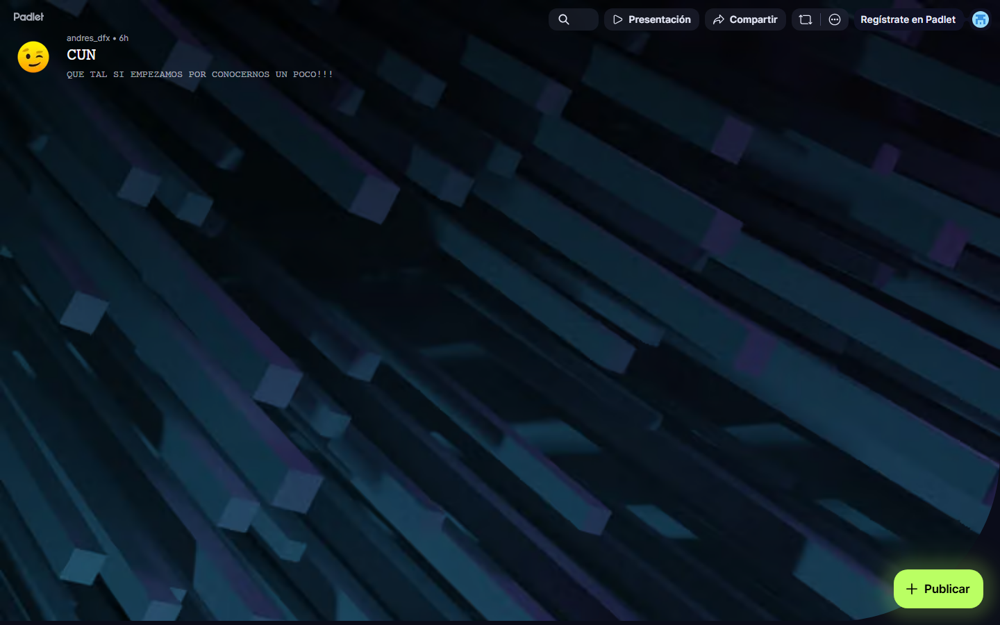

### GUIÓN DOCENTE — Sesión 01: Presentación del curso · docente · estudiantes · ACAs

> **Uso:** guion de **encuadre**. Esta sesión **no dicta tema**: presenta el curso, al Docente, a los estudiantes y las ACAs.
> El contenido curricular arranca en la **Sesión 02**; la unidad U1–U2 queda como **lectura autónoma**.
> **Duración del encuentro: 60 minutos.** El material da para dos horas: lo que no alcance se convierte en extensión y trabajo autónomo (ver tabla de ampliación).
> Logística de semestre (fechas, grupos, cortes) → Presentación del Curso / Manual.
> **PPTX:** `Clases/Sesion 01 - Presentación del curso · docente · estudiantes · ACAs/Presentacion.pptx` — en cada fase se indica la slide de ESA presentación.

📌 **De esta sesión**
- **Sesión:** **01** · **Tema:** Presentación del curso · docente · estudiantes · ACAs
- **Detalle:** Encuadre: presentación del curso, del Docente, de los estudiantes (Padlet) y de las ACAs (peso, fechas, formato). No se dicta tema.
- **PPTX estudiante:** `Clases/Sesion 01 - Presentación del curso · docente · estudiantes · ACAs/Presentacion.pptx`
- **Meet (serie del curso):** [URL Meet — mismo enlace toda la serie · CREATIVIDAD Y PENSAMIENTO INNOVADOR]

🗺️ **Slides de esta presentación** (Sesión 01 — encuadre; aquí no hay tema del Syllabus)

| Slide | Título en el PPTX | Cuándo usarla |
| :---: | :--- | :--- |
| **1** | Portada — SESIÓN 01, PRESENTACIÓN DEL CURSO | Apertura |
| **2** | AGENDA DE HOY | Encuadre de la hora |
| **3** | Docente | Presentación del Docente |
| **4** | PRESÉNTATE — ROMPEHIELOS (QR + Padlet) | Rompehielos |
| **5** | LAS ACAs — QUÉ SE EVALÚA | Pesos y entregas |
| **6** | Cómo trabajamos: una hora juntos, el resto por su cuenta | Metodología / aula invertida |
| **7** | Mapa del curso: las 7 sesiones de un vistazo | Recorrido del curso |
| **8** | Qué se llevan al final: la Propuesta de Innovación | Producto del curso |
| **9** | Las tres ACAs: qué se entrega en cada corte | Detalle de cada ACA |
| **10** | Qué separa un entregable fuerte de uno flojo | Criterio de calidad |
| **11** | Cómo se entrega: paso a paso en CDigital | Procedimiento de entrega |
| **12** | Integridad académica: la línea que no se cruza | Plagio y APA 7 |
| **13** | IA generativa: se usa, se declara y se verifica | Regla de uso de IA |
| **14** | Herramientas del curso: gratis y desde el navegador | Alistamiento técnico |
| **15** | Cómo pedir ayuda (y recibir respuesta pronto) | Canales y tiempos |
| **16** | Acuerdos de convivencia del encuentro | Cámara, micrófono, foro |
| **17** | Para la Sesión 02: lectura autónoma y qué traer | Encargo autónomo |
| **18** | Preguntas del primer día | Dudas típicas |
| **19** | ACUERDOS DE TRABAJO | Cierre de reglas |
| **20** | PARA LA PRÓXIMA SESIÓN | Tarea concreta |
| **21** | Cierre — Sesión 01 | Despedida |

🎯 **Objetivos de la sesión (encuadre — no hay tema del Syllabus)**
1. Que el estudiante sepa **qué produce este curso**: una **Propuesta de Innovación** propia, no un ensayo.
2. Que sepa **cómo se trabaja**: una hora sincrónica de aplicación + trabajo autónomo con el material leído antes.
3. Que sepa **qué se evalúa y cómo se entrega**: las tres ACAs, el formato APA CUN y el espacio de CDigital.
4. Que conozca las reglas de **integridad académica** y de **uso declarado de IA generativa**.
5. Que salga con **un solo encargo claro**: la lectura autónoma U1–U2 y un problema real escrito en tres líneas.

> **Lo que hoy NO se hace:** no se define creatividad, no se explica inteligencia emocional, no se dictan tipos de innovación. Todo eso **empieza en la Sesión 02**. Si usted se mete en el tema hoy, llega tarde a las ACAs y el grupo se va sin saber cómo entrega.

---

🧰 **Antes de la clase — qué debe tener listo el Docente** *(esta sesión no tiene fundamento teórico: tiene alistamiento)*

| Qué abrir / tener listo | Dónde está | Para qué momento |
| :--- | :--- | :--- |
| **Aula del curso en CDigital**, con el anuncio de bienvenida publicado y los espacios de entrega visibles | Campus institucional (login CUN) | Fases 5, 7 y 8 |
| **Padlet oficial** del rompehielos, abierto en una pestaña y con la URL copiada al portapapeles | https://padlet.com/andres_dfx/cun-wruz81hmf9k06gd7 | Fase 3 |
| **Enunciados de las ACAs 1–3** | `Clases/Recursos/ACAs/` | Fase 5 |
| **Plantilla APA CUN**, ya abierta en **Google Docs** (no en Word de escritorio) | `Clases/Recursos/Plantilla_APA_CUN_Proyecto de grado.docx` | Fase 5 |
| **PPTX de esta sesión** (21 slides) | `Clases/Sesion 01 - Presentación del curso · docente · estudiantes · ACAs/Presentacion.pptx` | Toda la clase |
| **Sala de Meet** abierta 5 minutos antes | [URL Meet — mismo enlace toda la serie · CREATIVIDAD Y PENSAMIENTO INNOVADOR] | Fase 1 |

**Tres decisiones que debe tener tomadas ANTES de entrar** (se las van a preguntar hoy, no la próxima semana):

1. **Trabajo individual o en dúo:** en este curso se puede trabajar en dúo si comparten el mismo problema, pero **cada estudiante entrega su propio documento** en CDigital.
2. **Uso de IA generativa:** permitido y **declarado** al final del documento; toda cita que entregue la IA se verifica antes de usarla.
3. **Entregas tarde:** se conversan **antes** del cierre del espacio de entrega, nunca después. Cerrado el espacio, la nota es la que hay.

> Si duda de alguna de las tres, decida ahora y dígalo igual todo el semestre. Lo que desordena un curso no es la regla dura: es la regla que cambia.

---

🧭 **Plan de Clase por Fases** — *Total: 60 min (encuentro oficial)*

| Fase | Minutos | Reloj sugerido (desde el inicio) |
| :--- | :---: | :--- |
| 1️⃣ Apertura y bienvenida | 5 | min 00:00 – 05:00 |
| 2️⃣ Quién es el Docente | 4 | min 05:00 – 09:00 |
| 3️⃣ Rompehielos Padlet — que se presenten ellos | 9 | min 09:00 – 18:00 |
| 4️⃣ Cómo trabajamos, recorrido del curso y su producto final | 11 | min 18:00 – 29:00 |
| 5️⃣ Las ACAs y cómo se entrega | 12 | min 29:00 – 41:00 |
| 6️⃣ Integridad académica y uso de IA | 7 | min 41:00 – 48:00 |
| 7️⃣ Herramientas, canales de ayuda y acuerdos | 7 | min 48:00 – 55:00 |
| 8️⃣ Encargo autónomo y cierre | 5 | min 55:00 – 60:00 |

> **Suma:** **60 minutos** exactos.

**Si dispone de dos horas (o si el grupo va rápido)** — el material de la deck da para el doble; amplíe en este orden:

| Ampliación | Minutos extra | Cómo se hace |
| :--- | :---: | :--- |
| Padlet leído completo, no tres notas | +8 | Leer en voz alta todas las notas y agrupar temas parecidos en pantalla |
| Recorrido lento del **mapa del curso** (slide 7) | +10 | Preguntar sesión por sesión: “¿qué creen que sale de esta?” |
| **Plantilla APA CUN** en vivo | +12 | Compartir pantalla, crear la copia en Google Docs y mostrar dónde escribe cada quien |
| **Enunciado de la ACA 1** leído entero con el checklist | +10 | Abrirlo desde `Clases/Recursos/ACAs/` y marcar criterio por criterio |
| Mini-ejercicio “mi problema en tres líneas” escrito en clase | +15 | Cada quien escribe; dos voluntarios leen; el Docente solo pregunta “¿a quién le pasa?” |

> Lo que no alcance a hacer **no se elimina: se convierte en trabajo autónomo** y se anuncia como tal en CDigital.

---

#### 1️⃣ Apertura y bienvenida (~5 min) — Protagonista: Docente
**Slides:** 1 (Portada) → 2 (AGENDA DE HOY)

**Objetivo de la fase:** que entiendan en un minuto que hoy es una sesión de reglas y no de contenido, y que eso es deliberado.

**GUION LITERAL:**
> “Buenas tardes y bienvenidos a **Creatividad y Pensamiento Innovador**. Antes de arrancar: verifiquen que su nombre real aparezca en la sala, porque por ese nombre los voy a llamar y voy a registrar su participación.”

> “**Slide 2 — AGENDA DE HOY.** Hoy no vamos a ver tema. Y no es porque sobre tiempo: es una decisión. Hoy resolvemos las cuatro cosas por las que se pierde un curso sin necesidad: **qué se hace aquí, quién los acompaña, quiénes son ustedes y cómo se evalúa**. El contenido arranca la próxima semana, en la **Sesión 02**, con Design Thinking.”

> “Se los digo de una vez para que nadie se lleve sorpresas: este curso tiene **un solo producto**, una **Propuesta de Innovación** que ustedes van a escribir por partes desde la próxima sesión. No es un ensayo sobre innovación; es su propuesta, sobre un problema real, con un usuario de carne y hueso.”

**Qué hacer:**
1. (1 min) Portada compartida, saludo, verificación de audio y de nombres.
2. (2 min) Leer la agenda de la slide 2 y decir explícitamente que hoy no hay tema.
3. (2 min) Anunciar el producto del curso y que la evaluación es **por cortes**.

---

#### 2️⃣ Quién es el Docente (~4 min) — Protagonista: Docente
**Slides:** 3 (Docente)

**GUION LITERAL:**
> “**Slide 3.** Un minuto sobre quién los acompaña: soy Ingeniero de Sistemas, candidato a Magíster en Inteligencia Artificial, y trabajo como líder técnico en la industria. Les cuento esto por una razón práctica: lo que vamos a hacer aquí —mirar un problema, proponer algo y sustentarlo— es literalmente lo que hago cada semana en mi trabajo.”

> “Mi correo institucional está en pantalla y lo tienen también en CDigital. Más adelante les explico cuál duda va por foro y cuál por correo, para que la respuesta no se demore.”

**Qué hacer:**
1. (2 min) Perfil breve, sin currículum extendido: lo que le da autoridad ante el grupo es el vínculo con la práctica.
2. (2 min) Anunciar que los canales de contacto se explican en la fase 7 (no dispersar la información ahora).

---

> **En pantalla:** Tablero oficial del rompehielos. URL: https://padlet.com/andres_dfx/cun-wruz81hmf9k06gd7. ~5 min de escritura.

#### 3️⃣ Rompehielos Padlet — que se presenten ellos (~9 min) — Protagonista: Estudiantes
**Slides:** 4 (PRESÉNTATE — QR + Padlet)

**Objetivo de la fase:** romper el silencio del primer día y, de paso, tener por escrito los intereses del grupo (le sirven de ejemplo todo el semestre).

**GUION LITERAL:**
> “**Slide 4 — PRESÉNTATE.** Ahora los escucho a ustedes, pero por escrito, que es más rápido que veinte presentaciones habladas. Escaneen el **QR** de la pantalla o abran este enlace, que también les pego en el chat: https://padlet.com/andres_dfx/cun-wruz81hmf9k06gd7.”

> “Publiquen **un solo post-it** con tres cosas: (1) su **nombre**; (2) **una expectativa** de este curso —qué quieren llevarse—; y (3) **un tema o problema que les interese**, algo que hayan visto que funciona mal en su trabajo, en su barrio o aquí mismo en la universidad. Sirve una línea. No busquen que suene inteligente: busquen que sea verdad. Tienen **cinco minutos** y yo los voy leyendo en voz alta.”

**Cómo conducirlo (esto es lo que hace que funcione):**
1. Proyecte el tablero mientras escriben: ver aparecer notas ajenas destraba a los que dudan.
2. Lea en voz alta **tres o cuatro** notas, sin juzgar ninguna, y conecte dos que se parezcan: “miren, dos personas dijeron algo de tiempo perdido en trámites”.
3. Cierre nombrando lo que ve: “tenemos gente de sistemas, gente que trabaja y gente que viene de otro semestre; eso ayuda, porque los problemas buenos salen de contextos distintos”.

**Si nadie escribe** (pasa, sobre todo en el primer encuentro virtual):
- **Escriba usted el primer post-it** en vivo, con su nombre y un problema real suyo. El tablero vacío paraliza; el tablero con una nota se llena solo.
- Baje el costo de entrada: “no tiene que ser el tema definitivo, ni tiene que ser original; puede cambiar la próxima semana”.
- Nombre a dos o tres personas directamente y con amabilidad: “Camila, ¿qué escribiste? Yo lo pego por ti si quieres”.
- Si aun así no pasa nada, **no alargue**: pida que lo publiquen antes de la Sesión 02 y siga. Un rompehielos que se estira diez minutos en silencio hace más daño que uno corto.

---

#### 4️⃣ Cómo trabajamos, recorrido del curso y su producto final (~11 min) — Protagonista: Docente
**Slides:** 6 (CÓMO TRABAJAMOS) → 7 (MAPA DEL CURSO) → 8 (QUÉ SE LLEVAN AL FINAL)

**GUION LITERAL:**
> “**Slide 6 — Cómo trabajamos.** Esta materia son dos créditos: alrededor de 32 horas conmigo y **64 horas suyas**. Léanlo otra vez: el doble del tiempo lo pone usted, fuera de esta sala. No lo digo para asustar, lo digo para que nadie crea que esta hora semanal es el curso completo.”

> “Como la hora es corta, trabajamos en **aula invertida**: el material de cada unidad queda en **CDigital** y ustedes lo leen **antes**. La hora de encuentro no la voy a gastar leyéndoles diapositivas: la vamos a gastar **aplicando** eso a su propia propuesta. Traigan siempre su documento de trabajo abierto; aquí se trabaja sobre lo que ya está escrito, no sobre lo que uno recuerda.”

> “**Slide 7 — Mapa del curso.** Son siete encuentros. Hoy encuadre; la próxima, Design Thinking; luego el Manual de Oslo, los tipos de innovación, la validación con Canvas y MVP, la vigilancia tecnológica y, al final, el ecosistema y el pitch. Fíjense en la tercera columna: **cada sesión deja un pedazo del mismo documento**. Ninguna es un taller suelto.”

> “Van a notar que el mapa tiene ocho unidades y solo siete encuentros. Las dos primeras —la Propuesta de Innovación y el bloque de creatividad e inteligencia emocional— quedan como **lectura autónoma** y las retomamos al abrir la Sesión 02. Al final de la clase les digo exactamente qué leer.”

> “**Slide 8 — Qué se llevan al final.** El producto es una **Propuesta de Innovación** de ocho a doce páginas más un pitch de una página, que responde en orden: problema, usuario, propuesta de valor, tipo de innovación, validación, vigilancia y siguiente paso. Y una advertencia sincera: si al terminar solo tienen un archivo para la nota, desperdiciaron el semestre. Esto les sirve para una entrevista de trabajo, para proponer una mejora en la empresa donde están, o como semilla de su opción de grado.”

**Qué hacer:**
1. (3 min) Insistir en la proporción 32/64 horas: es la expectativa que evita el reclamo del corte 3.
2. (4 min) Recorrer el mapa preguntando al grupo qué creen que sale de dos o tres sesiones.
3. (4 min) Anclar el producto final y su utilidad fuera del aula.

---

#### 5️⃣ Las ACAs y cómo se entrega (~12 min) — Protagonista: Docente
**Slides:** 5 (LAS ACAs — QUÉ SE EVALÚA) → 9 (LAS TRES ACAs EN DETALLE) → 10 (FUERTE vs. FLOJO) → 11 (CÓMO SE ENTREGA)

**GUION LITERAL:**
> “**Slide 5.** Evaluación por cortes: **30, 30 y 40 por ciento**. Los pesos están ahí y también en la Presentación del Curso. Las **fechas exactas no las dicto de memoria**: están en el enunciado de cada ACA, en `Clases/Recursos/ACAs/`, y en el espacio de entrega de CDigital. Anótenlas hoy mismo en su calendario.”

> “**Slide 9 — Las tres ACAs en detalle.** ACA 1: la ficha del problema, el mapa de bloqueadores y la síntesis de ideación; se evalúa que el problema sea **real, observable y de alguien concreto**. ACA 2: la propuesta tipificada, con FODA, Canvas y MVP; se evalúa que esté **validada**, no solo descrita. ACA 3: la propuesta consolidada con vigilancia, entidades de apoyo y pitch; se evalúa que **cierre el hilo**, del problema al siguiente paso.”

> “**Slide 10 — Qué separa un entregable fuerte de uno flojo.** Léanla completa esta semana. Resumo la columna izquierda: usuario genérico, problema deducido de la solución que ya eligieron, evidencia tipo ‘todo el mundo sabe que’, fuentes copiadas de un blog sin autor y un documento escrito la noche anterior. Yo no evalúo **cuánto** escribieron: evalúo si **se entiende, se sostiene y avanzó** desde el corte anterior.”

> “**Slide 11 — Cómo se entrega.** Seis pasos y ninguno es opcional: escriben en la **plantilla APA CUN** abierta en **Google Docs** —no necesitan Office instalado—, revisan el checklist del enunciado, exportan a **PDF**, nombran el archivo **CRE_ACA1_Apellido**, lo suben al espacio del corte en **CDigital** y **verifican que abra** desde la plataforma. Un archivo corrupto cuenta como no entregado.”

> “Y la regla que más disgustos evita: **entrega oficial es CDigital**. No recibo trabajos por correo, ni por WhatsApp, ni por mensaje privado. Si se les complica una fecha, hablamos **antes** del cierre, no después.”

**Qué hacer:**
1. (3 min) Recorrer las tres ACAs sin leer el enunciado completo: el detalle vive en `Clases/Recursos/ACAs/`.
2. (4 min) Abrir en pantalla el enunciado de la **ACA 1** y mostrar dónde está el checklist de criterios.
3. (5 min) Compartir pantalla con la **plantilla APA CUN en Google Docs** y mostrar el flujo real: copia propia → escribir → exportar PDF → subir a CDigital.

> **En pantalla:** Abrir la plantilla en Google Docs, hacer una copia propia y mostrar el camino hasta CDigital.

---

#### 6️⃣ Integridad académica y uso de IA (~7 min) — Protagonista: Docente
**Slides:** 12 (INTEGRIDAD ACADÉMICA) → 13 (IA GENERATIVA)

**GUION LITERAL:**
> “**Slide 12.** Todo lo que no sea suyo se **cita en APA 7**: texto, datos, imágenes, código y también las ideas que resumieron con sus palabras. Citar no les resta mérito; demuestra que leyeron. Cuenta como plagio copiar y pegar sin fuente, parafrasear sin citar, traducir un texto ajeno y presentarlo como propio, o entregar un trabajo que hizo otra persona.”

> “Sean conscientes de una cosa: si aparece plagio, **esto no se arregla entre ustedes y yo**. Sigue el conducto que fija el Reglamento Estudiantil de la CUN. Por eso les pido que pregunten antes, no que expliquen después: nadie ha perdido puntos por preguntar cómo se cita.”

> “**Slide 13 — IA generativa.** En este curso la IA **no está prohibida: está regulada**. Tres reglas. Primera: **declárenla** en una nota corta al final del documento —qué herramienta, para qué y qué hicieron ustedes con la salida—. Declararlo no baja la nota; ocultarlo sí es una falta. Segunda: **verifiquen toda cita** que les dé; el error número uno son las referencias inventadas, autor y año que suenan perfectos y no existen. Si no lograron abrir el documento original, esa fuente no entra.”

> “Tercera, y es la importante: la IA **no puede hacer lo que este curso evalúa**. No puede observar a un usuario real, no puede elegir su problema y no puede defender su criterio. Un texto impecable sobre un problema que ustedes nunca miraron se cae en la primera pregunta que yo haga. Ustedes firman el entregable: responden por cada frase.”

**Qué hacer:**
1. (3 min) Integridad y debido proceso, sin dramatizar y sin amenazar.
2. (4 min) Regla de IA con ejemplo: pedirle a una IA tres referencias y mostrar cómo se verifica una en Google Scholar.

---

#### 7️⃣ Herramientas, canales de ayuda y acuerdos (~7 min) — Protagonista: Docente
**Slides:** 14 (HERRAMIENTAS) → 15 (CÓMO PEDIR AYUDA) → 16 (CONVIVENCIA) → 19 (ACUERDOS DE TRABAJO)

**GUION LITERAL:**
> “**Slide 14 — Herramientas.** Todas gratis y todas desde el navegador: CDigital para material y entregas; Google Docs y Slides para escribir; Padlet para tableros; Excalidraw para bocetos; Canvanizer para el Canvas del corte 2; Scholar, SciELO y Redalyc para buscar; ZoteroBib para armar las referencias en APA 7 sin instalar nada. **Nada de pagar ni de instalar.** Si una herramienta les pide tarjeta, no es la que estamos pidiendo.”

> “**Slide 15 — Cómo pedir ayuda.** Tres canales, en este orden. En el encuentro, los últimos minutos son para dudas y casi nadie los usa. En el **foro de CDigital**, las dudas que le sirven a todo el grupo: formato, entrega, alcance de un ACA; ahí respondo y la respuesta queda para los demás. Por **correo institucional**, lo personal. Asunto sugerido: **EI004, su nombre y el tema en cuatro palabras**. Respondo en días hábiles, normalmente entre 24 y 48 horas; no hay atención de madrugada ni domingo.”

> “Y una petición concreta: pregunten **la duda puntual**. ‘No entendí nada’ no se puede responder. ‘No sé si mi usuario es el estudiante o el laboratorista’ sí se responde en dos líneas.”

> “**Slide 16 — Convivencia.** Empezamos a la hora en punto. Nombre real en la sala. Micrófono cerrado por defecto y abierto para participar; **cámara bienvenida pero no obligatoria** —si no pueden, participen por el chat—. Lo que no funciona es estar conectado y ausente. Aquí se piensa en voz alta y se muestran borradores a medio hacer: **ninguna idea se ridiculiza**; las ideas se critican con criterio, a las personas no. Y si el encuentro se graba, lo aviso al inicio y la grabación queda en CDigital.”

> “**Slide 19 — Acuerdos de trabajo.** Son los tres que ya dijimos, juntos: la entrega es en CDigital, se trae el avance escrito a cada encuentro, y se cita siempre en APA 7.”

**Qué hacer:**
1. (3 min) Recorrer herramientas y pedirles que abran CDigital **ahora**, en otra pestaña, para confirmar que entran.
2. (2 min) Canales y tiempos de respuesta.
3. (2 min) Convivencia y acuerdos, en tono de acuerdo mutuo y no de reglamento leído.

---

#### 8️⃣ Encargo autónomo y cierre (~5 min) — Protagonista: Docente
**Slides:** 17 (PARA LA SESIÓN 02) → 18 (PREGUNTAS DEL PRIMER DÍA) → 20 (PARA LA PRÓXIMA SESIÓN) → 21 (Cierre)

**GUION LITERAL:**
> “**Slide 17 — Para la Sesión 02.** Cuatro cosas, y son cortas. Primera: la **lectura autónoma obligatoria**, unidades **U1 y U2** del Syllabus —Propuesta de Innovación, y creatividad e inteligencia emocional—; el material está en CDigital. Las retomamos en los primeros minutos de la próxima sesión: las repasamos, no las dictamos completas. Léanlas con una pregunta en la mano: **¿qué de esto me sirve para el problema que voy a elegir?**”

> “Segunda: abran el **enunciado de la ACA 1** y léanlo entero, con checklist. Tercera: **traigan escrito**, con tres líneas basta, un problema real que les moleste, **a quién** le pasa y **dónde** lo vieron. No me traigan una solución; tráiganme un problema: la solución es el trabajo del resto del curso. Cuarta: creen su documento en Google Docs con la plantilla APA CUN y déjenlo listo.”

> “**Slide 18 — Preguntas del primer día.** Las dejo en pantalla mientras me preguntan lo que quieran: si se pierde fácil, si se puede en dúo, si sirve un trabajo de otro semestre y si hace falta programar. Las respuestas cortas están ahí; las largas se las doy ahora.”

> “**Slide 20 — Para la próxima sesión.** Resumido en tres líneas para que nadie lo pierda: lectura autónoma U1–U2, enunciado de la ACA 1 leído, y su problema escrito. Lo pego también en el chat y lo publico hoy mismo en CDigital.”

> “**Slide 21 — Cierre.** Hoy no vimos tema y salimos sabiendo cómo se trabaja, qué se entrega y con quién cuentan. La **Sesión 02** arranca el contenido: *Creatividad e innovación en I+D, Design Thinking y técnicas*, y se trabaja sobre lo que ustedes traigan. Mismo enlace de siempre. Nos vemos.”

**Qué hacer:**
1. (2 min) Dictar el encargo autónomo y **escribirlo también en el chat** (lo que solo se dice, se pierde).
2. (2 min) Preguntas abiertas con la slide 18 proyectada.
3. (1 min) Cierre y despedida.

---

❓ **Si un estudiante pregunta… — Usted responde…** *(las dudas reales del primer día)*

| Si un estudiante pregunta… | Usted responde… |
| :--- | :--- |
| “¿Esta materia se pierde fácil?” | “No, si entrega. Se pierde por no entregar y por dejarlo todo para el Corte 3, que pesa el 40%. Quien avanza cada semana llega tranquilo.” |
| “¿Puedo trabajar solo o toca en grupo?” | “Puede trabajar en dúo si comparten el mismo problema, pero **cada uno entrega su documento** en CDigital. La nota es individual.” |
| “¿Sirve un trabajo de otro semestre?” | “Puede **partir** de un proyecto suyo si lo declara y lo lleva más lejos. Volver a entregar lo mismo es autoplagio, y eso sí es falta.” |
| “¿La clase se graba?” | “Si se graba, lo aviso al inicio y la grabación queda en CDigital. No es reemplazo de la clase: el taller se hace en vivo.” |
| “¿Puedo usar ChatGPT?” | “Sí, declarándolo al final del documento y verificando toda cita que le dé. Lo que la IA no puede hacer es observar a su usuario ni defender su criterio.” |
| “¿Necesito saber programar o diseñar?” | “No. Aquí se evalúa criterio: problema real, propuesta clara y evidencia. La tecnología es un medio, no el requisito.” |
| “¿Cuándo es la primera entrega?” | “La fecha exacta está en el enunciado de la ACA 1 y en el espacio de entrega de CDigital. Ábralo hoy y anótela en su calendario.” |
| “¿Y si no puedo conectarme a un encuentro?” | “Avise antes, revise el material en CDigital y llegue al siguiente con el avance. La ausencia no mueve la fecha de entrega.” |
| “¿Qué tema escojo? No se me ocurre nada.” | “No busque un tema: busque algo que **funcione mal** donde usted está. Un trámite lento, un dato que se pierde, una fila. De ahí sale la propuesta.” |
| “¿Se puede cambiar de problema después?” | “Sí, y es normal, sobre todo tras la Sesión 02. Lo que no se puede es llegar al Corte 2 sin haber elegido ninguno.” |

---

🧩 **Qué se lleva el estudiante de esta sesión**

**No hay entregable evaluado hoy** (el encuadre no se califica). Se lleva **tres cosas verificables**:

1. Su **post-it publicado** en el Padlet del curso: https://padlet.com/andres_dfx/cun-wruz81hmf9k06gd7
2. El **enunciado de la ACA 1** abierto y leído, con la fecha de entrega anotada en su calendario.
3. El **encargo autónomo** para la Sesión 02: lectura U1–U2 en CDigital + un problema real escrito en tres líneas (a quién le pasa y dónde lo vio) + documento de trabajo creado en Google Docs con la plantilla APA CUN.

**Criterio de éxito de la clase:** si al terminar un estudiante puede responder sin dudar *“¿qué produce este curso, cómo entrego y qué debo traer la próxima semana?”*, el encuadre funcionó.

---

✅ **Checklist del Docente antes de clase**
- [ ] Pantallazos de apoyo abiertos (`Guiones/Capturas/Sesion 01/`)
- [ ] Aula de **CDigital** abierta, con el anuncio de bienvenida publicado
- [ ] Abrí `Clases/Sesion 01 - Presentación del curso · docente · estudiantes · ACAs/Presentacion.pptx` (21 slides)
- [ ] **Padlet** abierto y URL copiada para pegar en el chat: https://padlet.com/andres_dfx/cun-wruz81hmf9k06gd7
- [ ] Enunciados **ACA 1–3** abiertos desde `Clases/Recursos/ACAs/`
- [ ] **Plantilla APA CUN** abierta en Google Docs, lista para compartir pantalla
- [ ] Tengo decidida mi respuesta a: dúo, IA y entregas tarde
- [ ] Meet listo: [URL Meet — mismo enlace toda la serie · CREATIVIDAD Y PENSAMIENTO INNOVADOR]

📋 **Después de la clase (mismo día)**
- [ ] Publiqué en **CDigital** el anuncio con: enlace del Padlet, encargo autónomo (lectura U1–U2) y recordatorio del enunciado de la ACA 1
- [ ] Revisé el Padlet y anoté 3 problemas del grupo para usarlos como ejemplo en la Sesión 02
- [ ] Verifiqué que el espacio de entrega del Corte 1 esté visible para los estudiantes

---
*Fin del Guión — Sesión 01 (encuadre). Aquí no se dicta tema: el contenido del Syllabus arranca en la Sesión 02 y la unidad U1–U2 queda como lectura autónoma.*
