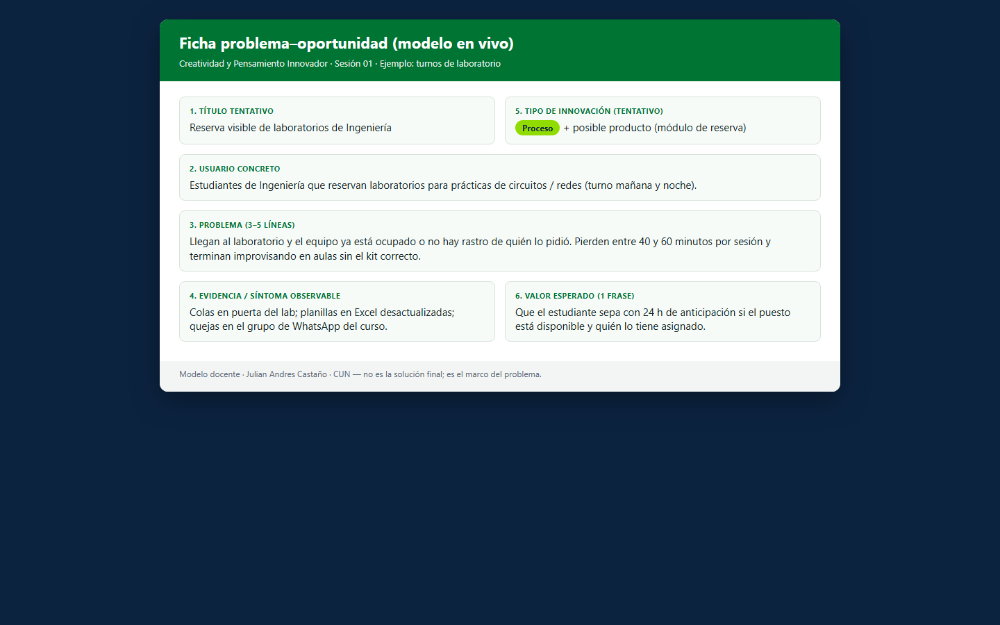
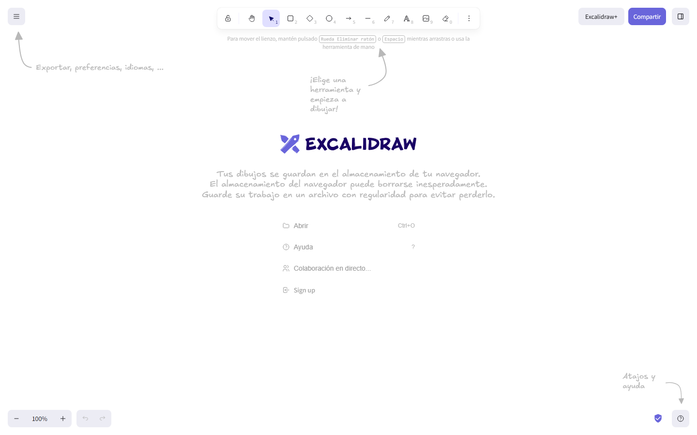

### GUIÓN DOCENTE — Sesión 01: Presentación del curso · docente · estudiantes · ACAs

> **Uso:** guion de locución de **esta** clase. Léalo en voz alta casi literal.
> Estudie primero el Fundamento Teórico. **Duración: 60 minutos**.
> Logística de semestre (fechas, grupos, cortes) → Presentación del Curso / Manual.
> **PPTX:** `Clases/Sesion 01 - Presentación del curso · docente · estudiantes · ACAs/Presentacion.pptx` — en cada fase se indica la slide de ESA presentación.

📌 **De esta sesión**
- **Sesión:** **01** · **Tema:** Presentación del curso · docente · estudiantes · ACAs
- **Detalle:** Encuadre: presentación del curso, del Docente, de los estudiantes (Padlet) y de las ACAs (peso, fechas, formato). No se dicta tema.
- **PPTX estudiante:** `Clases/Sesion 01 - Presentación del curso · docente · estudiantes · ACAs/Presentacion.pptx`
> **Rompehielos Padlet:** slide PRESÉNTATE de la Presentación del Curso. URL: https://padlet.com/andres_dfx/cun-wruz81hmf9k06gd7

- **Meet (serie del curso):** [URL Meet — mismo enlace toda la serie · CREATIVIDAD Y PENSAMIENTO INNOVADOR]

🗺️ **Slides de esta presentación** (Sesión 01 — tema puntual)

| Slide | Título en el PPTX | Cuándo usarla |
| :---: | :--- | :--- |
| **1** | Portada — Sesión 01 | Apertura |
| **2** | OBJETIVOS DE HOY | Encuadre |
| **3** | ENFOQUE DE HOY | Anclar el entregable de la hora |
| **4** | TABLERO COLABORATIVO — Padlet | Rompehielo / expectativas |
| **5** | CREATIVIDAD ≠ INNOVACIÓN | Exposición |
| **6** | ANALOGÍA DE LA RECETA | Exposición |
| **7** | EL TRABAJO FINAL DESDE EL DÍA 1 | Modelación del hilo |
| **8** | TIPOS DE INNOVACIÓN (vista previa) | Vocabulario Oslo |
| **9** | EJEMPLO MODELADO — Ficha | Modelación en vivo |
| **10** | TALLER — Ficha problema–oportunidad | Consigna práctica |
| **11** | PARA CONTINUAR | Trabajo autónomo |
| **12** | Cierre — Sesión 01 | Despedida |

🎯 **Objetivos de la sesión**
1. **Distinguir** creatividad de innovación con ejemplos de Ingeniería.
2. **Comprender** que el hilo conductor del curso es la **Propuesta de Innovación** (se construye desde hoy).
3. **Redactar** en clase una ficha inicial: problema real + usuario + tipo de innovación tentativo.
4. **Salir** con la tarea autónoma clara para la Sesión 01.

---

📚 **Fundamento Teórico para el Docente** *(estudiar ANTES de la clase)*

> Este apartado asume que usted **no** es especialista en innovación. Léalo completo: las definiciones y analogías de aquí son las que usará en voz alta.

#### 1. Creatividad ≠ innovación (la confusión #1)
**Creatividad** es la capacidad de **generar ideas nuevas** (conexiones, alternativas, enfoques). Puede quedarse en la cabeza o en un post-it.
**Innovación** es **llevar una idea a la práctica con valor**: alguien la usa, mejora un proceso, genera adopción, reduce costo, crea impacto. Sin implementación y sin valor, no hay innovación: hay idea.

Analogía de clase: la creatividad es **inventar la receta**; la innovación es **cocinarla, servirla y que alguien la pida de nuevo**.

| | Creatividad | Innovación |
| :--- | :--- | :--- |
| Pregunta | ¿Se me ocurre algo nuevo? | ¿Lo pongo en marcha y genera valor? |
| Evidencia | Idea, boceto, lluvia de ideas | Prototipo usado, proceso cambiado, usuario que adopta |
| Riesgo típico del estudiante | Quedarse en “tengo una idea genial” | No medir si alguien la necesita |

#### 2. Manual de Oslo (OCDE) — cinco tipos (visión previa; se profundiza en U4–U5)
El **Manual de Oslo** es la referencia internacional de la OCDE para medir y clasificar innovación. Para Ingeniería conviene memorizar cinco tipos:

| Tipo | Pregunta guía | Ejemplo corto en Ingeniería |
| :--- | :--- | :--- |
| **Producto** | ¿Qué nuevo bien/servicio ofrezco? | App o módulo que resuelve un dolor concreto |
| **Proceso** | ¿Cómo produzco/entrego distinto? | Automatizar pruebas o despliegues |
| **Organización** | ¿Cómo nos coordinamos distinto? | Nuevo flujo de roles en un equipo Dev |
| **Marketing** | ¿Cómo llego/posiciono distinto? | Canal nuevo de adopción / onboarding |
| **Social** | ¿Qué impacto comunitario genero? | Solución que mejora un servicio público o comunitario |

Hoy **no** evalúe dominio perfecto de Oslo; solo deje el vocabulario sembrado.

#### 3. Por qué anunciar el trabajo final el día 1
Si no anuncia la **Propuesta de Innovación** desde hoy, cada taller se vuelve una isla. Cada encuentro debe **alimentar el mismo entregable**; no hace falta recorrer el mapa completo en esta clase.

#### 4. Qué es “una buena ficha de problema” (criterio de calidad)
Una ficha débil dice: “quiero hacer una app de IA”. Una ficha fuerte responde:
1. **¿Quién** sufre el problema? (usuario concreto, no “la gente”).
2. **¿Qué** duele hoy? (síntoma observable).
3. **¿Dónde** ocurre? (contexto: empresa, campus, proceso, comunidad).
4. **¿Por qué importa**? (costo, tiempo, error, exclusión, riesgo).
5. **Tipo tentativo** de innovación (aunque cambie después).

#### 5. Errores frecuentes / preguntas trampa
- “Innovación = tecnología nueva.” ❌ Puede ser proceso u organización sin gadget.
- “Ya tengo la solución; el problema no importa.” ❌ Sin problema claro no hay propuesta defendible.
- “Es innovador porque a mí me gusta.” ❌ Falta usuario y valor.
- Confundir creatividad con innovación: sin implementación y valor, solo hay idea.

---

🧭 **Plan de Clase por Fases** — *Total: 60 min*

| Fase | Minutos | Reloj sugerido (desde el inicio) |
| :--- | :---: | :--- |
| 1️⃣ Encuadre + tablero Padlet | 12 | min 00:00 – 12:00 |
| 2️⃣ Creatividad vs. innovación + hilo de la propuesta | 10 | min 12:00 – 22:00 |
| 3️⃣ Qué es la Propuesta de Innovación (modelación) | 12 | min 22:00 – 34:00 |
| 4️⃣ Taller: ficha del problema–oportunidad | 18 | min 34:00 – 52:00 |
| 5️⃣ Cierre + trabajo autónomo | 8 | min 52:00 – 60:00 |

> **Suma:** **60 minutos** exactos.

---

#### 1️⃣ Encuadre + tablero Padlet (~12 min) — Protagonista: Docente
**Slides:** 1 (Portada) → 2 (OBJETIVOS) → 3 (ENFOQUE DE HOY) → 4 (TABLERO Padlet)

**Objetivo de la fase:** que sepan qué se espera al final de la hora (ficha escrita) y dejen su expectativa en un mural colaborativo.

**GUION LITERAL:**
> “Buenas tardes. Hoy es la **Sesión 01**. Al terminar esta hora no se van solo con teoría: se van con una **ficha escrita** del problema que van a atacar con su Propuesta de Innovación.”

> “Miren la **slide 2 — OBJETIVOS**. Hoy vamos a: (1) separar creatividad de innovación; (2) anunciar el hilo conductor — la Propuesta de Innovación — desde el día 1; y (3) salir con un avance observable.”

> “**Slide 3 — ENFOQUE DE HOY.** No entregamos la propuesta completa: entregamos el **insumo #1**. Cada unidad alimentará el mismo documento. Sin problema claro no hay propuesta defendible.”

> “**Slide 4 — TABLERO Padlet.** Antes del taller largo, abrimos el mural colaborativo oficial. Escaneen el **QR** de la Presentación del Curso o abran: https://padlet.com/andres_dfx/cun-wruz81hmf9k06gd7 — también lo pego en el chat de Meet. Agreguen un post-it con: (a) **una expectativa** del curso y (b) **un tema o problema** que les interesa. Tienen **~7 minutos**.”

**Qué hacer EN PANTALLA (tablero):**
1. (2 min) Portada + bienvenida + control de audio/nombres en Meet.
2. (2 min) Leer objetivos (slide 2) + enfoque (slide 3).
3. (1 min) Abrir https://padlet.com/andres_dfx/cun-wruz81hmf9k06gd7 → proyectar → pegar URL en chat Meet / anuncio CDigital.
4. (6–7 min) Estudiantes publican post-its; usted proyecta el tablero y lee en voz alta 3–4 notas (sin juzgar).

---

#### 2️⃣ Creatividad vs. innovación + hilo de la propuesta (~10 min) — Protagonista: Docente
**Slides:** 5 (CREATIVIDAD ≠ INNOVACIÓN) → 6 (ANALOGÍA) → 7 (TRABAJO FINAL)

**GUION LITERAL:**
> “Vamos a la **slide 5**. Primera idea madre, escríbanla: **creatividad no es lo mismo que innovación**.”

> “Creatividad = generar ideas nuevas. Innovación = llevar la idea a la práctica **con valor**. Analogía en la **slide 6**: inventar la receta vs. cocinarla, servirla y que alguien la pida otra vez. En Ingeniería vemos mucho ‘tengo una idea de app’ y muy poco ‘alguien la usó y le cambió el dolor’. Nosotros vamos por lo segundo.”

> “**Slide 7.** El hilo conductor es la **Propuesta de Innovación**. Hoy no es el mapa de todo el semestre: es el anuncio de que cada encuentro alimenta **el mismo** documento. Si avanzan la propuesta cada semana, el corte no los sorprende.”

**Qué hacer:**
1. (5 min) Definiciones + analogía; pedir 1 ejemplo oral de “idea que no llegó a innovar”.
2. (5 min) Anclar el hilo de la Propuesta (sin listar todas las unidades).

---

> **En pantalla:** Presentación del Curso → PRESÉNTATE. URL: https://padlet.com/andres_dfx/cun-wruz81hmf9k06gd7. ~7 min.

> **En pantalla:** Proyectar la ficha modelo; llenar campos en vivo (usuario, dolor, tipo tentativo).

#### 3️⃣ Qué es la Propuesta de Innovación — modelación (~12 min) — Protagonista: Docente
**Slides:** 8 (TIPOS Oslo vista previa) → 9 (EJEMPLO MODELADO)

**Modelar EN VIVO** un ejemplo resuelto (use este o uno propio del sector):

**Ejemplo modelo — “Turnos de laboratorio desordenados”**
- Usuario: estudiantes de Ingeniería que reservan laboratorios.
- Problema: llegan y el equipo está ocupado / no hay rastro de quién lo pidió; pierden 40–60 min.
- Dolor: tiempo, frustración, subuso de equipos.
- Tipo tentativo: **proceso** (flujo de reserva) + posible **producto** (módulo de reserva).
- NO es aún la solución final: es el **marco del problema**.

**GUION LITERAL:**
> “Miren cómo se ve una ficha bien hecha. No digo ‘voy a hacer una app con IA’. Digo: **quién** sufre, **qué** duele, **dónde** ocurre, **por qué** importa, y un **tipo tentativo** de innovación. La solución viene después. Si saltamos a la app, estamos inventando martillos sin mirar el clavo.”

> “Los cinco tipos del Manual de Oslo —producto, proceso, organización, marketing, social— los veremos a fondo en las siguientes sesiones (Oslo / tipos). Hoy solo elijan un tipo **tentativo** para no quedarse en el aire.”

**Qué hacer:**
1. (7 min) Llenar el ejemplo en pantalla (Google Docs / Excalidraw).
2. (5 min) Preguntar a 2 estudiantes: “¿su post-it del tablero era solución o problema?”. Corregir con amabilidad.

---

> **En pantalla:** Abrir https://excalidraw.com/ sin cuenta; boceto del problema si ayuda.

> **En pantalla:** Estudiante redacta/pega la ficha y sube a CDigital.

#### 4️⃣ Taller en clase: ficha del problema–oportunidad (~18 min) — Protagonista: Estudiantes
**Slides:** 10 (TALLER)

**GUION LITERAL (consigna):**
> “Pasamos a la **slide 10 — TALLER**. Tienen **18 minutos**. Cada uno —o dúo si ya tienen proyecto conjunto— completa la **Ficha problema–oportunidad** con estos campos: (1) título tentativo, (2) usuario concreto, (3) problema en 3–5 líneas, (4) evidencia o síntoma observable, (5) tipo de innovación tentativo, (6) una frase de valor esperado. Pueden partir del tema que escribieron en el Padlet. Al final pediré a **tres personas** que lean solo el usuario y el problema en 30 segundos. Criterio de éxito: si yo, sin saber su tema, entiendo el dolor, la ficha sirve.”

**Tabla de acompañamiento:**

| Si el estudiante… | Usted responde… |
| :--- | :--- |
| Solo tiene “una app de IA” | “¿Quién la usaría mañana a las 8 am y qué le duele hoy?” |
| Habla de un problema planetario | “Bájenlo a un contexto donde puedan observar esta semana.” |
| Copia un caso famoso | “¿Cuál es SU ángulo local / de práctica / de trabajo?” |
| No elige tipo | “Escojan tentativo: producto o proceso; luego lo afinamos.” |

---

#### 5️⃣ Cierre + trabajo autónomo (~8 min) — Protagonista: Docente
**Slides:** 11 (PARA CONTINUAR) → 12 (Cierre)

**GUION LITERAL:**
> “Tres ideas de hoy: (1) creatividad genera; innovación **implementa con valor**; (2) el curso es un solo hilo — la **Propuesta de Innovación**; (3) sin problema claro no hay propuesta defendible.”

> “**Slide 11 — PARA CONTINUAR.** Trabajo autónomo: (a) subir la ficha a CDigital (`S01_FichaProblema_Apellido`); (b) mejorar el problema con una observación real; (c) traer a la próxima **3 bloqueadores personales** o 1 evidencia de empatía.”

> “**Slide 12 — Cierre.** Próxima: *Creatividad/innovación en I+D · Design Thinking*. Mismo Meet. Gracias y buen trabajo.”

---

🧩 **Actividad práctica / taller (resumen del entregable de hoy)**

**Nombre:** Ficha problema–oportunidad (insumo #1 de la Propuesta de Innovación) + mural Padlet.

1. Publicar en Padlet (https://padlet.com/andres_dfx/cun-wruz81hmf9k06gd7) expectativa + tema/problema de interés (~7 min).
2. Completar en clase los 6 campos de la ficha.
3. **Criterio de éxito:** un lector externo entiende usuario + dolor + contexto sin pedir aclaración.
4. **Entregable:** archivo o captura de la ficha en CDigital (nombre: `S01_FichaProblema_Apellido`).
5. **Trabajo autónomo:** evidencia de observación + 3 bloqueadores para Sesión 01.

---

✅ **Checklist del docente antes de clase**
- [ ] Pantallazos en `Guiones/Capturas/` abiertos
- [ ] Leí el Fundamento Teórico completo
- [ ] Abrí `Clases/Sesion 01 - Presentación del curso · docente · estudiantes · ACAs/Presentacion.pptx`
- [ ] Abrí el Padlet oficial S01 y pegué la URL en Meet/CDigital
- [ ] Publiqué en CDigital el espacio de entrega de la Ficha S01
- [ ] Tengo el ejemplo modelo listo para compartir pantalla
- [ ] Meet listo: [URL Meet — mismo enlace toda la serie · CREATIVIDAD Y PENSAMIENTO INNOVADOR]

---
*Fin del Guión — Sesión 01. Documento autocontenido: un docente sin trayectoria en innovación puede estudiarlo y dictar la hora completa.*
