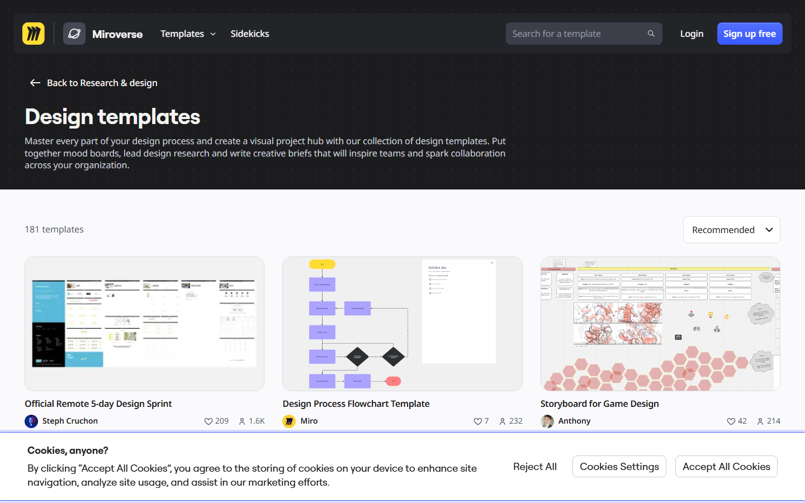
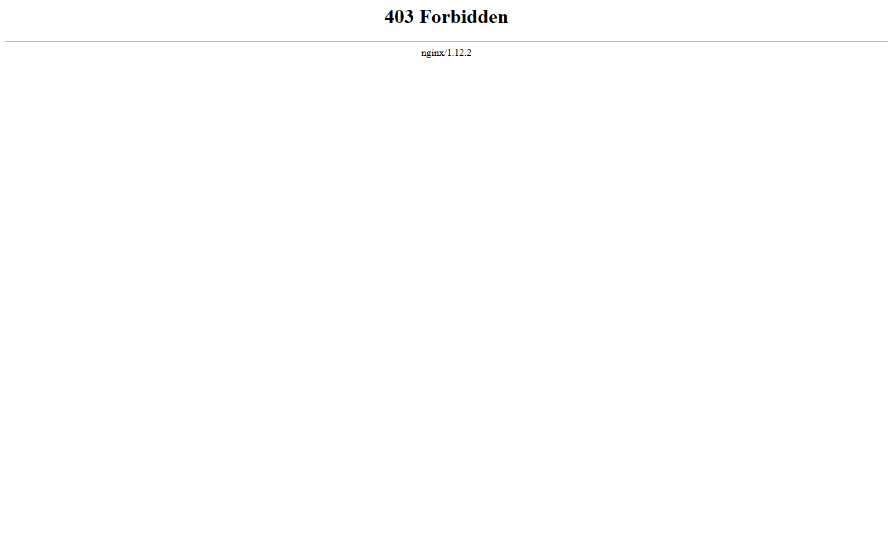

### GUIÓN DOCENTE — Sesión 02: Creatividad/innovación en I+D · Design Thinking y técnicas

> **Uso:** guion de locución de **esta** clase. Léalo en voz alta casi literal.
> Estudie primero el Fundamento Teórico. **Duración: 60 minutos**.
> Logística de semestre (fechas, grupos, cortes) → Presentación del Curso / Manual.
> **PPTX:** `Clases/Sesion 02 - Creatividadinnovación en I+D · Design Thinking y técnicas/Presentacion.pptx` — en cada fase se indica la slide de ESA presentación.

📌 **De esta sesión**
- **Sesión:** **02** · **Tema:** Creatividad/innovación en I+D · Design Thinking y técnicas
- **Detalle:** Pensamiento divergente/convergente · ideación.
- **PPTX estudiante:** `Clases/Sesion 02 - Creatividadinnovación en I+D · Design Thinking y técnicas/Presentacion.pptx`
- **Meet (serie del curso):** [URL Meet — mismo enlace toda la serie · CREATIVIDAD Y PENSAMIENTO INNOVADOR]

⏱️ **Evaluación de esta sesión en CDigital** *(ítems reales del libro de calificaciones)*

| Ítem en el aula | Tipo | Corte | Peso | Qué pasa en esta sesión |
| :--- | :--- | :---: | ---: | :--- |
| **Quiz 1** | Cuestionario | 1 | 6% | **Cierra hoy** — se aplica en clase (~12 min reservados en el plan) |

> **Abierto todo el periodo (hoy no cierra):** **ACA Final** (Tarea · 32,8% · corte 3). Es el producto acumulativo: cada sesión le agrega una sección, así que el avance de hoy es parte de esa entrega.
> **Reserva de tiempo:** el plan de clase de abajo ya trae la fase de evaluación (**12 min**) y el resto de las fases están recortadas para que la hora siga sumando lo mismo. No es tiempo adicional.
> **En este guion no van fechas de periodo.** El aviso dice *hoy*, *antes del próximo encuentro* o *ya cerró*: las fechas exactas están en la Presentación del Curso, en el enunciado del ítem y en el propio ítem de CDigital.

🗺️ **Slides de esta presentación** (deck real: **22 slides** — no es el mapa del curso)

| Slide | Título en el PPTX |
| :---: | :--- |
| **1** | SESIÓN 02 — Creatividad/innovación en I+D · Design Thinking y técnicas |
| **2** | El problema que resolvimos... y que nadie tenía |
| **3** | Qué es Design Thinking (y qué NO es) |
| **4** | Las cinco etapas del Design Thinking |
| **5** | El doble diamante: abrir y cerrar, dos veces |
| **6** | Divergir y converger son dos oficios distintos |
| **7** | How Might We: la bisagra entre problema y solución |
| **8** | How Might We: la bisagra entre problema y solución (cont.) |
| **9** | HMW mal escrito vs. HMW bien escrito |
| **10** | Ejemplo modelado (1/2): un HMW y diez ideas sin filtrar |
| **11** | Ejemplo modelado (1/2): un HMW y diez ideas sin filtrar (cont.) |
| **12** | Ejemplo modelado (2/2): convergemos con tres criterios |
| **13** | SCAMPER: siete preguntas para no quedarse en blanco |
| **14** | Dos técnicas más para que hable todo el grupo |
| **15** | Errores frecuentes y mitos que hay que desarmar |
| **16** | Errores frecuentes y mitos que hay que desarmar (cont.) |
| **17** | Paso a paso: su boceto en Excalidraw en 5 minutos |
| **18** | TALLER — Ideación sobre su propio problema (22 minutos) |
| **19** | Antes de entregar: revise usted mismo |
| **20** | Para continuar — trabajo autónomo |
| **21** | Para continuar — trabajo autónomo (cont.) |
| **22** | Cierre — Sesión 02 |

> Los **momentos** del plan de clase (Portada, OBJETIVOS, CONTENIDO CLAVE, TALLER, PARA CONTINUAR, Cierre) son los del guion, no números de slide: el deck real tiene más slides y su orden está en la tabla de arriba.

🎯 **Objetivos de la sesión**
1. **Describir** las cinco etapas del Design Thinking (DT) en una versión operable, no decorativa.
2. **Practicar** pensamiento divergente y, por separado, pensamiento convergente.
3. **Redactar** un *How Might We* (HMW) centrado en el usuario y el dolor de su propuesta.
4. **Generar** mínimo 8 ideas y **elegir** 1–2 para un prototipo conceptual (boceto).
5. **Actualizar** la Propuesta de Innovación con el HMW y el boceto de hoy.

---

📚 **Fundamento Teórico para el Docente** *(estudiar ANTES de la clase)*

> Este apartado asume que usted **no** es especialista en Design Thinking. Léalo completo: las definiciones, la analogía del doble diamante y los ejemplos de aquí son los que dirá en voz alta.

#### 1. Qué es Design Thinking (y por qué a un ingeniero le sirve)
**Design Thinking (DT)** es un enfoque de resolución de problemas **centrado en las personas**, popularizado por la consultora **IDEO** y la **d.school de Stanford**. Su idea central es simple pero incómoda para quien viene de Ingeniería: **primero se entiende profundamente al usuario y su problema; la solución se pospone**. El ingeniero promedio salta al “cómo lo construyo” en el minuto uno; DT lo obliga a quedarse un rato más en el “qué le duele y a quién”.

No es una receta lineal: es **iterativo**. Se avanza, se prueba con un usuario, se descubre que el problema estaba mal planteado y se retrocede. Ese ir y volver no es fracaso, es el método funcionando. En el aula lo trabajamos en cinco etapas:

| Etapa | Pregunta | Producto mínimo |
| :--- | :--- | :--- |
| **Empatizar** | ¿Qué vive y siente el usuario? | Notas de observación/entrevista |
| **Definir** | ¿Cuál es el problema real? | Pregunta *How Might We* (HMW) |
| **Idear** | ¿Qué alternativas hay? | Lista amplia sin juzgar |
| **Prototipar** | ¿Cómo se ve/toca la idea? | Boceto, storyboard, mock feo |
| **Evaluar / testear** | ¿Qué aprendimos al mostrarlo? | 3 aprendizajes del usuario |

Hoy el foco fuerte es **Definir + Idear**. La **empatía** no se dictó en clase: la S01 fue de encuadre y lo que el estudiante trae es su **problema escrito en tres líneas** (a quién le pasa y dónde lo vio) más la **lectura autónoma de U1–U2**. Cuente con eso y no con más: si alguien llega sin observación de usuario, sirve igual para arrancar. El prototipo de hoy puede ser solo conceptual (un boceto feo en Excalidraw).

> **U1–U2 (lectura autónoma) se retoma aquí, en dos minutos y de viva voz** — es lo que promete el encuadre. No hay slides de esa unidad en el deck y **no se dicta**: se pregunta qué se llevaron y se conecta con el HMW de hoy. Los dos ganchos que sí sirven: *creatividad se entrena, no se tiene* (por eso hoy se practica divergir y converger) y *el bloqueador más común es juzgar la idea antes de escribirla* (la regla sagrada de la fase de ideación).

#### 2. Divergencia y convergencia — el “doble diamante”
La imagen que mejor funciona en clase es el **doble diamante**: se **abre** (divergencia) y se **cierra** (convergencia) **dos veces** — una para entender el problema y otra para construir la solución.

- **Pensamiento divergente:** ampliar opciones. Importa la **cantidad** y se acepta la rareza. Regla sagrada: **prohibido juzgar**. Una idea mala dicha en voz alta suele ser el trampolín de una buena.
- **Pensamiento convergente:** filtrar y decidir con **criterios explícitos**: deseabilidad (¿lo quiere el usuario?), factibilidad (¿lo podemos hacer en el semestre?) y viabilidad (¿se sostiene?).

El error clásico —y el que usted verá hoy en clase— es **converger a los 30 segundos**: alguien propone algo y otro dice “eso no se puede”. Ahí mataron la idea antes de que naciera. Su trabajo como docente es **separar los dos momentos en el tiempo**: “ahora solo generamos; en cinco minutos filtramos”.

#### 3. How Might We (HMW) — la bisagra entre problema y solución
El HMW es la frase que traduce un problema en un **reto accionable**. Fórmula:

**¿Cómo podríamos [acción] para [usuario] de modo que [resultado deseado]?**

- Mal (mira la tecnología): “¿Cómo hacemos una app con IA?”
- Bien (mira al usuario y el dolor): “¿Cómo podríamos **reducir la incertidumbre de reserva de laboratorio** para que **el estudiante de Ingeniería** **no pierda su hora de práctica**?”

Un buen HMW no es tan amplio que no se pueda atacar (“¿cómo salvamos la educación?”) ni tan estrecho que ya contenga la solución (“¿cómo hacemos un botón de reserva?”). Es el punto medio que abre espacio para muchas ideas.

#### 4. Técnicas de ideación (para que no se queden mirando la hoja en blanco)
- **SCAMPER** — una batería de siete preguntas para forzar variaciones sobre el problema: **S**ustituir, **C**ombinar, **A**daptar, **M**odificar, **P**oner en otro uso, **E**liminar, **R**eordenar. Ejemplo en Ingeniería: “¿Y si *eliminamos* el paso de reserva y el sistema asigna el equipo automáticamente por horario?”.
- **Brainwriting (6-3-5):** en vez de gritar ideas, cada quien escribe 3 ideas en silencio y las pasa; evita que hable solo el extrovertido y multiplica el volumen.
- **Analogías:** “¿Cómo resuelve este dolor otra industria?” (turnos de banco, reservas de restaurante, casilleros de gimnasio). Trasplantar soluciones de otro sector es una fuente enorme de innovación.

#### 5. Del boceto al prototipo conceptual (herramientas gratis + nube)
Un prototipo no es la app terminada: es **lo mínimo para que otro entienda y opine**. Cajitas y flechas en **Excalidraw** (https://excalidraw.com, sin cuenta), un **storyboard** de 4 viñetas, o el journey en una **plantilla free de Miro** bastan. Si Miro pide login, el plan B siempre es Excalidraw o **tldraw**. El **IDEO Design Kit** se usa **solo como referencia visual** si carga; nunca instalen software ni exijan cuentas de pago.

#### 6. Errores frecuentes / preguntas trampa

| Error o pregunta trampa del estudiante | Respuesta sugerida del docente |
| :--- | :--- |
| “Design Thinking es solo llenar post-its de colores.” | “Los post-its son el envase. El método es *entender antes de resolver* e *iterar con el usuario*. Sin usuario, es manualidad.” |
| “Ya sé la solución, ¿para qué idear más?” | “Porque tu primera idea es la más obvia y la que ya existe. La divergencia te da 2 alternativas mejores en 10 minutos.” |
| “Mi HMW es: ¿cómo hago una app?” | “Eso ya es una solución disfrazada de pregunta. Reescríbelo: ¿cómo podríamos [resultado] para [usuario]? La app quizá ni sea la respuesta.” |
| “Prototipar es programar la versión 1.” | “No. Prototipar es lo más barato que responde tu duda más cara. Un dibujo en Excalidraw es un prototipo válido hoy.” |
| “Esa idea es ridícula, no la anoto.” | “Anótala igual. La idea rara #7 casi siempre destraba la idea seria #8.” |

---

🧭 **Plan de Clase por Fases** — *Total: 60 min*

| Fase | Minutos | Reloj sugerido (desde el inicio) |
| :--- | :---: | :--- |
| 1️⃣ Encuadre + retomada de U1–U2 y puente desde el encuadre | 6 | min 00:00 – 06:00 |
| 2️⃣ Design Thinking + divergente/convergente | 11 | min 06:00 – 17:00 |
| 3️⃣ Modelación de ideación (HMW + SCAMPER) | 12 | min 17:00 – 29:00 |
| 4️⃣ Taller: ideación sobre su problema | 12 | min 29:00 – 41:00 |
| 5️⃣ Quiz 1 en CDigital (se aplica en clase) | 12 | min 41:00 – 53:00 |
| 6️⃣ Cierre + trabajo autónomo | 7 | min 53:00 – 60:00 |

> **Suma:** **60 minutos** exactos.

---

#### 1️⃣ Encuadre + retomada de U1–U2 y puente desde el encuadre (~6 min) — Protagonista: Docente
**Momento del deck:** Portada → OBJETIVOS

**Objetivo de la fase:** cerrar la lectura autónoma de U1–U2 con dos ganchos y conectar el problema que traen escrito con el reto de hoy (definir un HMW e idear).

**GUION LITERAL:**
> “Buenas tardes. Hoy es la **Sesión 02** y el tema es **Design Thinking y técnicas de creatividad**. Empiezo cumpliendo lo que prometí el primer día: la lectura autónoma de las unidades **1 y 2** —Propuesta de Innovación, y creatividad e inteligencia emocional— la **retomamos aquí**, no la dictamos. Y me la llevo en dos frases: la creatividad **se entrena**, no se tiene; y el bloqueador que más ideas mata es **juzgarlas antes de escribirlas**. Guárdense la segunda, porque en veinte minutos la van a necesitar.”

> “Lo otro que traían era su **problema en tres líneas**: a quién le pasa y dónde lo vieron. Hoy lo convertimos en dos cosas concretas: un **How Might We** bien redactado y un **banco de al menos 8 ideas** con 1 o 2 elegidas.”

> “Miren la **slide 2 — OBJETIVOS**. No venimos a llenar post-its bonitos: venimos a practicar un músculo —abrir muchas ideas y luego cerrar con criterio— que van a usar toda su vida profesional. Al final de la hora, su Propuesta de Innovación tendrá un reto claro y un primer boceto.”

**Qué hacer:**
1. (2 min) Portada + control de audio/nombres en Meet.
2. (2 min) Retomar U1–U2 con los dos ganchos y leer objetivos (slide 2). No dictar la unidad: no hay slides de U1–U2 en este deck y el tiempo es del taller.
3. (2 min) Pedir en el chat de Meet que 2 personas peguen su problema en una frase (a quién le pasa y dónde lo vieron).

---

#### 2️⃣ Design Thinking + divergente/convergente (~11 min) — Protagonista: Docente
**Momento del deck:** CONTENIDO CLAVE → ENFOQUE DE HOY

**Objetivo de la fase:** que entiendan el ciclo DT y, sobre todo, que **divergir y converger son dos momentos distintos** que no se mezclan.

**GUION LITERAL:**
> “Design Thinking no es un póster bonito: es un ciclo para **no enamorarnos de la primera solución**. Empatizar → Definir → Idear → Prototipar → Evaluar. Y ojo: no es una escalera, es un ciclo. Uno prueba, descubre que el problema estaba mal y vuelve atrás. Eso no es perder tiempo, es el método haciendo su trabajo.”

> “La regla de oro de hoy está en la **slide 4**: primero **divergimos** —muchas ideas, cero juicios— y **después** convergemos —elegimos con criterios—. Si juzgan mientras idean, es como manejar con el freno de mano puesto. Imagínense una lluvia de ideas donde cada propuesta recibe un ‘eso no sirve’: a los dos minutos nadie habla. Por eso separamos los momentos: ahora abrimos, luego cerramos.”

> “Y para pasar del problema a las ideas usamos una bisagra: el **How Might We**. La fórmula es ‘¿Cómo podríamos [acción] para [usuario] de modo que [resultado]?’. Ejemplo del laboratorio: en vez de ‘¿cómo hago una app?’, decimos ‘¿cómo podríamos reducir la incertidumbre de reserva para que el estudiante no pierda su hora de práctica?’. ¿Ven la diferencia? La segunda deja espacio para muchas soluciones; la primera ya me encerró en una.”

**Qué hacer:**
1. (5 min) Explicar el ciclo de 5 etapas con la tabla del fundamento.
2. (4 min) Explicar el doble diamante: abrir/cerrar dos veces; insistir en “prohibido juzgar” durante la divergencia.
3. (4 min) Enseñar la fórmula HMW con el ejemplo del laboratorio y un contraejemplo (“¿cómo hago una app?”).

---

> **En pantalla:** Mostrar etapas DT; plan B: Excalidraw si Miro pide login.

> **En pantalla:** Escribir 1 How Might We y 10 ideas en voz alta.

#### 3️⃣ Modelación de ideación — HMW + SCAMPER (~12 min) — Protagonista: Docente
**Momento del deck:** CONTENIDO CLAVE

**Objetivo de la fase:** mostrar en vivo cómo se generan muchas ideas sin juzgar y cómo se filtran después con criterios.

**Modelar EN VIVO** (en Excalidraw o una plantilla free de Miro, compartiendo pantalla): escriba **1 HMW** y genere **en voz alta 10 ideas** mezclando serias y disparatadas —incluya 2 absurdas a propósito—. Luego pase a SCAMPER una o dos preguntas (“¿y si *eliminamos* el paso de reserva?”). Al final, **converja**: filtre a 2 ideas usando tres criterios visibles en pantalla —impacto en el dolor, factibilidad en el semestre, aprendizaje rápido—.

**GUION LITERAL:**
> “Miren cómo se hace. Este es mi HMW —lo escribo aquí— y ahora voy a soltar diez ideas sin filtrar. Algunas van a ser malas a propósito: ‘un semáforo gigante en la puerta del laboratorio’, ‘un mayordomo que asigna equipos’… Anótenlas todas. ¿Por qué? Porque la idea del mayordomo, si le quito lo absurdo, es en realidad ‘asignación automática por horario’. La idea loca destrabó una seria.”

> “Ahora **convergemos**. De estas diez, me quedo con dos usando tres criterios que escribo aquí en pantalla: ¿cuánto alivia el dolor?, ¿la puedo probar este semestre?, ¿aprendo rápido si la muestro? La que no pase ningún criterio, la suelto sin culpa.”

**Qué hacer:**
1. (7 min) Generar 10 ideas en pantalla sin juzgar; aplicar 1–2 preguntas SCAMPER.
2. (5 min) Converger a 2 ideas con los tres criterios visibles; pensar en voz alta al descartar.

---

> **En pantalla:** Solo si carga bien; si no, continuar en Excalidraw/Miro free.

#### 4️⃣ Taller: ideación sobre su problema (~12 min) — Protagonista: Estudiantes
**Momento del deck:** ACTIVIDAD / TALLER

**GUION LITERAL (consigna):**
> “Pasamos a la **slide 5 — TALLER**. Tienen **12 minutos** y trabajan sobre SU problema. Cuatro pasos: (1) redacten **su HMW** con la fórmula de la pizarra; (2) generen **mínimo 8 ideas** —solos o en dúo— sin juzgar ninguna; (3) **elijan 1 o 2** y justifíquenlas con los tres criterios; (4) hagan un **boceto de 1 minuto** en Excalidraw —cajitas y flechas, feo está bien—. Al final le pido a **tres personas** que lean **solo su HMW** en 20 segundos. Criterio de éxito: si su HMW menciona al usuario y el dolor —y no la tecnología— vamos bien.”

**Tabla de acompañamiento:**

| Si el estudiante… | Usted responde… |
| :--- | :--- |
| Escribe el HMW empezando por la tecnología | “Bórralo y empieza por el usuario: ¿para quién y para aliviar qué?” |
| Se queda con 3 ideas y dice “ya no hay más” | “Usa SCAMPER: ¿qué pasa si combinas dos? ¿si eliminas un paso? Sácame 5 más.” |
| Juzga sus propias ideas mientras las escribe | “Ahora estamos abriendo. Anota todo, hasta lo ridículo; filtramos en 5 minutos.” |
| Elige la idea sin justificar | “¿Con qué criterio la elegiste: alivia el dolor, es factible o aprendes rápido?” |
| No sabe dibujar el boceto | “No es arte: son cajitas y flechas. En 60 segundos, ¿cómo se ve el flujo?” |

---

#### 5️⃣ Quiz 1 en CDigital (se aplica en clase) (~12 min) — Protagonistas: Estudiantes + Docente
> **Replaneación de hoy (la hora no crece):** la fase de evaluación toma **12 min** y por eso se recortan: Design Thinking + divergente/convergente 13→11 min, Taller: ideación sobre su problema 22→12 min. Donde la consigna del taller diga otra cantidad de minutos, manda el plan de clase.

**Sin slides nuevas.** Se comparte la pantalla del aula solo para mostrar dónde está el cuestionario; el resto de la fase el Docente no proyecta nada.

**Antes de abrirlo (1 min, con el aula ya en pantalla):**
- Verificar que **Quiz 1** esté **visible** para el grupo y con la configuración prevista: número de intentos, tiempo límite, orden aleatorio de preguntas y retroalimentación **diferida** (que no muestre respuestas antes del cierre).
- Decir en voz alta la regla de conexión: si se cae el internet, **no se cierra la pestaña** y se avisa al Docente por el canal del curso **mientras la ventana sigue abierta**; después del cierre ya no hay nada que hacer desde el aula.
- Recordar que es **individual**: el Docente responde fallas técnicas, no contenido.

**GUION LITERAL:**
> “Guarden lo que estén escribiendo. Los próximos **doce minutos** son para **Quiz 1**, que es un **cuestionario en CDigital** y **cierra hoy**: no queda abierto para la noche ni para mañana.”
> “Pesa **6%** del curso dentro del **corte 1**, que vale **30%**. El resto del corte 1 lo aportan **Parcial 1** (24%). Con esto ya saben por qué no es un trámite.”
> “Ruta exacta: entran al aula del curso en CDigital, la sección del **corte 1** del aula, y abren el ítem **Quiz 1**. Cuando terminen, la plataforma tiene que decirles **enviado**: un intento empezado y no enviado cuenta como no presentado.”
> “Yo me quedo en el Meet con el micrófono abierto **solo** para fallas técnicas. Preguntas de contenido no las respondo mientras el cuestionario corre; las dejamos para el cierre.”

**Qué hace el Docente mientras corre (~9 min):** mirar el chat del Meet, anotar quién reporta falla técnica (nombre y hora: es la evidencia para cualquier reclamación posterior) y **no** empezar a calificar todavía. Si el grupo termina antes, se adelanta el cierre de la sesión: no se rellena con contenido nuevo.

**Si alguien no lo presenta:** el estudiante avisa **antes** del cierre por el canal del curso; el Docente verifica en el aula si el intento quedó abierto y resuelve con el reglamento en la mano. Nada se arregla “después” por WhatsApp ni por correo personal.

**Cierre de la fase (1 min):** “¿Todos vieron el mensaje de **enviado**? Quien NO lo haya visto, escríbalo en el chat ahora, no cuando ya se haya cerrado.”

> **El orden lo decide el Docente:** si el grupo llega disperso, esta fase se puede aplicar justo después del encuadre y dejar el taller al final; lo que no se puede es dejarla sin tiempo propio.

#### 6️⃣ Cierre + trabajo autónomo (~7 min) — Protagonista: Docente
**Momento del deck:** PARA CONTINUAR → Cierre

**GUION LITERAL:**
> “Tres ideas de hoy: (1) **primero entiendo, después resuelvo**; (2) **divergir y converger son momentos distintos**, no los mezclo; (3) un buen **HMW** mira al usuario, no a la tecnología.”

> “**PARA CONTINUAR.** Trabajo autónomo: (a) suban a CDigital su HMW + banco de ideas + boceto como `S02_Ideacion_Apellido`; (b) mejoren el boceto con una segunda mirada; (c) traigan a la próxima sesión una **clasificación tentativa** de su idea en un tipo de innovación —producto, proceso, organización, marketing o social—, que es justo lo que veremos con el Manual de Oslo.”

> “**Cierre.** La próxima clase es **Gestión de la innovación con el Manual de Oslo**. Mismo Meet. Buen trabajo.”

**Qué hacer:**
1. (3 min) Recoger 3 HMW en voz alta y corregir amablemente si empiezan por la tecnología.
2. (2 min) Enunciar el trabajo autónomo y el nombre del archivo.
3. (2 min) Anunciar el tema de la próxima sesión.

---

🧩 **Actividad práctica / taller (resumen del entregable de hoy)**

**Nombre:** Ideación DT (HMW + banco de ideas + boceto) — insumo de la Propuesta de Innovación.

1. Redactar el HMW con la fórmula usuario/dolor/resultado.
2. Generar mínimo 8 ideas (divergencia) y elegir 1–2 con tres criterios (convergencia).
3. Boceto de 1 minuto en Excalidraw (o plantilla free de Miro).
4. **Criterio de éxito:** el HMW se centra en usuario y dolor (no en “hacer una app”).
5. **Entregable:** `S02_Ideacion_Apellido` en CDigital (HMW + ideas + captura del boceto).
6. **Trabajo autónomo:** clasificación tentativa del tipo de innovación para la próxima sesión.

---

✅ **Checklist del docente antes de clase**
- [ ] **Quiz 1** (Cuestionario · 6% · corte 1) publicado en CDigital con intentos, tiempo límite y retroalimentación diferida ya configurados
- [ ] Pantallazos en `Guiones/Capturas/` abiertos
- [ ] Leí el Fundamento Teórico completo
- [ ] Abrí `Clases/Sesion 02 - Creatividadinnovación en I+D · Design Thinking y técnicas/Presentacion.pptx`
- [ ] Tengo Excalidraw abierto (y una plantilla free de Miro como opción)
- [ ] Tengo listo mi HMW y mis 10 ideas modelo para la demostración
- [ ] Publiqué en CDigital el espacio de entrega `S02_Ideacion`
- [ ] Meet listo: [URL Meet — mismo enlace toda la serie · CREATIVIDAD Y PENSAMIENTO INNOVADOR]

---
*Fin del Guión — Sesión 02. Documento autocontenido: un docente sin trayectoria en innovación puede estudiarlo y dictar la hora completa.*
