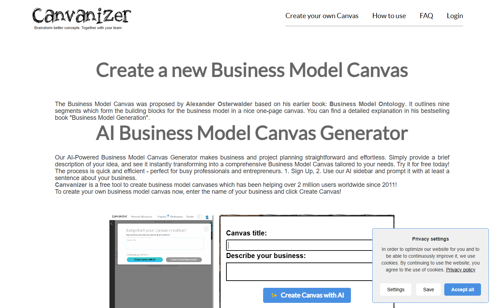
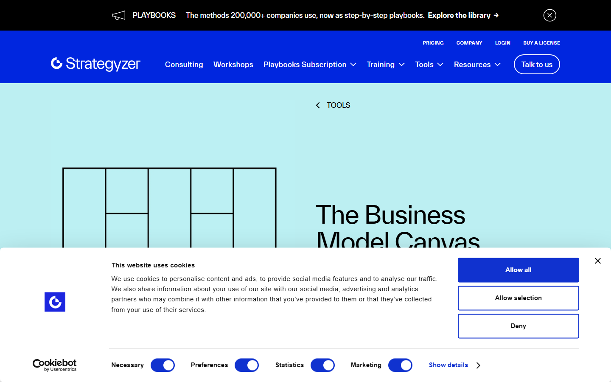

### GUIÓN DOCENTE — Sesión 05: Análisis de negocios · validación de la propuesta

> **Uso:** guion de locución de **esta** clase. Léalo en voz alta casi literal.
> Estudie primero el Fundamento Teórico. **Duración: 60 minutos**.
> Logística de semestre (fechas, grupos, cortes) → Presentación del Curso / Manual.
> **PPTX:** `Clases/Sesion 05 - Análisis de negocios · validación de la propuesta/Presentacion.pptx` — en cada fase se indica la slide de ESA presentación.

📌 **De esta sesión**
- **Sesión:** **05** · **Tema:** Análisis de negocios · validación de la propuesta
- **Detalle:** FODA, Canvas, MVP · sustentación de propuesta.
- **PPTX estudiante:** `Clases/Sesion 05 - Análisis de negocios · validación de la propuesta/Presentacion.pptx`
- **Meet (serie del curso):** [URL Meet — mismo enlace toda la serie · CREATIVIDAD Y PENSAMIENTO INNOVADOR]

🗺️ **Slides de esta presentación** (tema de hoy — no es el mapa del curso)

| Slide | Título en el PPTX | Cuándo usarla |
| :---: | :--- | :--- |
| **1** | Portada (SESIÓN NN — tema) | Apertura |
| **2** | OBJETIVOS | Encuadre |
| **3** | CONTENIDO CLAVE | Exposición y modelación |
| **4** | ENFOQUE DE HOY | Anclaje del tema |
| **5** | ACTIVIDAD / TALLER | Consigna del taller |
| **6** | PARA CONTINUAR | Trabajo autónomo |
| **7** | Cierre | Despedida |

🎯 **Objetivos de la sesión**
1. **Usar** el FODA como radiografía rápida y verificable (sin prosa vacía).
2. **Completar** un Business Model Canvas **mínimo** centrado en la propuesta de valor.
3. **Definir** un MVP (producto mínimo viable) de **aprendizaje**, no una “app completa”.
4. **Diseñar** una prueba de validación para el supuesto más riesgoso, con criterio de éxito medible.

---

📚 **Fundamento Teórico para el Docente** *(estudiar ANTES de la clase)*

> Este apartado asume que usted **no** viene de negocios. Léalo completo: FODA, Canvas, MVP y la cadena de validación son las herramientas con las que la propuesta deja de ser un ensayo y empieza a sostenerse.

#### 1. FODA (DAFO) — la radiografía rápida
**FODA** = **F**ortalezas, **O**portunidades, **D**ebilidades, **A**menazas. Fortalezas y Debilidades son **internas** (dependen de usted/su equipo); Oportunidades y Amenazas son **externas** (del entorno). Regla de oro: cada ítem debe ser **específico y verificable**, no un adjetivo bonito.

- Mal: “Fortaleza: somos creativos.” (no se puede verificar).
- Bien: “Fortaleza: tenemos acceso a 30 usuarios del laboratorio esta semana.” (concreto y comprobable).

Un FODA de 6 bullets bien escritos vale más que uno de 20 frases genéricas. Su función no es decorar: es **decidir dónde apoyarse y qué vigilar**.

#### 2. Business Model Canvas (Osterwalder) — foco de aula
El **Business Model Canvas (BMC)** de Alexander Osterwalder es un lienzo de **9 bloques** que describe cómo una propuesta **crea, entrega y captura valor**. No exija una obra maestra; en una hora priorice los bloques que más aclaran la propuesta:

| # | Bloque | Pregunta clave |
| :--- | :--- | :--- |
| 1 | **Segmento de clientes** | ¿Para quién es (quién usa)? |
| 2 | **Propuesta de valor** | ¿Qué dolor alivia o qué gana el usuario? |
| 3 | **Canales** | ¿Cómo llega la propuesta al usuario? |
| 4 | **Relación con el cliente** | ¿Cómo se capta y se retiene? |
| 5 | **Actividades clave** | ¿Qué hay que hacer sí o sí? |
| 6 | **Recursos clave** | ¿Qué se necesita (datos, gente, infra)? |
| 7 | **Socios clave** | ¿Quién ayuda desde afuera? |
| 8 | **Estructura de costos** | ¿Qué cuesta (aunque sea cualitativo)? |
| 9 | **Fuentes de ingreso** | ¿Quién paga o cómo se sostiene (si es social)? |

En clase se trabaja en **Canvanizer** (https://canvanizer.com/new/business-model-canvas, gratis, en la nube). **Strategyzer** solo se muestra como referencia visual; el trabajo real se hace en Canvanizer, Excalidraw o Google Docs. Prioridad mínima de hoy: **propuesta de valor, segmento, canales y actividades clave**.

#### 3. MVP — Producto Mínimo Viable (de aprendizaje)
El **MVP** es la versión **más pequeña** que permite **aprender** de un usuario real. **No** es “la app fea pero completa” ni “la fase 1 del software grande”. Ejemplos válidos y baratos:

- Una **landing page** con un botón y una lista de espera (¿cuánta gente se anota?).
- Un **prototipo clicable** (pantallas enlazadas, sin backend).
- Un **piloto manual tipo “concierge”**: usted hace a mano lo que después haría el sistema, para ver si el usuario lo valora.
- Un **storyboard** probado con 5 usuarios.

La pregunta que responde un MVP no es “¿funciona el código?”, sino “¿esto le importa a alguien?”.

#### 4. La cadena de validación
Validar es una cadena corta y disciplinada:

**Supuesto → Riesgo si es falso → Prueba → Criterio de éxito → Decisión (seguir / pivotar / parar)**

Se empieza por el supuesto **más riesgoso**: aquel que, si es falso, tumba el proyecto. No se valida con opiniones de amigos; se valida con el **segmento real** y un **criterio medible u observable** definido de antemano (para no “ver lo que quiero ver”).

#### 5. Errores frecuentes / preguntas trampa

| Error o pregunta trampa del estudiante | Respuesta sugerida del docente |
| :--- | :--- |
| “Mi FODA: fortaleza, somos creativos.” | “Eso no se verifica. Cámbialo por un hecho: ‘acceso a 30 usuarios esta semana’.” |
| “El MVP es la app terminada pero sin diseño.” | “No. El MVP es lo más barato que responde tu duda más cara. Una landing o un prototipo en papel sirve.” |
| “Ya validé: a mis amigos les gustó.” | “Tus amigos no son el segmento y no te dirán que no. Prueba con usuarios reales y un criterio medible.” |
| “Lleno el Canvas con frases generales.” | “Un Canvas genérico no decide nada. Sé concreto en propuesta de valor y segmento.” |
| “¿Para qué elegir un solo supuesto?” | “Porque el tiempo es finito. Valida primero el que, si es falso, tumba todo el proyecto.” |

---

🧭 **Plan de Clase por Fases** — *Total: 60 min*

| Fase | Minutos | Reloj sugerido (desde el inicio) |
| :--- | :---: | :--- |
| 1️⃣ Encuadre + puente desde la sesión anterior | 5 | min 00:00 – 05:00 |
| 2️⃣ FODA + Business Model Canvas + MVP | 14 | min 05:00 – 19:00 |
| 3️⃣ Modelación de validación (supuesto → prueba) | 12 | min 19:00 – 31:00 |
| 4️⃣ Taller: mini-Canvas + plan MVP | 22 | min 31:00 – 53:00 |
| 5️⃣ Cierre + pista de sustentación | 7 | min 53:00 – 60:00 |

> **Suma:** **60 minutos** exactos.

---

#### 1️⃣ Encuadre + puente desde la sesión anterior (~5 min) — Protagonista: Docente
**Slides:** 1 (Portada) → 2 (OBJETIVOS)

**Objetivo de la fase:** anunciar que hoy la propuesta pasa de idea argumentada a idea **sostenible y validada**.

**GUION LITERAL:**
> “Buenas tardes. **Sesión 05**: **Análisis de negocios y validación**. Aquí la propuesta deja de ser un ensayo y empieza a **sostenerse**: con un FODA honesto, un Canvas mínimo y —lo más importante— una **prueba** al supuesto más peligroso. La sesión pasada les pedí una lista de supuestos; hoy elegimos el más riesgoso y lo ponemos a prueba.”

> “Miren la **slide 2 — OBJETIVOS**. Salen de la hora con un mini-Canvas, un MVP descrito en 5 líneas y una prueba de validación con criterio de éxito medible.”

**Qué hacer:**
1. (2 min) Portada + control de audio/nombres en Meet.
2. (2 min) Leer objetivos (slide 2).
3. (1 min) Pedir a 1–2 estudiantes que lean uno de sus supuestos.

---

#### 2️⃣ FODA + Business Model Canvas + MVP (~14 min) — Protagonista: Docente
**Slides:** 3 (CONTENIDO CLAVE) → 4 (ENFOQUE DE HOY)

**Objetivo de la fase:** que sepan qué es cada herramienta y para qué sirve, sin convertirlo en teoría de administración.

**GUION LITERAL:**
> “**Slide 3.** Tres herramientas, una detrás de otra. Primero el **FODA**: cuatro cajas —fortalezas y debilidades internas, oportunidades y amenazas externas—. Regla única: cada frase debe poderse verificar. ‘Somos creativos’ no vale; ‘tengo 30 usuarios a la mano esta semana’ sí.”

> “Segundo, el **Business Model Canvas**: nueve bloques que cuentan cómo su propuesta crea y entrega valor. Hoy no lleno los nueve; me concentro en cuatro que aclaran todo: **propuesta de valor, segmento, canales y actividades clave**. Lo trabajamos en Canvanizer, gratis y en el navegador.”

> “**Slide 4.** Y el **MVP**. Aquí está la analogía que quiero que recuerden: **no construyan el edificio entero para saber si alguien quiere vivir ahí; armen la maqueta que responde la duda más cara**. El MVP no es la app terminada; es lo más pequeño que me enseña si a alguien le importa: una landing con lista de espera, un prototipo clicable, un piloto hecho a mano.”

**Qué hacer:**
1. (5 min) Explicar FODA con la regla “específico y verificable”.
2. (6 min) Recorrer el Canvas priorizando 4 bloques; mencionar Canvanizer.
3. (3 min) Definir MVP con la analogía del edificio/maqueta.

---

> **En pantalla:** Abrir https://canvanizer.com/new/business-model-canvas; llenar 3 bloques clave en vivo.

> **En pantalla:** Solo referencia; el trabajo se hace en Canvanizer/Excalidraw/Docs.

#### 3️⃣ Modelación de validación: supuesto → prueba (~12 min) — Protagonista: Docente
**Slides:** 3 (CONTENIDO CLAVE)

**Objetivo de la fase:** mostrar la cadena completa de validación con un ejemplo cronometrable.

Tome el caso del laboratorio de turnos y escriba en pantalla (Canvanizer/Excalidraw/Docs) la cadena:

- **Supuesto riesgoso:** “Los estudiantes registrarían la reserva si el flujo toma menos de 1 minuto.”
- **Riesgo si es falso:** nadie usa el sistema y el problema sigue igual.
- **Prueba:** 5 estudiantes cronometran un prototipo en papel o clicable.
- **Criterio de éxito:** ≥ 4 de 5 completan en menos de 60 s y dicen que lo usarían cada semana.
- **Decisión:** si pasa, seguir; si no, pivotar el flujo o parar.

**GUION LITERAL:**
> “Miren la cadena completa. No digo ‘voy a validar mi idea’ en abstracto. Digo: este es el supuesto que si es falso me hunde; esta es la prueba concreta; y —clave— **defino el criterio de éxito ANTES de probar**, para no engañarme viendo lo que quiero ver. Cuatro de cinco en menos de un minuto: pasa. Tres de cinco: no pasa, y toca pivotar.”

**Qué hacer:**
1. (7 min) Escribir la cadena supuesto → prueba → criterio → decisión en pantalla.
2. (5 min) Insistir en fijar el criterio de éxito antes de la prueba; pedir un ejemplo oral a un estudiante.

---

> **En pantalla:** FODA 4 cuadrantes + hipótesis de MVP en 5 líneas.

> **En pantalla:** Pegar captura o texto del Canvas y subir a CDigital.

#### 4️⃣ Taller: mini-Canvas + plan MVP (~22 min) — Protagonista: Estudiantes
**Slides:** 5 (ACTIVIDAD / TALLER)

**GUION LITERAL (consigna):**
> “Pasamos a la **slide 5 — TALLER**. Tienen **22 minutos**. Cuatro entregas: (1) un **FODA** de máximo 6 bullets en total, todos verificables; (2) un **Canvas mínimo** en Canvanizer con al menos propuesta de valor, segmento, canales y actividades clave; (3) su **MVP descrito en 5 líneas** —qué es lo mínimo que van a mostrar—; (4) **una prueba de validación** de su supuesto más riesgoso, con criterio numérico u observable. Al final dos personas comparten solo su prueba y su criterio. Éxito: la prueba tiene un criterio que se pueda medir.”

**Tabla de acompañamiento:**

| Si el estudiante… | Usted responde… |
| :--- | :--- |
| Escribe un FODA con adjetivos vagos | “‘Somos buenos’ no se mide. Dame un hecho verificable para cada casilla.” |
| Describe el MVP como la app completa | “Recórtalo: ¿cuál es la versión más pequeña que te dice si a alguien le importa?” |
| Pone una prueba sin criterio de éxito | “¿Cómo sabrás si pasó? Fija el número o la observación ANTES de probar.” |
| Va a validar con amigos | “Tus amigos no son el segmento. ¿Quién es el usuario real que puedes tocar esta semana?” |
| Se pierde llenando los 9 bloques | “Hoy solo 4: valor, segmento, canales y actividades. El resto queda para después.” |

---

#### 5️⃣ Cierre + pista de sustentación (~7 min) — Protagonista: Docente
**Slides:** 6 (PARA CONTINUAR) → 7 (Cierre)

**GUION LITERAL:**
> “Tres ideas de hoy: (1) el **FODA** solo sirve si es verificable; (2) el **MVP** es la maqueta que responde la duda más cara, no el edificio; (3) validar es **supuesto → prueba → criterio → decisión**, con el criterio fijado antes.”

> “**Slide 6 — PARA CONTINUAR.** Autónomo: (a) suban su Canvas + MVP + prueba como `S06_CanvasMVP_Apellido`; (b) **ejecuten la prueba** aunque sea con 3 usuarios y traigan los resultados a la próxima sesión. Eso alimenta directamente su sustentación.”

> “**Slide 7 — Cierre.** La próxima clase es **Vigilancia tecnológica**, para que su MVP no viva en una burbuja. Mismo Meet. Gracias.”

**Qué hacer:**
1. (3 min) Escuchar 2 pruebas y verificar que tengan criterio medible.
2. (2 min) Enunciar el trabajo autónomo (ejecutar la prueba) y el nombre del archivo.
3. (2 min) Anunciar el tema de la próxima sesión.

---

🧩 **Actividad práctica / taller (resumen del entregable de hoy)**

**Nombre:** Mini-Canvas + MVP + prueba de validación — insumo de la Propuesta de Innovación.

1. FODA de máximo 6 bullets verificables.
2. Canvas mínimo en Canvanizer (valor, segmento, canales, actividades).
3. MVP descrito en 5 líneas + 1 prueba del supuesto más riesgoso con criterio medible.
4. **Criterio de éxito:** supuesto riesgoso + prueba concreta + criterio de éxito definido de antemano.
5. **Entregable:** `S06_CanvasMVP_Apellido` en CDigital.
6. **Trabajo autónomo:** ejecutar la prueba con al menos 3 usuarios y traer resultados.

---

✅ **Checklist del docente antes de clase**
- [ ] Pantallazos en `Guiones/Capturas/` abiertos
- [ ] Leí el Fundamento Teórico completo
- [ ] Abrí `Clases/Sesion 05 - Análisis de negocios · validación de la propuesta/Presentacion.pptx`
- [ ] Abrí Canvanizer (https://canvanizer.com/new/business-model-canvas) para modelar en vivo
- [ ] Tengo la cadena de validación del caso laboratorio lista para escribir
- [ ] Publiqué en CDigital el espacio de entrega `S06_CanvasMVP`
- [ ] Meet listo: [URL Meet — mismo enlace toda la serie · CREATIVIDAD Y PENSAMIENTO INNOVADOR]

---
*Fin del Guión — Sesión 05. Documento autocontenido: un docente sin trayectoria en innovación puede estudiarlo y dictar la hora completa.*
