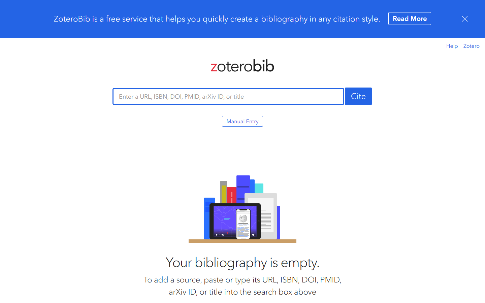

### GUIÓN DOCENTE — Sesión 03: Prueba parcial · 1.er avance del artículo

> **Uso:** guion de locución de **esta** clase. Léalo en voz alta casi literal.
> Estudie primero el Fundamento Teórico. **Duración: 60 minutos**.
> Logística de semestre → Presentación del Curso / Manual. **Sin fechas de periodo.**
> **PPTX:** `Clases/Sesion 03 - Prueba parcial · 1.er avance del artículo/Presentacion.pptx`

📌 **De esta sesión**
- **Sesión:** **03** · **Tema:** Prueba parcial · 1.er avance del artículo
- **Detalle:** Talleres/sustentaciones · tipos de conocimiento y fuentes.
- **PPTX estudiante:** `Clases/Sesion 03 - Prueba parcial · 1.er avance del artículo/Presentacion.pptx`
- **Meet (serie del curso):** [URL Meet — mismo enlace toda la serie · INVESTIGACIÓN, CIENCIA Y TECNOLOGÍA]

⏱️ **Evaluación de esta sesión en CDigital** *(ítems reales del libro de calificaciones)*

| Ítem en el aula | Tipo | Corte | Peso | Qué pasa en esta sesión |
| :--- | :--- | :---: | ---: | :--- |
| **Parcial 1** | Cuestionario | 1 | 24% | **Cierra hoy** — se aplica en clase (~22 min reservados en el plan) |

> **Abierto todo el periodo (hoy no cierra):** **ACA Final** (Tarea · 32,8% · corte 3). Es el producto acumulativo: cada sesión le agrega una sección, así que el avance de hoy es parte de esa entrega.
> **Reserva de tiempo:** el plan de clase de abajo ya trae la fase de evaluación (**22 min**) y el resto de las fases están recortadas para que la hora siga sumando lo mismo. No es tiempo adicional.
> **En este guion no van fechas de periodo.** El aviso dice *hoy*, *antes del próximo encuentro* o *ya cerró*: las fechas exactas están en la Presentación del Curso, en el enunciado del ítem y en el propio ítem de CDigital.

🗺️ **Slides de esta presentación** (deck real: **24 slides** — no es el mapa del curso)

| Slide | Título en el PPTX |
| :---: | :--- |
| **1** | SESIÓN 03 — PRUEBA PARCIAL · 1.ER AVANCE DEL ARTÍCULO |
| **2** | Bajemos la ansiedad: el avance no es media tesis |
| **3** | Qué es y qué NO es el primer avance |
| **4** | Las cuatro piezas del avance (y su error típico) |
| **5** | El título: fórmula y ejemplos |
| **6** | La introducción en tres párrafos: contexto → vacío → propósito |
| **7** | La introducción en tres párrafos: contexto → vacío → propósito (cont.) |
| **8** | Ejemplo modelado: introducción escrita completa |
| **9** | Tipos de conocimiento (esto suele caer en el parcial) |
| **10** | Tipos de fuente: primaria, secundaria y terciaria |
| **11** | Wikipedia, blogs e IA generativa: qué se puede y qué no |
| **12** | Wikipedia, blogs e IA generativa: qué se puede y qué no (cont.) |
| **13** | Qué evalúa la prueba parcial |
| **14** | Qué evalúa la prueba parcial (cont.) |
| **15** | Paso a paso: sus referencias en APA 7 con ZoteroBib |
| **16** | Paso a paso: sus referencias en APA 7 con ZoteroBib (cont.) |
| **17** | TALLER · Escribir el 1.er avance |
| **18** | TALLER · cómo se revisa y dónde se entrega |
| **19** | Checklist antes de subir su entrega |
| **20** | Checklist antes de subir su entrega (cont.) |
| **21** | Trabajo autónomo · para la próxima sesión |
| **22** | Trabajo autónomo · para la próxima sesión (cont.) |
| **23** | RUTA DE ENTREGABLES DEL CURSO |
| **24** | Cierre — Sesión 03 |

> Los **momentos** del plan de clase (Portada, OBJETIVOS, CONTENIDO CLAVE, TALLER, PARA CONTINUAR, Cierre) son los del guion, no números de slide: el deck real tiene más slides y su orden está en la tabla de arriba.

🎯 **Objetivos de la sesión**
1. **Aclarar** qué evalúa la prueba escrita parcial y qué debe contener el **1.er avance** del artículo.
2. **Distinguir** tipos de conocimiento (cotidiano, empírico, científico) y tipos de fuentes (primaria, secundaria, terciaria).
3. **Entregar** un borrador mínimo viable: título + introducción breve + problema/pregunta + primeras referencias.

---

📚 **Fundamento Teórico para el Docente** *(estudiar ANTES de la clase)*

#### 1. Qué es el 1.er avance (y qué NO es)
El primer avance **no** es "media tesis". Es un **borrador mínimo viable**: título tentativo, una introducción breve, el problema/pregunta y 2–3 referencias. Repita el lema del curso: **calidad > extensión**. Media página bien planteada vale más que cinco de relleno.

#### 2. Estructura mínima del artículo en este punto
| Sección del avance | Qué va | Error típico |
| :--- | :--- | :--- |
| Título tentativo | Actor + fenómeno + contexto en ≤ 20 palabras | Título-eslogan sin variables |
| Introducción breve | Contexto → vacío → propósito (3 párrafos) | Empezar con "desde la antigüedad…" |
| Problema y pregunta | El vacío convertido en pregunta investigable | Pregunta de sí/no |
| Referencias iniciales | 2–3 fuentes en APA 7 | Copiar URLs sin formato |

#### 3. Tipos de conocimiento (lo que suele preguntar el parcial)
- **Cotidiano / vulgar:** "sé que llueve porque me mojé." Sin método.
- **Empírico:** basado en experiencia repetida y observación, pero sin sistematizar.
- **Científico:** sistemático, verificable, con método y evidencia. **Es el que sostiene su artículo.**

#### 4. Tipos de fuentes y confiabilidad
- **Primaria:** el estudio original (paper, dataset, norma).
- **Secundaria:** interpreta primarias (revisión, libro de texto).
- **Terciaria:** índices y enciclopedias (guían, no se citan como autoridad).

Regla: Wikipedia y blogs **orientan**, pero **no** son fuente para el artículo.

#### Ejemplo modelo para clase
Introducción de 3 párrafos: contexto de las prácticas de laboratorio → vacío (sin datos de pérdida de paquetes) → propósito del artículo.

#### Errores frecuentes
| Error frecuente / pregunta trampa | Qué responde el docente |
| :--- | :--- |
| “Más páginas = mejor nota en el avance.” | No: se evalúa el planteamiento claro. Media página sólida gana a cinco de relleno. |
| “Cito Wikipedia y un blog.” | Orientan, no son fuente. Lleve la referencia a una primaria o secundaria confiable. |
| “La introducción arranca con 'desde la antigüedad el ser humano…'.” | Arranque en el contexto real del problema, no en la historia universal. |
| “Conocimiento empírico y científico son lo mismo.” | El empírico observa; el científico sistematiza, verifica y usa método. |

---

🧭 **Plan de Clase por Fases** — *Total: 60 min*

| Fase | Minutos | Reloj sugerido (desde el inicio) |
| :--- | :---: | :--- |
| 1️⃣ Encuadre criterios del avance | 8 | min 00:00 – 08:00 |
| 2️⃣ Estructura mínima del artículo | 7 | min 08:00 – 15:00 |
| 3️⃣ Modelación de introducción | 7 | min 15:00 – 22:00 |
| 4️⃣ Taller de escritura | 8 | min 22:00 – 30:00 |
| 5️⃣ Parcial 1 en CDigital (se aplica en clase) | 22 | min 30:00 – 52:00 |
| 6️⃣ Cierre / entrega | 8 | min 52:00 – 60:00 |

> **Suma:** **60 minutos** exactos.

---

#### 1️⃣ Encuadre criterios del avance (~8 min) — Portada y objetivos
**Protagonista:** Docente.

**GUION LITERAL:**
> “Sesión 03, y es una sesión bisagra: hoy trabajamos la **prueba parcial** y el **primer avance** del artículo. Quiero bajarles la ansiedad de una vez: el avance no es media tesis, es un **borrador mínimo viable** bien planteado.”

> “**OBJETIVOS.** Vamos a: aclarar qué evalúa el parcial, repasar tipos de conocimiento y de fuentes —porque suelen caer— y salir con el borrador del avance empezado. Tengan abierto su Doc con el tema y la línea de las sesiones anteriores.”

#### 2️⃣ Estructura mínima del artículo (~7 min) — Exposición del concepto
**Protagonista:** Docente (exposición).

**GUION LITERAL:**
> “**CONTENIDO CLAVE.** El avance tiene cuatro piezas: título, introducción breve, problema/pregunta y primeras referencias. Solo cuatro. Y una regla que voy a repetir todo el semestre: **calidad sobre extensión**.”

> “Ahora la parte conceptual que suele caer en el parcial. Tipos de conocimiento: el **cotidiano** —me mojé, luego llueve—, el **empírico** —lo he visto muchas veces— y el **científico** —lo mido, lo verifico, uso método—. Su artículo se sostiene en el tercero.”

> “**ENFOQUE DE HOY.** Y los tipos de fuente: **primaria** es el estudio original; **secundaria** lo interpreta; **terciaria** es un índice o enciclopedia. Wikipedia orienta, pero no se cita como autoridad. Todo esto no es para memorizar: es para que su avance tenga fuentes que aguanten una revisión.”

#### 3️⃣ Modelación de introducción (~7 min) — Modelación en pantalla
**Protagonista:** Docente (modela en Google Docs).

**En pantalla (Google Docs):** escriba una introducción de 3 párrafos en vivo.

**GUION LITERAL:**
> “Modelo una introducción con la estructura **contexto → vacío → propósito**. Párrafo 1, contexto: 'En los laboratorios de redes se realizan prácticas que dependen de una conexión estable…'. Párrafo 2, vacío: 'Sin embargo, no se ha caracterizado con datos la pérdida de paquetes en el laboratorio X…'. Párrafo 3, propósito: 'Este artículo busca describir esa pérdida y su impacto en las prácticas.'”

> “Vean lo que **no** hice: no empecé con 'desde la antigüedad el ser humano se comunica'. Arranqué en el problema real. Ese es el estándar del curso.”

> **En pantalla:** Escribir en vivo 3 párrafos: contexto / vacío / propósito. Señalar qué NO hacer (arranque histórico).

#### 4️⃣ Taller de escritura (~8 min) — Taller
**Protagonista:** Estudiantes (taller) · Docente acompaña.

**GUION LITERAL (consigna):**
> “**TALLER.** ~8 minutos. En `S03_Avance1_Apellido` escriban las cuatro piezas: (1) título tentativo con actor+fenómeno+contexto; (2) introducción de 3 párrafos contexto→vacío→propósito; (3) el problema convertido en una pregunta; (4) dos referencias en APA 7 usando ZoteroBib. Prefiero media página impecable a tres de relleno.”

> “Criterio de éxito: si leo su introducción sin conocer su tema, entiendo el contexto, el vacío y qué se proponen.”

**Acompañamiento:**
| Si el estudiante… | Usted responde… |
| :--- | :--- |
| Escribe una intro larguísima | “Recorte a 3 párrafos: contexto, vacío, propósito.” |
| No tiene referencias | “Vamos a ZoteroBib: pegue un DOI o título y genere el APA.” |
| Su pregunta se responde sí/no | “Reformule con 'cómo', 'qué' o 'en qué medida'.” |
| Copia una definición de un blog | “Lléveme a una fuente primaria o secundaria; el blog no cuenta.” |

> **En pantalla:** Pegar 1 DOI/URL → generar APA 7 → copiar a Google Docs. Sin instalar Zotero de escritorio.

#### 5️⃣ Parcial 1 en CDigital (se aplica en clase) (~22 min) — Protagonistas: Estudiantes + Docente
> **Replaneación de hoy (la hora no crece):** la fase de evaluación toma **22 min** y por eso se recortan: Estructura mínima del artículo 12→7 min, Modelación de introducción 10→7 min, Taller de escritura 22→8 min. Donde la consigna del taller diga otra cantidad de minutos, manda el plan de clase.

**Sin slides nuevas.** Se comparte la pantalla del aula solo para mostrar dónde está el cuestionario; el resto de la fase el Docente no proyecta nada.

**Antes de abrirlo (1 min, con el aula ya en pantalla):**
- Verificar que **Parcial 1** esté **visible** para el grupo y con la configuración prevista: número de intentos, tiempo límite, orden aleatorio de preguntas y retroalimentación **diferida** (que no muestre respuestas antes del cierre).
- Decir en voz alta la regla de conexión: si se cae el internet, **no se cierra la pestaña** y se avisa al Docente por el canal del curso **mientras la ventana sigue abierta**; después del cierre ya no hay nada que hacer desde el aula.
- Recordar que es **individual**: el Docente responde fallas técnicas, no contenido.

**GUION LITERAL:**
> “Guarden lo que estén escribiendo. Los próximos **veintidós minutos** son para **Parcial 1**, que es un **cuestionario en CDigital** y **cierra hoy**: no queda abierto para la noche ni para mañana.”
> “Pesa **24%** del curso dentro del **corte 1**, que vale **30%**. El resto del corte 1 lo aportan **Quiz 1** (6%). Con esto ya saben por qué no es un trámite.”
> “Ruta exacta: entran al aula del curso en CDigital, la sección del **corte 1** del aula, y abren el ítem **Parcial 1**. Cuando terminen, la plataforma tiene que decirles **enviado**: un intento empezado y no enviado cuenta como no presentado.”
> “Yo me quedo en el Meet con el micrófono abierto **solo** para fallas técnicas. Preguntas de contenido no las respondo mientras el cuestionario corre; las dejamos para el cierre.”

**Qué hace el Docente mientras corre (~19 min):** mirar el chat del Meet, anotar quién reporta falla técnica (nombre y hora: es la evidencia para cualquier reclamación posterior) y **no** empezar a calificar todavía. Si el grupo termina antes, se adelanta el cierre de la sesión: no se rellena con contenido nuevo.

**Si alguien no lo presenta:** el estudiante avisa **antes** del cierre por el canal del curso; el Docente verifica en el aula si el intento quedó abierto y resuelve con el reglamento en la mano. Nada se arregla “después” por WhatsApp ni por correo personal.

**Cierre de la fase (1 min):** “¿Todos vieron el mensaje de **enviado**? Quien NO lo haya visto, escríbalo en el chat ahora, no cuando ya se haya cerrado.”

> **El orden lo decide el Docente:** si el grupo llega disperso, esta fase se puede aplicar justo después del encuadre y dejar el taller al final; lo que no se puede es dejarla sin tiempo propio.

#### 6️⃣ Cierre / entrega (~8 min) — Cierre y trabajo autónomo
**Protagonista:** Docente.

**GUION LITERAL:**
> “Cerramos. Tres ideas: (1) el avance son cuatro piezas bien hechas, no muchas páginas; (2) el conocimiento que sostiene el artículo es el **científico**; (3) mandan las fuentes primarias y secundarias, no los blogs.”

> “**PARA CONTINUAR.** Suban `S03_Avance1_Apellido` a CDigital. Y revisen en CDigital el **detalle de la evaluación de este corte** —el desglose oficial vive allí—. La próxima sesión afinamos el corazón del artículo: **identificar el problema y formular la pregunta**.”

> “**Cierre.** Gracias; mismo Meet.”

---

🧩 **Entregable de hoy**
1. En Google Docs (`S03_Avance1_Apellido`): título tentativo + introducción de 3 párrafos (contexto→vacío→propósito) + pregunta + 2 referencias en APA 7 con ZoteroBib.
2. Archivo en CDigital: `S03_Avance1_Apellido` en CDigital.
3. Herramientas: gratis + nube (Docs, Scholar, ZoteroBib, Excalidraw y —solo en la Sesión 01— el Padlet o el juego en Slido, según el tamaño del grupo).
4. Pantallazos de apoyo en `Docente/Guiones/Capturas/` (y subcarpetas `Sesion NN/` / `Herramientas/`).

✅ **Checklist del docente antes de clase**
- [ ] **Parcial 1** (Cuestionario · 24% · corte 1) publicado en CDigital con intentos, tiempo límite y retroalimentación diferida ya configurados
- [ ] Fundamento teórico leído
- [ ] PPTX `Clases/Sesion 03 - Prueba parcial · 1.er avance del artículo/Presentacion.pptx`
- [ ] Pantallazos de esta sesión abiertos (carpeta `Docente/Guiones/Capturas/`)
- [ ] Ejemplo modelo listo para compartir pantalla
- [ ] Espacio de entrega en CDigital
- [ ] Meet: [URL Meet — mismo enlace toda la serie · INVESTIGACIÓN, CIENCIA Y TECNOLOGÍA]

---
*Fin del Guión — Sesión 03. Autocontenido para dictar 60 minutos.*
