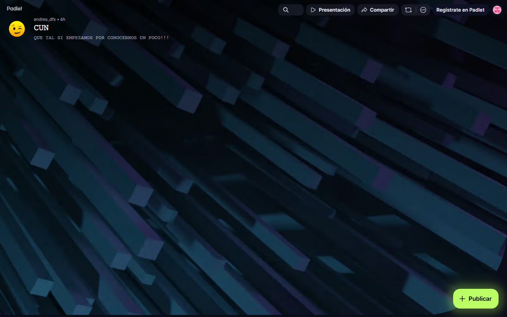

### GUIÓN DOCENTE — Sesión 01: Presentación del curso · docente · estudiantes · ACAs

> **Uso:** guion de la sesión de **encuadre**. Hoy **no se dicta tema**: se presenta el curso, el Docente, el grupo y las ACAs.
> El contenido del Syllabus arranca en la **Sesión 02**; las unidades **U1–U2** quedan como **lectura autónoma** de esta semana.
> Léalo en voz alta casi literal. **Duración: 60 minutos**.
> Logística de semestre → Presentación del Curso / Manual. **Sin fechas de periodo.**
> **PPTX:** `Clases/Sesion 01 - Presentación del curso · docente · estudiantes · ACAs/Presentacion.pptx`

📌 **De esta sesión**
- **Sesión:** **01** · **Tema:** Presentación del curso · docente · estudiantes · ACAs
- **Detalle:** Encuadre: presentación del curso, del Docente, de los estudiantes y de las ACAs (peso, fechas, formato). No se dicta tema.
- **PPTX estudiante:** `Clases/Sesion 01 - Presentación del curso · docente · estudiantes · ACAs/Presentacion.pptx`
- **Meet (serie del curso):** [URL Meet — mismo enlace toda la serie · INVESTIGACIÓN, CIENCIA Y TECNOLOGÍA]

> **Rompehielos Padlet:** slide **PRESÉNTATE** (QR + URL). Es el **mismo tablero y el mismo momento** que el de la Presentación del Curso —la Sesión 01 *es* la sesión de presentación—, no dos rompehielos distintos. URL: https://padlet.com/andres_dfx/cun-wruz81hmf9k06gd7
> Este curso conserva el muro porque tiene **20 estudiantes**: veinte notas se leen enteras en pantalla. En los grupos de más de 20 el rompehielos es un **juego en Slido**.

⏱️ **Evaluación de esta sesión en CDigital** *(ítems reales del libro de calificaciones)*

| Ítem en el aula | Tipo | Corte | Peso | Qué pasa en esta sesión |
| :--- | :--- | :---: | ---: | :--- |
| **Quiz 1** | Cuestionario | 1 | 6% | **Abre hoy** la ventana en CDigital |
| **ACA Final** | Tarea | 3 | 32,8% | **Abre hoy** la ventana en CDigital |

**Cómo anunciarlo (guion literal, en el cierre de la clase — no en el último minuto):**
> “Aviso de plataforma: **Quiz 1** ya está **abierto** en CDigital, en la sección del corte 1. Es un **cuestionario** y vale **6%** del curso. Ábranlo hoy mismo aunque no lo vayan a resolver todavía: así saben cuántas preguntas tiene y cuánto tiempo les da.”
> “Aviso de plataforma: **ACA Final** ya está **abierto** en CDigital, en la sección del corte 3. Es un **tarea** y vale **32,8%** del curso. Ábranlo hoy mismo aunque no lo vayan a resolver todavía: así saben cuántas preguntas tiene y cuánto tiempo les da.”

> **Nómbrelos como están en el aula.** En el libro de calificaciones de este curso hay: **corte 1** (30%): **Quiz 1** (cuestionario, 6%), **Parcial 1** (cuestionario, 24%); **corte 2** (30%): **Quiz 2** (cuestionario, 9%), **Parcial 2** (cuestionario, 21%); **corte 3** (40%): **ACA Final** (tarea, 32,8%), **Quiz 3** (cuestionario, 4%), **Autoevaluación** (cuestionario, 1,6%), **Coevaluación** (foro, 1,6%). Úselos con **esos** nombres: son los que el estudiante va a buscar en CDigital. (La antigua numeración «ACA 1 / ACA 2 / ACA 3» quedó anulada el 10/08/2026 y ya no aparece en ningún deck; si alguien la menciona, remítalo a esta lista.)
> **En este guion no van fechas de periodo.** El aviso dice *hoy*, *antes del próximo encuentro* o *ya cerró*: las fechas exactas están en la Presentación del Curso, en el enunciado del ítem y en el propio ítem de CDigital.

🗺️ **Slides de esta presentación** (deck de **encuadre**, 21 slides — no es el mapa del curso)

| Slide | Título en el PPTX | Fase |
| :---: | :--- | :---: |
| **1** | Portada — Sesión 01 | 1 |
| **2** | AGENDA DE HOY | 1 |
| **3** | Docente | 1 |
| **4** | PRESÉNTATE — ROMPEHIELOS (QR + Padlet) | 2 |
| **5** | CÓMO SE EVALÚA — LOS ÍTEMS DEL AULA | 4 |
| **6** | Cómo trabajamos: una hora en vivo, el resto en su documento | 3 |
| **7** | Mapa del curso: las 6 sesiones | 3 |
| **8** | Qué se llevan al final: un artículo | 3 |
| **9** | Este es un periodo corto: qué implica | 3 |
| **10** | Corte por corte: qué hay en el aula y qué se prepara | 4 |
| **11** | Cómo se entrega, paso a paso | 4 |
| **12** | Integridad académica | 4 |
| **13** | Inteligencia artificial generativa | 4 |
| **14** | Herramientas del curso | 4 |
| **15** | Cómo pedir ayuda | 4 |
| **16** | Acuerdos de convivencia | 5 |
| **17** | Preguntas frecuentes del primer día | 5 |
| **18** | Lo que debe tener listo para la Sesión 02 | 5 |
| **19** | ACUERDOS DE TRABAJO | 5 |
| **20** | PARA LA PRÓXIMA SESIÓN | 5 |
| **21** | Cierre — Sesión 01 | 5 |

🎯 **Objetivos de la sesión**
1. **Encuadrar** el curso: cómo se usa la hora sincrónica, qué se hace en trabajo autónomo y cuál es el producto final (**un artículo**).
2. **Presentar** al Docente y conocer al grupo, dejando a cada estudiante en el Padlet oficial.
3. **Explicar** las ACAs, la ruta de entrega en CDigital y las reglas de integridad académica y de uso de IA generativa.
4. **Cerrar** con acuerdos de trabajo y con el encargo autónomo: **lectura de U1–U2** + ficha de tema tentativo.

---

🧰 **Preparación del Docente ANTES de la clase** *(hoy no hay tema que estudiar: hay logística que dejar lista)*

> Esta sesión se cae si el Padlet no abre, si el espacio de entrega no existe o si usted no puede mostrar en pantalla los **ítems reales del libro de calificaciones** (Quiz 1 6% + Parcial 1 24% en el primer corte). Todo lo de abajo se deja listo **antes** de entrar al Meet.

#### 1. Qué debe tener abierto y probado
| Qué | Para qué lo necesita hoy |
| :--- | :--- |
| Aula del curso en **CDigital**, con el espacio de entrega de la Sesión 01 creado | Va a proyectar dónde se sube el encargo; nada de “luego les aviso” |
| **Presentación del Curso** (`Clases/Presentacion del Curso - ….pptx`) | Slide **PRESÉNTATE** (QR + Padlet) y logística de periodo (grupo, fechas, evaluación) |
| **Esta deck** (`Clases/Sesion 01 - …/Presentacion.pptx`) | Es el hilo de la hora: 21 slides, en orden |
| **Padlet oficial** abierto y probado en una pestaña | Rompehielos; el link se pega en el chat apenas empiece |
| **Libro de calificaciones** del aula, abierto en otra pestaña | Es la fuente de los nombres, tipos y pesos que va a anunciar hoy: los ítems se muestran, no se describen de memoria |
| Enunciado de la **ACA Final** (`Clases/Recursos/ACAs/`) | Es la única entrega documental del curso; la **fecha exacta vive ahí y en CDigital**, no en la deck |
| **Plantilla APA CUN** (`Clases/Recursos/`) | Mostrar en vivo cómo se abre en Google Docs, sin instalar Office |
| **Meet** de la serie, 10 minutos antes | Recibir a quien llega temprano y probar audio |
| Lista del grupo | Saludar por nombre y registrar asistencia |

#### 2. Qué NO se hace hoy
**No se dicta tema.** Si alguien pregunta por el método científico o por qué el producto es un artículo, la respuesta es: *“eso es exactamente la lectura de esta semana y lo abrimos en la Sesión 02”*. Adelantar U1–U2 hoy deja la próxima sesión sin sustancia y el encuadre a medias.

#### 3. Los tres mensajes que deben quedar grabados
1. **El producto del curso es un artículo**, y se empieza a construir esta misma semana.
2. **Se entrega en CDigital**, siempre, con la plantilla APA CUN.
3. **Son seis encuentros**: en periodo corto no existe la semana de recuperación.

#### 4. Tono del primer día
Es la única clase donde usted “vende” el curso. Hable despacio, use el nombre de quien participa y explique cada acuerdo **con la razón detrás**, no como lista de prohibiciones. Un encuadre bien hecho ahorra medio periodo de preguntas repetidas.

#### Qué proyectar en pantalla (y en qué orden)
Deje **cinco pestañas** abiertas y páselas en este orden, sin buscar nada en vivo:
**1.** Padlet (rompehielos) → **2.** CDigital, en el espacio de entrega de la sesión → **3.** el **libro de calificaciones** del aula, para leer en pantalla los ítems con su nombre y su peso → **4.** `Clases/Recursos/ACAs/` con el enunciado de la **ACA Final** → **5.** plantilla APA CUN abierta en Google Docs (*Archivo → Abrir con → Documentos de Google*).
Modelar el paso 5 en vivo, treinta segundos, evita la mitad de las preguntas de la primera semana.

#### Si un estudiante pregunta… (dudas reales del primer día)
| Si un estudiante pregunta… | Usted responde… |
| :--- | :--- |
| “¿Hoy no vamos a ver tema?” | “Hoy es el encuadre: cómo trabajamos, cómo se evalúa y quiénes somos. El tema arranca la próxima sesión, y la lectura de esta semana es la base.” |
| “¿Esta materia se pierde fácil?” | “Se pierde por no entregar, casi nunca por escribir mal. Quien entrega los tres cortes, pasa; el riesgo es dejar todo para la última semana.” |
| “¿Puedo trabajar solo o toca en grupo?” | “El artículo de este curso es individual, salvo que el enunciado de la **ACA Final** diga otra cosa. Y los cuestionarios —quices y parciales— son **siempre individuales**.” |
| “¿Los quices y los parciales son en clase?” | “Sí: son cuestionarios de CDigital que cierran el mismo día de la sesión, y por eso les reservo tiempo en clase. El que falte ese día pierde el ítem, así que la asistencia aquí sí pesa en la nota.” |
| “¿Me sirve un trabajo de otro semestre?” | “Puede partir de un tema suyo, pero el texto debe ser nuevo y hay que citar lo que reutilice. Reentregarlo tal cual es falta académica.” |
| “¿La clase se graba?” | Dígalo con claridad según lo que usted vaya a hacer, y aclare lo que sí es fijo: “el material y la consigna quedan siempre en la carpeta de esa sesión, en el **Drive de clases**; CDigital es para entregar y para las notas”. |
| “¿Puedo usar ChatGPT para escribir?” | “Como apoyo sí, y se declara en una línea al final del documento. Pero verifique las fuentes: inventa citas. Lo que usted no pueda explicar en voz alta, no le sirve.” |
| “Todavía no tengo tema, ¿estoy mal?” | “No. Hoy nadie tiene tema definitivo. Salga con una frase tentativa; en la Sesión 02 la afinamos con la línea de investigación.” |
| “¿Dónde entrego?” | “Solo en CDigital, en el espacio de la sesión. Lo que llegue por WhatsApp o correo personal no cuenta como entregado.” |

---

🧭 **Plan de Clase por Fases** — *Total: 60 min*

| Fase | Minutos | Reloj sugerido (desde el inicio) |
| :--- | :---: | :--- |
| 1️⃣ Apertura, agenda y presentación del Docente | 10 | min 00:00 – 10:00 |
| 2️⃣ Preséntate: rompehielos en Padlet | 10 | min 10:00 – 20:00 |
| 3️⃣ Recorrido del curso: cómo trabajamos y qué se llevan | 14 | min 20:00 – 34:00 |
| 4️⃣ Cómo se evalúa (quices, parciales y ACA Final), entrega e integridad | 18 | min 34:00 – 52:00 |
| 5️⃣ Acuerdos, encargo autónomo y cierre | 8 | min 52:00 – 60:00 |

> **Suma:** **60 minutos** exactos.

---

#### 1️⃣ Apertura, agenda y presentación del Docente (~10 min) — Slides 1–3 (Portada · AGENDA · Docente)
**Protagonista:** Docente.

**GUION LITERAL:**
> “Buenas tardes y bienvenidos a Investigación, Ciencia y Tecnología. Soy el Docente que los va a acompañar este periodo. Aclaro algo de una vez: **hoy no vamos a ver tema**. Hoy vamos a entender cómo funciona este curso, qué se entrega, cómo se evalúa y quién es quién. El contenido arranca en la próxima sesión.”

> “**Slide 2 — AGENDA DE HOY.** El orden es este: les cuento de qué se trata el curso y cómo trabajamos; me presento; se presentan ustedes en un tablero; vemos las ACAs, es decir qué se entrega y cuánto pesa; y cerramos con los acuerdos y con la tarea de esta semana. Una hora exacta, sin dictado.”

> “**Slide 3 — Docente.** Un minuto sobre mí, para que sepan a quién le están escribiendo.” [Preséntese con las credenciales de la slide: formación, experiencia y una frase de por qué le interesa la investigación aplicada.] “Mi correo está en pantalla: úsenlo para novedades personales. Todo lo académico va por CDigital, porque ahí queda registro y lo ven todos.”

**Cómo se maneja este arranque:** salude por nombre a quien va entrando (no solo “presentes”); es el primer gesto de que aquí nadie es un número. Si el grupo está frío, no llene el silencio con más discurso: pase de una vez al Padlet.

#### 2️⃣ Preséntate: rompehielos en Padlet (~10 min) — Slide 4 (PRESÉNTATE — Padlet)
**Protagonista:** Estudiantes (Padlet) · Docente conduce.

**En pantalla:** Presentación del Curso → slide **PRESÉNTATE**, con el QR. URL: https://padlet.com/andres_dfx/cun-wruz81hmf9k06gd7

**GUION LITERAL:**
> “**Slide 4 — PRESÉNTATE.** Ahora los quiero conocer. En pantalla hay un QR y un enlace; lo dejo también en el chat del Meet. Es un tablero colaborativo: pongan un post-it con (a) su nombre, (b) qué esperan de este curso y (c) una idea o un problema de ingeniería que les dé curiosidad. Una frase por punto, no un ensayo. Tienen unos siete minutos y no hay respuestas malas.”

> [Mientras escriben, deje el tablero proyectado y ponga **usted** el primer post-it, narrándolo en voz alta.] “Yo pongo el mío para romper el hielo.”

> “Voy a leer tres o cuatro en voz alta.” [Lea, agradezca por nombre y conecte cada post-it con el curso: *“esto que escribió [nombre] ya suena a tema investigable; lo trabajamos en la Sesión 02”*.]

**Si nadie escribe** — pasa casi siempre el primer día virtual:
| Situación | Qué hace el Docente |
| :--- | :--- |
| Silencio total a los 2 minutos | Escribe un segundo post-it de ejemplo y dice en voz alta lo que está escribiendo. |
| “No me abre el link” | Pega el URL otra vez en el chat y ofrece que lo digan por micrófono; usted lo transcribe al tablero. |
| Post-its de una palabra (“ninguna”) | Pregunta directo, por nombre: “¿qué le gustaría que le sirviera de este curso?”. |
| Alguien pone algo de broma | Se agradece con humor y se reencauza; **no se borra en vivo** delante del grupo. |

> **En pantalla:** Tablero de la Presentación del Curso. Pegue el URL en el chat, ponga usted el primer post-it y lea 3–4 en voz alta (~7 min).

#### 3️⃣ Recorrido del curso: cómo trabajamos y qué se llevan (~14 min) — Slides 6–9 (cómo trabajamos · mapa · producto · periodo corto)
**Protagonista:** Docente (recorrido de la deck).

**GUION LITERAL:**
> “**Slide 6 — Cómo trabajamos.** Este curso son seis encuentros de una hora. Con seis horas no se aprende a investigar oyendo: se aprende escribiendo. El trato es este: ustedes llegan con la lectura hecha, yo explico el criterio en diez o quince minutos, y el resto lo usamos para que cada uno escriba su documento mientras yo paso resolviendo. Por eso les pido siempre dos cosas: el documento abierto y una duda concreta.”

> “**Slide 7 — Mapa del curso.** Miren las seis sesiones. Fíjense en la última columna: ninguna sesión termina en apuntes, todas terminan en algo escrito —la línea, el avance, la pregunta, el planteamiento, el marco—. Y lean la nota de abajo: las unidades 1 y 2 del Syllabus no desaparecen; son la **lectura de esta semana** y las retomamos al abrir la Sesión 02.”

> “**Slide 8 — Qué se llevan al final.** El producto es **un artículo**. No seis trabajos sueltos: uno solo, que crece. Al final debe tener título, introducción, problema, pregunta, marco con fuentes citadas y lista de referencias. ¿Para qué sirve de verdad? Es la semilla de su trabajo de grado y la prueba de que usted puede sostener una idea con evidencia y no con opinión.”

> “**Slide 9 — Este es un periodo corto.** No se lo digo para asustarlos, sino para que se organicen: son seis encuentros, faltar a uno es perder casi la sexta parte del curso, y los avances se acumulan. Si faltan, ese mismo día abran la carpeta de la sesión en el **Drive de clases**: ahí queda la consigna y el material.”

**Pregunte a dos estudiantes:** “¿en qué semana creen que se empieza a escribir el artículo?”. Conviene que la respuesta —**esta semana**— la digan ellos.

#### 4️⃣ Cómo se evalúa (quices, parciales y ACA Final), entrega e integridad (~18 min) — Slides 5 y 10–15 (evaluación real del aula · entrega · integridad · IA · herramientas · ayuda)
**Protagonista:** Docente, compartiendo pantalla (CDigital + libro de calificaciones + plantilla APA).

**GUION LITERAL:**
> “**Slide 5 — Cómo se evalúa este curso.** Miren la tabla, pero escuchen esto porque es lo que decide la nota: en el aula **no hay tres trabajos escritos**. hay **Quiz 1 6% + Parcial 1 24%** en el primer corte, **Quiz 2 9% + Parcial 2 21%** en el segundo y **ACA Final 32,8% + Quiz 3 4% + Autoevaluación 1,6% + Coevaluación 1,6%** en el tercero. Los quices y los parciales son **cuestionarios de CDigital**; la ACA Final es la **única tarea con documento**; y la **coevaluación es un foro**, o sea que hay que escribir en él.”

> “Lo voy a decir de la forma que a ustedes les importa: los **cuestionarios suman 65,6% del curso**, más que el documento. El **Parcial 1**, solo él, vale 24%. Quien viene a clase y responde, pasa; quien se guarda todo para el documento del final, no alcanza.”

> “**Slide 10 — ítem por ítem.** Los quices y los parciales caen **en día de clase**: se abren aquí, tienen tiempo y cierran el mismo día, así que faltar a esa sesión es perder ese ítem. La **ACA Final** es distinta: es el documento acumulativo, se sube en PDF y cierra en la fecha de recepción del periodo. La **autoevaluación** se diligencia y la **coevaluación** se participa; las dos abren al final y son individuales.”

> “Las **fechas exactas no están en esta presentación a propósito**, porque se desactualizan: viven en el ítem de CDigital y en el enunciado. Ábranlas hoy mismo y pásenlas a su calendario con alarma.”

> “**Slide 11 — Cómo se entrega.** Esto es puro procedimiento y les ahorra sustos.” [Hágalo en vivo: abra la plantilla APA CUN en Google Docs, muestre el nombre de archivo `SNN_Tema_Apellido`, descargue como PDF y abra el espacio de entrega en CDigital.] “Apellido en el nombre del archivo, PDF, CDigital. Y verifiquen el estado: **subido no es entregado**.”

> “**Slide 12 — Integridad académica.** Citar no es un adorno: es lo que separa un trabajo académico de un texto de internet. Todo lo que no es suyo se cita en APA 7. Copiar y pegar sin comillas, traducir un texto ajeno o entregar el trabajo de otro es plagio, y eso tiene **debido proceso institucional**; no es algo que yo arregle en privado. El truco práctico es simple: anoten la fuente en el mismo instante en que pegan algo.”

> “**Slide 13 — Inteligencia artificial.** Hablemos claro, porque todos la van a usar. Sí se puede usar para entender un concepto o pulir la redacción de un párrafo que ya escribieron. Se declara en una línea al final del documento. Y hay una regla que no negocio: **verifiquen las fuentes**, porque estas herramientas inventan citas y DOIs que no existen. Si yo les pregunto por qué escribieron algo y no lo pueden explicar, ese párrafo no les sirve.”

> “**Slide 14 — Herramientas.** Todas gratis y en el navegador: Docs, Google Académico, SciELO, Redalyc, la biblioteca CUN, ZoteroBib para las citas, Excalidraw para diagramar y CDigital para entregar. Nadie tiene que comprar ni instalar nada.”

> “**Slide 15 — Cómo pedir ayuda.** Foro de CDigital para lo académico, correo para lo personal, respuesta en días hábiles y siempre antes del siguiente encuentro. Y una petición: pregunten con contexto, con el texto en la mano. Miren los dos ejemplos de la slide y noten la diferencia.”

> **En pantalla:** Modele en vivo: abrir la plantilla con *Archivo → Abrir con → Documentos de Google*, nombrar el archivo `SNN_Tema_Apellido` y descargar como PDF.

#### 5️⃣ Acuerdos, encargo autónomo y cierre (~8 min) — Slides 16–21 (convivencia · dudas · Sesión 02 · acuerdos · cierre)
**Protagonista:** Docente.

**GUION LITERAL:**
> “**Slides 16 y 17 — Convivencia y dudas frecuentes.** Dos minutos de acuerdos: empezamos a la hora, micrófono apagado mientras alguien habla, cámara si su conexión da, y respeto en el foro —se comenta el texto, nunca a la persona—. En la siguiente slide dejé las dudas que siempre salen el primer día; léanlas con calma después.”

> “**Slide 18 — Lo que debe tener listo para la Sesión 02.** Esta es la tarea, y es doble. Primero, la **lectura autónoma**: las unidades 1 y 2 del Syllabus, que están en la carpeta de esta sesión, en el **Drive de clases** —el enlace les llega en el correo de bienvenida—. Media hora de lectura y traen **dos dudas anotadas**. Segundo, escriban su **tema tentativo** en un Google Doc llamado `S01_TemaTentativo_Apellido`: una frase con actor, fenómeno y contexto; dos o tres líneas de por qué les importa; y una fuente que encuentren en Google Académico. Súbanlo a CDigital antes de la próxima clase.”

> “**Slides 19 y 20 — Acuerdos y para la próxima.** Resumo el trato: se entrega en CDigital, se trae el avance escrito y se cita en APA 7. Con esas tres, este curso funciona.”

> “**Slide 21 — Cierre.** Ya saben qué vamos a hacer, cómo se evalúa y quién es quién. La próxima sesión abre con los temas de ustedes en pantalla y con las dudas de la lectura. Gracias, y nos vemos el próximo jueves en el mismo Meet.”

---

🧩 **Encargo autónomo (para la Sesión 02)**
1. **No se hace en clase, es trabajo autónomo:** leer las unidades **U1–U2**, publicadas en la carpeta de la Sesión 01 del **Drive de clases**, y anotar 2 dudas; y redactar en Google Docs la ficha de **tema tentativo** — una frase con actor + fenómeno + contexto, 2–3 líneas de por qué importa y 1 fuente exploratoria de Google Académico.
2. Archivo en CDigital: `S01_TemaTentativo_Apellido` (Google Doc o PDF), **antes de la Sesión 02**.
3. Herramientas: gratis + nube (Docs, Scholar, ZoteroBib, Excalidraw y —solo en la Sesión 01— el Padlet o el juego en Slido, según el tamaño del grupo).
4. Pantallazos de apoyo en `Guiones/Capturas/` (y subcarpetas `Sesion NN/` / `Herramientas/`).

✅ **Checklist del docente antes de clase**
- [ ] **Quiz 1** (Cuestionario · 6% · corte 1) **habilitado hoy** en CDigital y anunciado en clase (su ventana abre en esta sesión)
- [ ] **ACA Final** (Tarea · 32,8% · corte 3) **habilitado hoy** en CDigital y anunciado en clase (su ventana abre en esta sesión)
- [ ] Aula del curso en **CDigital** abierta, con el espacio de entrega de la Sesión 01 creado
- [ ] **Lectura autónoma U1–U2** cargada en `Clases/Sesion 01 - …/` del **Drive de clases** (sin eso el encargo de hoy no se puede cumplir)
- [ ] **Padlet** oficial probado y el link listo para pegar en el chat: https://padlet.com/andres_dfx/cun-wruz81hmf9k06gd7
- [ ] **Presentación del Curso** abierta en la slide PRESÉNTATE (QR)
- [ ] Deck de hoy abierta (`Presentacion.pptx` de la Sesión 01 — 21 slides)
- [ ] **Libro de calificaciones** del aula abierto (nombres, tipos y pesos reales) y enunciado de la **ACA Final** listo para proyectar
- [ ] **Plantilla APA CUN** lista para mostrar en Google Docs
- [ ] Lista del grupo para saludar por nombre y registrar asistencia
- [ ] Meet de la serie abierto **10 minutos antes** (enlace en la ficha de arriba)

---
*Fin del Guión — Sesión 01. Autocontenido para dictar 60 minutos.*
