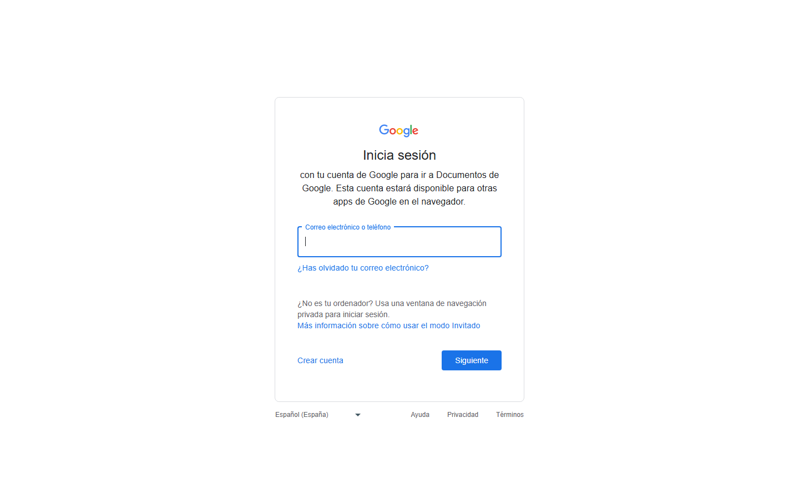
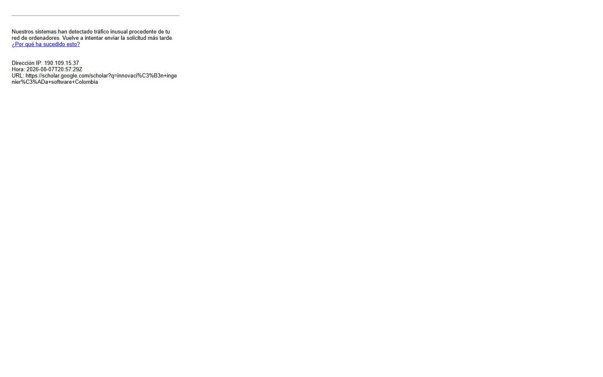

### GUIÓN DOCENTE — Sesión 05: Planteamiento del problema · marco teórico y revisión de literatura

> **Uso:** guion de locución de **esta** clase. Léalo en voz alta casi literal.
> Estudie primero el Fundamento Teórico. **Duración del encuentro: 60 minutos.**
> **Es sesión doble (U7 + U10–U12)**, hoy se aplica el **Parcial 2** y es la **última sincrónica antes del cierre de la ACA Final y del Quiz 3**. La deck da para dos horas y quedan unos 38 minutos de clase: el plan prioriza, la deck es el material de estudio y eso **se dice en voz alta al empezar**.
> Logística de semestre → Presentación del Curso / Manual. **Sin fechas de periodo.**
> **PPTX:** `Clases/Sesion 05 - Planteamiento del problema · marco teórico y revisión de literatura/Presentacion.pptx`

📌 **De esta sesión**
- **Sesión:** **05** · **Tema:** Planteamiento del problema · marco teórico y revisión de literatura
- **Detalle:** U7+U10–U12 en un solo encuentro: estado actual, evidencias, causas y vacío hasta cerrar en la pregunta · constructos, posturas teóricas, fichas de lectura y primera página de marco. Última sincrónica antes del cierre de la ACA Final y del Quiz 3.
- **PPTX estudiante:** `Clases/Sesion 05 - Planteamiento del problema · marco teórico y revisión de literatura/Presentacion.pptx`
- **Meet (serie del curso):** [URL Meet — mismo enlace toda la serie · INVESTIGACIÓN, CIENCIA Y TECNOLOGÍA]

⏱️ **Evaluación de esta sesión en CDigital** *(ítems reales del libro de calificaciones)*

| Ítem en el aula | Tipo | Corte | Peso | Qué pasa en esta sesión |
| :--- | :--- | :---: | ---: | :--- |
| **Parcial 2** | Cuestionario | 2 | 21% | **Cierra hoy** — se aplica en clase (~22 min reservados en el plan) |
| **ACA Final** | Tarea | 3 | 32,8% | Abierto: **cierra antes del próximo encuentro** |
| **Quiz 3** | Cuestionario | 3 | 4% | Abierto: **cierra antes del próximo encuentro** |

**Cómo anunciarlo (guion literal, en el cierre de la clase — no en el último minuto):**
> “**ACA Final** es la **tarea** del corte 3 y **cierra antes del próximo encuentro**: pesa **32,8%**. Es el documento acumulativo, no un trabajo nuevo: se sube en CDigital, en PDF, y quien no lo vea cargado en la plataforma asuma que no está entregado.”
> “Ojo con esto, que es plata: **Quiz 3** es un **cuestionario en CDigital** que **cierra antes del próximo encuentro** y pesa **4%** del curso — todo el corte 3 vale 40%. No cae en clase, así que nadie se lo va a recordar el día del cierre: agéndenlo ustedes hoy. Cuando lo resuelvan, verifiquen que la plataforma diga **enviado**.”

> **Reserva de tiempo:** el plan de clase de abajo ya trae la fase de evaluación (**22 min**) y el resto de las fases están recortadas para que la hora siga sumando lo mismo. No es tiempo adicional.
> **En este guion no van fechas de periodo.** El aviso dice *hoy*, *antes del próximo encuentro* o *ya cerró*: las fechas exactas están en la Presentación del Curso, en el enunciado del ítem y en el propio ítem de CDigital.

🗺️ **Slides de esta presentación** (deck real: **35 slides** — no es el mapa del curso)

| Slide | Título en el PPTX |
| :---: | :--- |
| **1** | SESIÓN 05 — Planteamiento del problema · marco teórico y revisión de literatura |
| **2** | Hoy vestimos la pregunta y la ponemos a conversar |
| **3** | Qué es y qué NO es el planteamiento |
| **4** | La estructura de embudo |
| **5** | La estructura de embudo (cont.) |
| **6** | Los seis componentes del planteamiento |
| **7** | La regla dura de hoy: evidencia, no opinión |
| **8** | ¿De dónde saco evidencia si todavía no recojo datos? |
| **9** | ¿De dónde saco evidencia si todavía no recojo datos? (cont.) |
| **10** | El truco antibloqueo: primero la tabla, después la prosa |
| **11** | El truco antibloqueo: primero la tabla, después la prosa (cont.) |
| **12** | Ejemplo modelado (1/2): la tabla llena |
| **13** | Ejemplo modelado (2/2): del renglón al párrafo |
| **14** | Ejemplo modelado (2/2): del renglón al párrafo (cont.) |
| **15** | Jerarquizar causas y cerrar en la pregunta |
| **16** | Jerarquizar causas y cerrar en la pregunta (cont.) |
| **17** | Del planteamiento al marco: la misma pregunta, otro interlocutor |
| **18** | Del planteamiento al marco: la misma pregunta, otro interlocutor (cont.) |
| **19** | El marco teórico responde a la pregunta, no decora |
| **20** | Constructos: cómo salen de su propia pregunta |
| **21** | Constructos: cómo salen de su propia pregunta (cont.) |
| **22** | Posturas teóricas: cuando dos autores no dicen lo mismo |
| **23** | La ficha de lectura: campos y qué escribir |
| **24** | Cómo se redacta un párrafo de marco (con su plantilla) |
| **25** | Cómo se redacta un párrafo de marco (con su plantilla) (cont.) |
| **26** | Errores frecuentes: planteamiento y marco |
| **27** | Errores frecuentes: planteamiento y marco (cont.) |
| **28** | Paso a paso: las dos secciones, sin bloquearse |
| **29** | Paso a paso: las dos secciones, sin bloquearse (cont.) |
| **30** | TALLER · Planteamiento + primera página de marco (~24 min) |
| **31** | Checklist antes de subir su entrega |
| **32** | Checklist antes de subir su entrega (cont.) |
| **33** | Trabajo autónomo · recta final hacia la ACA Final |
| **34** | Trabajo autónomo · recta final hacia la ACA Final (cont.) |
| **35** | Cierre — Sesión 05 |

> Los **momentos** del plan de clase (Portada, OBJETIVOS, CONTENIDO CLAVE, TALLER, PARA CONTINUAR, Cierre) son los del guion, no números de slide: el deck real tiene más slides y su orden está en la tabla de arriba.

🎯 **Objetivos de la sesión**
1. **Redactar** el planteamiento del problema con sus **seis componentes** en orden —estado actual, evidencias, causas, consecuencias, vacío y pregunta— en prosa y en 1 a 1.5 páginas.
2. **Respaldar** cada afirmación fuerte con **evidencia citada** (cifra, registro o estudio), no con opinión.
3. **Organizar** la primera página de **marco teórico** por **constructos**, y **tomar postura** cuando dos autores no coinciden.
4. **Fichar** cada fuente con la **ficha de lectura** (un RAE breve de cinco campos) y dejar el documento listo para consolidar la **ACA Final**, que cierra antes del próximo encuentro.

---

📚 **Fundamento Teórico para el Docente** *(estudiar ANTES de la clase)*

> **Sesión doble: U7 (planteamiento del problema) + U10–U12 (posturas teóricas, marco teórico y revisión de literatura).** Se adelantaron a hoy porque **la ACA Final se califica con estas dos secciones** y cierra antes de la Sesión 06. Sume el **Parcial 2** dentro de la hora y la cuenta queda clara: **~38 minutos de clase para dos unidades**. No se dictan enteras y no hay que fingir que sí: se entregan los **criterios** y el estudiante escribe con la deck al lado. Dígalo en el primer minuto.

#### 1. Qué es el planteamiento (y qué no es)
Es la sección donde el estudiante **argumenta que su problema existe y merece estudiarse**. Se escribe en **prosa continua**, no en viñetas. **No es la introducción** (esa presenta y ubica; esta **demuestra**), **no es el marco** (aquí no se definen conceptos), **no es la solución** y no es un desahogo. Función real: cuando el lector termina, debe pensar **«tiene razón, esto hay que estudiarlo»**. Extensión de trabajo: **1 a 1.5 páginas**.

#### 2. El embudo y los seis componentes
Va de lo ancho a lo estrecho: estado actual → evidencias → causas → consecuencias → vacío → **pregunta**. El lector necesita ubicarse antes de que le importe; las causas solo tienen sentido después de saber qué pasa; y el vacío solo se nota después de ver lo que sí se sabe. Error de orden más común: **empezar por el vacío o por la pregunta**.

| Componente | Pregunta que responde | Extensión |
| :--- | :--- | :--- |
| **Estado actual** | ¿Qué ocurre hoy? | 1 párrafo |
| **Evidencias** | ¿Cómo lo sé? | dentro de los párrafos |
| **Causas** | ¿Por qué ocurre? | 1 párrafo (2–3 causas jerarquizadas) |
| **Consecuencias** | ¿A quién o a qué afecta? | 1 párrafo |
| **Vacío** | ¿Qué falta saber? | 2–3 frases |
| **Pregunta** | ¿Qué me propongo responder? | 1 frase final, **literal la de la Sesión 04** |

**Regla de oro:** el último párrafo contiene la pregunta, sin sorpresas.

#### 3. Evidencia, no opinión (y de dónde sale sin trabajo de campo)
«Creo que muchos reprueban» es opinión; «el 34 % del grupo reprobó, según el reporte académico (2024)» es evidencia. Lo que la vuelve fuerte: **cifra + fuente + año**, o **conteo + registro verificable**. No hace falta salir a recoger datos: sirven los **registros institucionales** (bitácoras, tickets, actas, reportes), la **estadística oficial** (DANE, MinTIC, SNIES, MinCiencias), los **informes de gremios**, los **artículos** que ya buscó en la Sesión 04 y la **documentación técnica**. Dos condiciones: se **cita siempre** el origen, y si el dato es de otro contexto **se dice** —sirve para mostrar que el fenómeno existe, no para afirmar que ocurre igual en su sede—.
**Truco antibloqueo que hay que enseñar sí o sí:** primero una tabla de tres columnas —**síntoma · evidencia · consecuencia**, mínimo tres filas— y después la prosa. Cada fila se convierte en un párrafo que **nace respaldado**; y si una casilla de evidencia queda vacía, ese síntoma todavía no se puede afirmar.

#### 4. Del planteamiento al marco: el mismo argumento, otro interlocutor
El planteamiento demuestra que **su caso** existe; el marco demuestra que sabe **qué se ha pensado ya** sobre eso. No son dos trabajos: el planteamiento **termina** en la pregunta y el marco **empieza** por esa misma pregunta. Si en una sección dice «caídas» y en la otra «interrupciones», el lector cree que son dos artículos pegados: **una palabra por concepto, en todo el documento**.

#### 5. Constructos, posturas teóricas y ficha de lectura
Un **constructo** es un concepto clave que el artículo necesita definir y sostener con literatura, y **se extrae subrayando la propia pregunta**. Con **dos o tres basta**; cada uno se vuelve un **subtítulo** del marco, y se busca literatura **por constructo**, no «sobre el tema en general».
Tarde o temprano aparecen dos fuentes que se contradicen. El estudiante inseguro **borra una**; el que entendió **las pone a conversar**, con tres movimientos: **acumular** («ambos coinciden en que…»), **contrastar** («mientras Apellido (2021) sostiene X, Apellido (2023) encuentra Y») y **tomar postura** —decir **cuál le sirve a su caso y por qué**, que es donde está su aporte—. No se dice «el autor está equivocado»: se dice **para qué contexto sirve cada uno**. Con **una** postura bien justificada basta para este curso.
La **ficha de lectura** —un RAE breve— tiene cinco campos: **referencia APA 7 · constructo al que responde · idea principal con sus propias palabras · cita textual con página (máx. 2 líneas) · relación con mi pregunta**. El último decide: **si no puede llenarlo, la fuente no entra en el marco**.

#### 6. El párrafo de marco, en cuatro movimientos
**1)** Enuncie el concepto con su fuente. **2)** Amplíe o matice con otra. **3)** Contraste o acumule. **4)** **Amarre a su caso.** El movimiento 4 es el que separa un marco de un resumen de lecturas. Señales de que está mal: un párrafo por autor en fila india; definiciones que después nunca se usan; citas textuales largas y poco texto propio.

#### 7. Qué se prioriza hoy (con el Parcial 2 adentro)
| Prioridad | Bloque | Si no alcanza |
| :--- | :--- | :--- |
| **1 (no se suelta)** | La tabla síntoma·evidencia·consecuencia y la conversión de una fila en párrafo | — |
| **2 (no se suelta)** | Constructos y la ficha de lectura (los cinco campos) | — |
| **3** | Los seis componentes, leídos de corrido sobre la tabla de la deck | Se anuncia y queda en la deck |
| **4** | Posturas teóricas y el párrafo de marco en cuatro movimientos | Se nombra en un minuto; el paso a paso queda en la deck |
| **5** | De dónde sale la evidencia · jerarquizar causas | Lectura autónoma de esta semana |

#### Ejemplo modelo para clase
**Del renglón al párrafo, y del párrafo al marco.** Fila de la tabla — síntoma: «la red del laboratorio X se interrumpe durante las prácticas»; evidencia: «la bitácora institucional registra 12 interrupciones en un mes»; consecuencia: «prácticas incompletas y repetición de sesiones». Convertida: *«Durante el último mes, la red del laboratorio X presentó doce interrupciones registradas en la bitácora institucional. Cada una obligó a suspender la práctica en curso, de modo que varios grupos no completaron las actividades programadas y debieron repetir la sesión en otra franja.»* — tiempo, cifra, fuente y consecuencia en tres líneas.
De la misma pregunta salen los constructos —**pérdida de paquetes** y **prácticas de laboratorio**— y el párrafo de marco en cuatro movimientos: definir con Apellido (2022), matizar con Apellido (2021), contrastar, y amarrar: *«este umbral sirve como referencia para interpretar las interrupciones del laboratorio X»*.

#### Errores frecuentes
| Error frecuente / pregunta trampa | Qué responde el docente |
| :--- | :--- |
| “Escribo lo que creo, sin datos.” | Cada afirmación fuerte necesita cifra, registro o estudio con año. Sin evidencia, el planteamiento es una opinión larga. |
| “Todavía no tengo datos propios, entonces no puedo escribir.” | No hace falta trabajo de campo: bitácoras, DANE, MinTIC, SNIES, informes de gremios y los artículos de la sesión pasada ya son evidencia. |
| “Empiezo por la solución que quiero proponer.” | Hoy se argumenta el problema. Si el texto ya dice «por eso se desarrollará una aplicación…», esa frase pertenece a otra sección. |
| “El planteamiento no termina en la pregunta.” | Debe caer exactamente en la pregunta de la Sesión 04. Si termina en otra, hay una desalineación que se corrige antes de seguir. |
| “Pongo 10 causas sin jerarquía.” | Priorice 2 o 3 con evidencia. Una causa bien sustentada pesa más que ocho enunciadas al paso. |
| “El marco es copiar y pegar definiciones.” | Se organiza por constructos y cada fuente entra porque ayuda a responder la pregunta. Si un párrafo no vuelve a su caso, sobra. |
| “Encontré dos autores que se contradicen: borro uno.” | Al contrario: contrástelos y **tome postura** diciendo cuál le sirve a su contexto y por qué. Ahí está su aporte. |
| “En el planteamiento digo ‘caídas’ y en el marco ‘interrupciones’.” | Elija una palabra por concepto y úsela en todo el documento; el cambio de vocabulario se lee como costura. |

---

🧭 **Plan de Clase por Fases** — *Total: 60 min*

| Fase | Minutos | Reloj sugerido (desde el inicio) |
| :--- | :---: | :--- |
| 1️⃣ Encuadre y puente desde la pregunta | 6 | min 00:00 – 06:00 |
| 2️⃣ Planteamiento: embudo, evidencia y el truco de la tabla | 8 | min 06:00 – 14:00 |
| 3️⃣ Marco: constructos, posturas y ficha de lectura | 8 | min 14:00 – 22:00 |
| 4️⃣ Taller: planteamiento + primera página de marco | 8 | min 22:00 – 30:00 |
| 5️⃣ Parcial 2 en CDigital (se aplica en clase) | 22 | min 30:00 – 52:00 |
| 6️⃣ Cierre: recta final hacia la ACA Final | 8 | min 52:00 – 60:00 |

> **Suma:** **60 minutos** exactos.

---

#### 1️⃣ Encuadre y puente desde la pregunta (~6 min) — Portada · «Hoy vestimos la pregunta y la ponemos a conversar»
**Protagonista:** Docente.

**Momento del deck:** Portada → «Hoy vestimos la pregunta y la ponemos a conversar»

**GUION LITERAL:**
> “Sesión 05. Ya tienen una pregunta y tres fuentes. Sola, la pregunta no convence a nadie: hay que **demostrar que el problema existe**. Eso es el **planteamiento**. Y hay una segunda mitad: el **marco teórico**, donde su problema deja de estar solo y **conversa con lo que otros ya estudiaron**. Las dos secciones responden a la **misma pregunta**.”

> “Piénsenlo como un juicio: usted acusa y el lector es el jurado. Si dice ‘creo que la red del laboratorio falla mucho’, el jurado se encoge de hombros. Si dice ‘la bitácora institucional registró doce interrupciones en un mes’, el jurado se sienta a escuchar.”

> “Y les hablo claro del reloj, que es parte del encuadre: hoy se aplica el **Parcial 2** y esta es la **última sesión antes de que cierren la ACA Final y el Quiz 3**. Nos quedan menos de cuarenta minutos de clase para dos unidades. Entonces yo les doy **los criterios** y ustedes escriben con la deck al lado: ahí está el paso a paso completo, slide por slide.”

> “**OBJETIVOS.** Salir con **1 a 1.5 páginas de planteamiento** que terminan en su pregunta, y con la **primera página de marco** organizada por constructos.”

**Antes de seguir:** pida que abran el documento de la Sesión 04 —el diagrama de causas y las fuentes ya citadas—. Es la materia prima de hoy; quien no lo traiga va a escribir en el aire.

#### 2️⃣ Planteamiento: embudo, evidencia y el truco de la tabla (~8 min) — De «Qué es y qué NO es el planteamiento» a «Jerarquizar causas y cerrar en la pregunta»
**Protagonista:** Docente (exposición + modelación en el mismo bloque).

**Momento del deck:** «Qué es y qué NO es el planteamiento» → «La estructura de embudo» → «Los seis componentes» → «La regla dura de hoy: evidencia, no opinión» → «¿De dónde saco evidencia…?» → «El truco antibloqueo» → «Ejemplo modelado (1/2) y (2/2)» → «Jerarquizar causas y cerrar en la pregunta»

**En pantalla (Google Docs):** la tabla de tres columnas ya rotulada —**síntoma · evidencia · consecuencia**— para llenarla en vivo.

**GUION LITERAL:**
> “**Qué es y qué no es.** El planteamiento es una **argumentación**: hechos, evidencia y consecuencias que llevan a una pregunta. En **prosa**, no en viñetas. **No es la introducción**, que presenta y ubica; aquí se **demuestra**. **No es el marco**: aquí no se definen conceptos. Y **no es la solución**: si su texto ya dice qué van a hacer, se saltaron una sección.”

> “**El embudo.** Arriba ancho: qué pasa hoy. Se cierra por evidencias, causas y consecuencias. Se estrecha en el **vacío** —lo que todavía no se sabe— y cae en un solo punto: **su pregunta**, literal, la misma de la clase pasada. Miren la tabla de los **seis componentes**: si les falta uno, el lector siente el hueco aunque no sepa nombrarlo.”

> “**La regla dura de hoy: evidencia, no opinión.** ‘Creo que muchos reprueban’ no sirve. ‘El 34 % del grupo reprobó, según el reporte académico de 2024’ sí. ¿Qué la volvió fuerte? Cifra, fuente y año. Prueba de control para su propio texto: subrayen cada afirmación fuerte; **si no tiene cifra ni cita al lado, es opinión**.”

> “Y antes de que me lo pregunten: **no hace falta trabajo de campo**. Sirven las bitácoras y los tickets de soporte de su institución o su empresa, el DANE, MinTIC, el SNIES, los informes de gremios, y los artículos que ya buscaron la semana pasada. Dos condiciones: **citen de dónde salió el dato**, y si el dato es de otro país, **díganlo**.”

> “**El truco antibloqueo, y aquí lo hago con ustedes.** La página en blanco no se vence escribiendo mejor: se vence **no empezando por la prosa**. Tabla de tres columnas. Fila uno —síntoma: ‘la red del laboratorio X se interrumpe durante las prácticas’; evidencia: ‘la bitácora registra **doce interrupciones en un mes**’; consecuencia: ‘prácticas incompletas y repetición de sesiones’. Fila dos, fila tres. Y fíjense en la tercera del ejemplo: ‘**no existe** ningún registro de pérdida de paquetes’. **La ausencia de datos también es evidencia**, y es justo la que anuncia el vacío.”

> “Ahora convierto la fila uno en párrafo, en vivo: *‘Durante el último mes, la red del laboratorio X presentó doce interrupciones registradas en la bitácora institucional. Cada una obligó a suspender la práctica en curso, de modo que varios grupos no completaron las actividades programadas y debieron repetir la sesión en otra franja.’* Desármenlo: **tiempo** delimitado, **cifra** exacta, **fuente** dentro de la misma frase, **consecuencia** con verbos de efecto. Del renglón salió el párrafo, y **cada dato tiene respaldo**.”

> “**Para cerrar la sección:** jerarquicen. Diez causas sueltas dispersan; elijan **dos o tres** con evidencia. Y el cierre son dos movimientos: penúltima frase, el **vacío** —‘no se dispone de mediciones que permitan establecer…’—; última frase, **la pregunta**.”

**Si el reloj va justo:** llene **una sola fila** de la tabla y conviértala en párrafo. Ese minuto y medio vale más que leer los seis componentes de corrido.

#### 3️⃣ Marco: constructos, posturas y ficha de lectura (~8 min) — De «Del planteamiento al marco» a «Errores frecuentes: planteamiento y marco»
**Protagonista:** Docente (exposición + una ficha modelada).

**Momento del deck:** «Del planteamiento al marco: la misma pregunta, otro interlocutor» → «El marco teórico responde a la pregunta, no decora» → «Constructos» → «Posturas teóricas» → «La ficha de lectura» → «Cómo se redacta un párrafo de marco» → «Errores frecuentes: planteamiento y marco»

**En pantalla (Google Docs):** la plantilla de **ficha de lectura** con sus cinco campos, en blanco, para llenar una en vivo.

**GUION LITERAL:**
> “Segunda mitad, y no es un tema nuevo: es **el mismo argumento con otro interlocutor**. En el planteamiento usted habla con su contexto; en el marco habla con la literatura. El planteamiento termina en la pregunta y el marco **empieza por esa misma pregunta**.”

> “**El marco no decora.** No es un collage de definiciones, no es historia del tema y no es un desfile de autores famosos. Es lo que le permite **entender y responder su pregunta**. Y se organiza por **constructos**, no por autores ni por fechas.”

> “**¿De dónde salen los constructos? De su propia pregunta.** Subrayen: *‘¿en qué medida la **pérdida de paquetes** afecta las **prácticas de laboratorio**…?’*. Ahí están los dos: pérdida de paquetes —qué es, cómo se mide, qué valores son críticos— y prácticas de laboratorio —qué son, qué condiciones requieren—. **Dos o tres bastan**; cinco es dispersión. Y cada constructo se vuelve un **subtítulo**: así el texto se ordena solo.”

> “**Cuando dos autores no dicen lo mismo** —y les va a pasar—, eso no es un problema: es la parte interesante. El inseguro borra una fuente para que no se note; el que ya entendió **las pone a conversar**. Tres movimientos: **acumular**, ‘ambos coinciden en que…’; **contrastar**, ‘mientras Apellido 2021 sostiene X, Apellido 2023 encuentra Y’; y **tomar postura**, que es decir **cuál de las dos le sirve a su caso y por qué**. Ese ‘por qué’ es su aporte. No se dice ‘el autor está equivocado’: se dice **para qué contexto sirve cada uno**.”

> “**La ficha de lectura**, que es el antídoto contra el collage. Cinco campos, y la lleno con una fuente en vivo: referencia en APA 7; **a cuál constructo responde**; idea principal en una frase, con sus palabras; una cita textual de máximo dos líneas **con página**; y el que decide todo: **relación con mi pregunta**. Si ese último campo no se puede llenar, **la fuente no entra**, por interesante que sea.”

> “**Y así se redacta el párrafo**, en cuatro movimientos: enuncio el concepto con su fuente; lo amplío o matizo con otra; contrasto o acumulo; y **amarro a mi caso** —‘este umbral sirve como referencia para interpretar las interrupciones del laboratorio X’—. El cuarto movimiento es el que separa un marco de un resumen de lecturas: **siempre vuelvan a su pregunta**.”

> “**Errores frecuentes**, y me detengo en uno: un marco que **nunca vuelve al caso**. Si ningún párrafo termina amarrando el concepto a su laboratorio, su sede o su empresa, lo que escribieron es un resumen de lecturas y así se va a calificar.”

> **En pantalla:** Arriba, la tabla *síntoma · evidencia · consecuencia* con una fila convertida en párrafo; abajo, la ficha de lectura con sus cinco campos y el último —relación con mi pregunta— lleno.

#### 4️⃣ Taller: planteamiento + primera página de marco (~8 min) — «Paso a paso: las dos secciones, sin bloquearse» → «TALLER · Planteamiento + primera página de marco»
**Protagonista:** Estudiantes (taller) · Docente acompaña.

**Momento del deck:** «Paso a paso: las dos secciones, sin bloquearse» → «TALLER · Planteamiento + primera página de marco»

**GUION LITERAL (consigna):**
> “**TALLER.** Tienen **8 minutos** y hoy no alcanzan a todo, así que les doy el orden. En el documento `S05_PlanteamientoMarco_Apellido`: **(1)** peguen arriba su **pregunta**, que es la brújula de las dos secciones; **(2)** llenen la tabla **síntoma · evidencia · consecuencia** con **tres filas**; **(3)** conviertan **cada fila en un párrafo**; **(4)** declaren sus **dos constructos** y pongan un **subtítulo** para cada uno; **(5)** llenen **una ficha de lectura** completa.”

> “Lo que **no** se hace aquí y sí esta semana: completar el planteamiento a 1–1.5 páginas con los seis componentes, subir a cinco fuentes fichadas y redactar un párrafo de marco por constructo. El paso a paso de los diez movimientos está en la deck.”

> “**Criterio de éxito, verificable:** al leer su planteamiento **sin conocer su tema** se entiende **qué pasa, cómo lo sabe y por qué importa**; y cada párrafo del marco **se puede etiquetar con un constructo**. Prueba rápida: cuenten cuántas veces aparece **un número o una cita** en su texto. Si la respuesta es cero, todavía es opinión.”

> “**Y la prueba de alineación**, que toma quince segundos: tapen todo y lean solo la pregunta; después lean solo el primer párrafo. ¿Hablan del mismo actor y del mismo contexto? Si no, algo se desalineó.”

> “La slide del taller dice ~24 minutos porque la deck está dimensionada para dos horas. Hoy manda el plan de clase, y con el Parcial 2 encima prefiero que salgan con **la tabla llena y una ficha bien hecha** que con dos páginas de relleno.”

**Acompañamiento:**
| Si el estudiante… | Usted responde… |
| :--- | :--- |
| Escribe solo opiniones | “¿Qué dato, registro o estudio respalda eso? Si no lo tiene, todavía no se puede afirmar.” |
| “No tengo datos de mi caso” | “Bitácora, tickets, actas, DANE o SNIES. Y si el dato es de otro contexto, dígalo en el texto.” |
| Se va a la solución | “Todavía no: hoy se argumenta el problema.” |
| No cierra en la pregunta | “Reescriba el último párrafo: vacío y después la pregunta, literal.” |
| Pone 10 causas sueltas | “Deje 2 o 3 con evidencia; las demás, en una frase.” |
| Su marco es un collage | “¿A qué parte de su pregunta responde este párrafo? Si no puede contestarme, sobra.” |
| Tiene cinco constructos | “Dos o tres. Subráyelos en su pregunta: los que no estén ahí, no son suyos.” |
| Cambia de palabra entre secciones | “Elija una: o ‘caídas’ o ‘interrupciones’, en todo el documento.” |

> **En pantalla:** Buscar 1 dato o estudio que sostenga el «estado actual» (no la solución) y anotarlo con su año.

> **En pantalla:** Cada cita nueva del marco se genera aquí en APA 7 y se revisa a mano antes de pegarla bajo *Referencias*.

#### 5️⃣ Parcial 2 en CDigital (se aplica en clase) (~22 min) — Protagonistas: Estudiantes + Docente
> **Replaneación de hoy (la hora no crece):** la fase de evaluación toma **22 min** y por eso se recortan: Planteamiento: embudo, evidencia y el truco de la tabla 15→8 min, Marco: constructos, posturas y ficha de lectura 15→8 min, Taller: planteamiento + primera página de marco 16→8 min. Donde la consigna del taller diga otra cantidad de minutos, manda el plan de clase.

**Sin slides nuevas.** Se comparte la pantalla del aula solo para mostrar dónde está el cuestionario; el resto de la fase el Docente no proyecta nada.

**Antes de abrirlo (1 min, con el aula ya en pantalla):**
- Verificar que **Parcial 2** esté **visible** para el grupo y con la configuración prevista: número de intentos, tiempo límite, orden aleatorio de preguntas y retroalimentación **diferida** (que no muestre respuestas antes del cierre).
- Decir en voz alta la regla de conexión: si se cae el internet, **no se cierra la pestaña** y se avisa al Docente por el canal del curso **mientras la ventana sigue abierta**; después del cierre ya no hay nada que hacer desde el aula.
- Recordar que es **individual**: el Docente responde fallas técnicas, no contenido.

**GUION LITERAL:**
> “Guarden lo que estén escribiendo. Los próximos **veintidós minutos** son para **Parcial 2**, que es un **cuestionario en CDigital** y **cierra hoy**: no queda abierto para la noche ni para mañana.”
> “Pesa **21%** del curso dentro del **corte 2**, que vale **30%**. El resto del corte 2 lo aportan **Quiz 2** (9%). Con esto ya saben por qué no es un trámite.”
> “Ruta exacta: entran al aula del curso en CDigital, la sección del **corte 2** del aula, y abren el ítem **Parcial 2**. Cuando terminen, la plataforma tiene que decirles **enviado**: un intento empezado y no enviado cuenta como no presentado.”
> “Yo me quedo en el Meet con el micrófono abierto **solo** para fallas técnicas. Preguntas de contenido no las respondo mientras el cuestionario corre; las dejamos para el cierre.”

**Qué hace el Docente mientras corre (~19 min):** mirar el chat del Meet, anotar quién reporta falla técnica (nombre y hora: es la evidencia para cualquier reclamación posterior) y **no** empezar a calificar todavía. Si el grupo termina antes, se adelanta el cierre de la sesión: no se rellena con contenido nuevo.

**Si alguien no lo presenta:** el estudiante avisa **antes** del cierre por el canal del curso; el Docente verifica en el aula si el intento quedó abierto y resuelve con el reglamento en la mano. Nada se arregla “después” por WhatsApp ni por correo personal.

**Cierre de la fase (1 min):** “¿Todos vieron el mensaje de **enviado**? Quien NO lo haya visto, escríbalo en el chat ahora, no cuando ya se haya cerrado.”

> **El orden lo decide el Docente:** si el grupo llega disperso, esta fase se puede aplicar justo después del encuadre y dejar el taller al final; lo que no se puede es dejarla sin tiempo propio.

#### 6️⃣ Cierre: recta final hacia la ACA Final (~8 min) — «Checklist antes de subir» → «Trabajo autónomo · recta final» → Cierre
**Protagonista:** Docente.

**Momento del deck:** «Checklist antes de subir su entrega» → «Trabajo autónomo · recta final hacia la ACA Final» → Cierre

**GUION LITERAL:**
> “Cierre. Tres ideas: **(1)** el planteamiento es un embudo de seis componentes que cae en su pregunta; **(2)** evidencia, no opinión; **(3)** el marco se organiza por **constructos** y cada párrafo vuelve a su caso.”

> “**Y ahora lo importante de hoy, que no es el contenido: es el calendario.** Esta semana cierran la **ACA Final** —el artículo consolidado— y el **Quiz 3**. Las fechas exactas están en CDigital y en el enunciado; ábranlas **hoy**, no mañana.”

> “**PARA CONTINUAR**, y háganlo en este orden: **uno**, peguen en un solo documento lo que ya existe —título e introducción, línea de Ingeniería, problema y pregunta, planteamiento, marco por constructos, referencias—. **Dos**, léanlo seguido **en voz alta**: donde se les trabe la lengua hay una frase mal armada, y donde cambie el vocabulario hay una costura. **Tres**, amplíen de cinco a **ocho fuentes** con ficha. **Cuatro**, búsquenle fuente a cada afirmación que quedó sin respaldo. **Cinco**, verifiquen que cada cita del texto esté en Referencias y al revés. **Seis**, incorporen la **retroalimentación** de los cortes anteriores: eso se evalúa.”

> “No dejen la consolidación para la última noche. Cerrado el espacio en CDigital, no hay archivo que lo reemplace.”

> “**La próxima sesión no tiene entrega nueva:** es la **socialización del artículo y el cierre del curso**. Vengan preparados para contar su trabajo en **cuatro minutos**.”

> “**Cierre.** Gracias; mismo Meet el próximo jueves.”

---

🧩 **Entregable de hoy**
1. En Google Docs (`S05_PlanteamientoMarco_Apellido`): pregunta pegada arriba + tabla síntoma/evidencia/consecuencia con 3 filas + cada fila convertida en párrafo + 2 constructos con su subtítulo + 1 ficha de lectura completa (cinco campos). En autónomo esta semana: planteamiento a 1–1.5 páginas con los seis componentes, 5 fuentes fichadas y un párrafo de marco por constructo.
2. Archivo en CDigital: `S05_PlanteamientoMarco_Apellido` en CDigital.
3. Herramientas: gratis + nube (Docs, Scholar, ZoteroBib, Excalidraw, Padlet según aplique).
4. Pantallazos de apoyo en `Guiones/Capturas/` (y subcarpetas `Sesion NN/` / `Herramientas/`).

✅ **Checklist del docente antes de clase**
- [ ] **Parcial 2** (Cuestionario · 21% · corte 2) publicado en CDigital con intentos, tiempo límite y retroalimentación diferida ya configurados
- [ ] Anunciar en clase que **ACA Final** (Tarea · 32,8%) cierra **antes del próximo encuentro** (la fecha exacta, leída desde CDigital)
- [ ] Anunciar en clase que **Quiz 3** (Cuestionario · 4%) cierra **antes del próximo encuentro** (la fecha exacta, leída desde CDigital)
- [ ] Fundamento teórico leído y **decidido qué se prioriza hoy** (con el Parcial 2 adentro quedan ~38 min de clase)
- [ ] Deck de hoy abierta (`Presentacion.pptx` de la Sesión 05) y marcadas las slides que **no** se proyectan
- [ ] **Google Docs** abierto con dos plantillas listas: la tabla *síntoma · evidencia · consecuencia* y la **ficha de lectura** de cinco campos
- [ ] Un **dato con fuente** a la mano para modelar la evidencia (bitácora, DANE, SNIES o un artículo de la Sesión 04)
- [ ] Pantallazos de esta sesión abiertos (carpeta `Guiones/Capturas/`)
- [ ] Espacio de entrega de la Sesión 05 creado en CDigital, con el nombre `S05_PlanteamientoMarco_Apellido` en la consigna
- [ ] Verificadas en CDigital las ventanas de **ACA Final** y **Quiz 3**, para anunciarlas sin equivocarse
- [ ] Meet de la serie abierto **10 minutos antes** (enlace en la ficha de arriba)

---
*Fin del Guión — Sesión 05. Autocontenido para dictar 60 minutos.*
