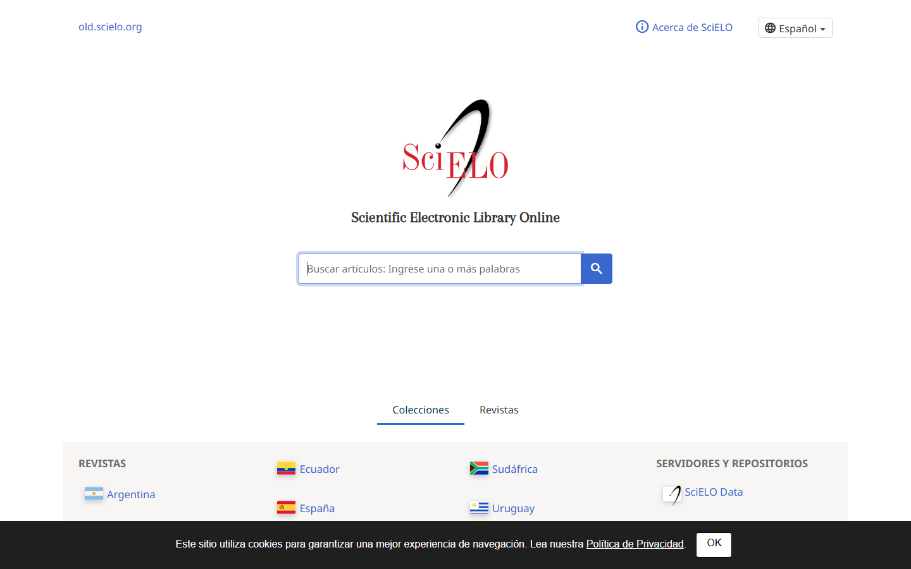
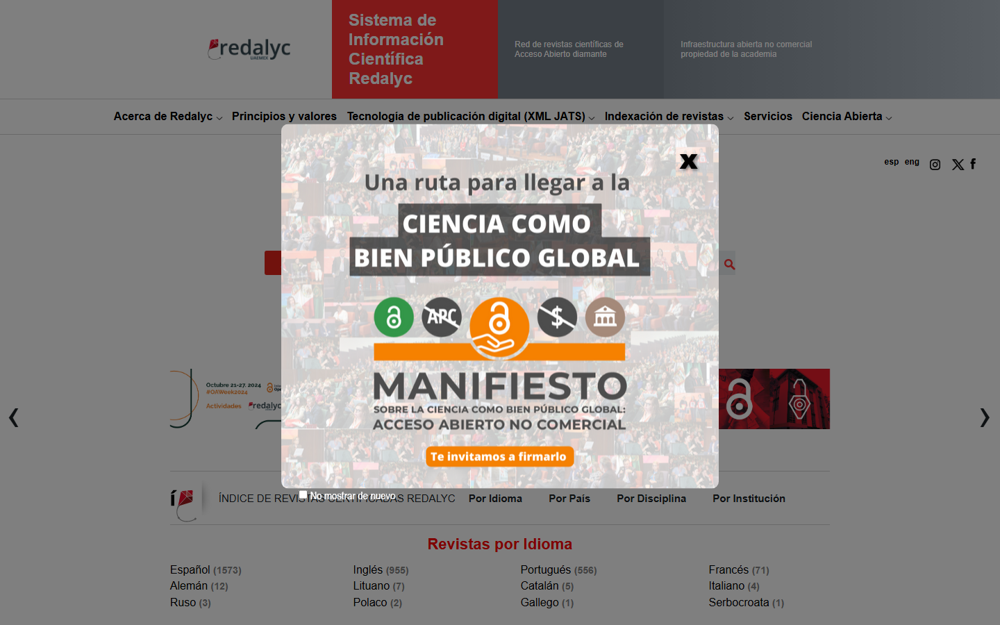

### GUIÓN DOCENTE — Sesión 06: Bases de datos CUN · gestores · marco teórico y revisión (U8+U10–12)

> **Uso:** guion de locución de **esta** clase. Léalo en voz alta casi literal.
> Estudie primero el Fundamento Teórico. **Duración: 60 minutos**.
> Logística de semestre → Presentación del Curso / Manual. **Sin fechas de periodo.**
> **PPTX:** `Clases/Sesion 06 - Bases de datos CUN · gestores · marco teórico y revisión (U8+U10–12)/Presentacion.pptx`

📌 **De esta sesión**
- **Sesión:** **06** · **Tema:** Bases de datos CUN · gestores · marco teórico y revisión (U8+U10–12)
- **Detalle:** COMBINACIÓN por periodo corto: U8 + U10–U12 en un solo encuentro. Scholar + biblioteca CUN + ZoteroBib (web) + avance de revisión en Google Docs.
- **PPTX estudiante:** `Clases/Sesion 06 - Bases de datos CUN · gestores · marco teórico y revisión (U8+U10–12)/Presentacion.pptx`
- **Meet (serie del curso):** [URL Meet — mismo enlace toda la serie · INVESTIGACIÓN, CIENCIA Y TECNOLOGÍA]

🗺️ **Slides de esta presentación** (tema de hoy — no es el mapa del curso)

| Slide | Título en el PPTX | Cuándo usarla |
| :---: | :--- | :--- |
| **1** | Portada — Sesión NN | Apertura |
| **2** | OBJETIVOS | Encuadre |
| **3** | CONTENIDO CLAVE | Exposición |
| **4** | ENFOQUE DE HOY | Anclaje |
| **5** | ACTIVIDAD / TALLER | Consigna |
| **6** | PARA CONTINUAR | Trabajo autónomo |
| **7** | Cierre | Despedida |

🎯 **Objetivos de la sesión**
1. **Buscar** en bases y buscadores académicos (Google Académico, SciELO, Redalyc, biblioteca CUN) con operadores.
2. **Generar** citas en **APA 7** con ZoteroBib (en la nube, sin instalar) y pegarlas en Google Docs.
3. **Avanzar** el marco teórico / revisión: fichas de lectura y una página que responda a la pregunta.

---

📚 **Fundamento Teórico para el Docente** *(estudiar ANTES de la clase)*

> Sesión combinada por periodo corto: reúne U8 (bases + gestores) y U10–U12 (posturas teóricas · marco · revisión). Es la sesión más "de laboratorio" del curso.

#### 1. Buscador ≠ base de datos (y cuándo usar cada uno)
- **Google Académico (Scholar):** buscador amplio; bueno para empezar y para el enlace "citado por".
- **SciELO y Redalyc:** bases de acceso abierto, fuertes en español/portugués y en Latinoamérica.
- **Biblioteca CUN (web, con login institucional):** acceso a bases suscritas; úsela para el texto completo.

Estrategia: empezar amplio en Scholar → afinar en SciELO/Redalyc → descargar el texto completo desde la biblioteca CUN.

#### 2. Operadores de búsqueda que ahorran horas
| Recurso | Para qué | Tip |
| :--- | :--- | :--- |
| Google Académico | Arranque amplio + "citado por" | Comillas "…" para la frase exacta |
| SciELO | Fuentes en español/portugués | Filtre por área y país |
| Redalyc | Revistas iberoamericanas abiertas | Contraste con lo hallado en Scholar |
| Biblioteca CUN (web) | Texto completo de bases suscritas | Requiere login institucional |
| ZoteroBib (zbib.org) | Generar APA 7 sin instalar | Pegue DOI → Copy → Docs |

Además: **AND/OR** para combinar o ampliar, y filtro por **año** (últimos 5 cuando el tema es tecnológico).

#### 3. Gestor de citas ligero: ZoteroBib (zbib.org)
ZoteroBib genera **APA 7** desde un DOI, ISBN o URL, **sin instalar nada** ni crear cuenta. Es la opción gratis-nube del curso: nada de Mendeley de escritorio ni plugins de Word.

#### 4. El marco teórico responde a la pregunta (no decora)
Un marco **no** es un collage de definiciones. Se organiza por **constructos** (los conceptos clave de su pregunta) y cada fuente entra porque **ayuda a responder**. Herramienta: la **ficha de lectura** = dato bibliográfico + idea principal + cita textual + cómo se relaciona con mi pregunta.

#### Ejemplo modelo para clase
Flujo en pantalla: Scholar → ZoteroBib → pegar la referencia APA 7 en Google Docs, ubicándola bajo su constructo.

#### Errores frecuentes
| Error frecuente / pregunta trampa | Qué responde el docente |
| :--- | :--- |
| “El marco es copiar y pegar definiciones.” | No: se organiza por constructos y cada cita debe ayudar a responder la pregunta. |
| “Cito sin haber leído.” | Se nota y es riesgo de plagio. Haga la ficha de lectura de cada fuente antes de citar. |
| “Uso Wikipedia y blogs como marco.” | Orientan; el marco se sostiene en fuentes académicas: Scholar, SciELO, Redalyc, biblioteca CUN. |
| “Instalo Mendeley/Zotero de escritorio.” | No hace falta: ZoteroBib en el navegador genera el APA 7 gratis. |

---

🧭 **Plan de Clase por Fases** — *Total: 60 min*

| Fase | Minutos | Reloj sugerido (desde el inicio) |
| :--- | :---: | :--- |
| 1️⃣ Encuadre | 6 | min 00:00 – 06:00 |
| 2️⃣ Bases y gestores | 14 | min 06:00 – 20:00 |
| 3️⃣ Criterios de selección de fuentes | 10 | min 20:00 – 30:00 |
| 4️⃣ Taller de búsqueda + fichas | 22 | min 30:00 – 52:00 |
| 5️⃣ Cierre del ciclo | 8 | min 52:00 – 60:00 |

> **Suma:** **60 minutos** exactos.

---

#### 1️⃣ Encuadre (~6 min) — Slides 1–2
**Protagonista:** Docente.

**GUION LITERAL:**
> “Sesión 06, y es la más 'de laboratorio' del curso. Como estamos en periodo corto, combinamos tres unidades del Syllabus: bases de datos, gestores de citas y marco teórico. Todo con herramientas **gratis y en la nube** —nada de instalar programas—.”

> “**Slide 2 — OBJETIVOS.** Vamos a buscar bien, a citar en APA 7 con ZoteroBib y a avanzar una página de marco que responda a su pregunta. Tengan abierto su planteamiento de la Sesión 05: el marco es su continuación, no un tema nuevo.”

#### 2️⃣ Bases y gestores (~14 min) — Slides 3–4
**Protagonista:** Docente (demo en pantalla).

**En pantalla:** Google Académico, SciELO, Redalyc, biblioteca CUN (login) y ZoteroBib.

**GUION LITERAL:**
> “**Slide 3 — CONTENIDO CLAVE.** Primero: no todo es Google normal. **Scholar** es un buscador amplio, ideal para arrancar y para el enlace 'citado por'. **SciELO** y **Redalyc** son bases de acceso abierto fuertes en español y en Latinoamérica. Y la **biblioteca CUN**, con su login institucional, les da el texto completo de bases suscritas.”

> “Operadores que ahorran horas: comillas para la frase exacta, AND/OR para combinar, filtro por año —en tecnología, últimos cinco—. Miren: busco 'pérdida de paquetes' AND laboratorio, filtro 2020 en adelante, y ya tengo resultados usables.”

> “**Slide 4 — ENFOQUE DE HOY.** Para citar no instalamos nada: **ZoteroBib**, en zbib.org. Pego un DOI o un título, me arma el APA 7 y lo copio a Google Docs. Cero Mendeley de escritorio, cero plugins.”

#### 3️⃣ Criterios de selección de fuentes (~10 min) — Modelación en pantalla
**Protagonista:** Docente (modela una ficha de lectura).

**En pantalla (Google Docs):** plantilla de ficha de lectura.

**GUION LITERAL:**
> “El marco no es un collage de definiciones. Se organiza por **constructos**: los conceptos clave de su pregunta. Si mi pregunta habla de 'pérdida de paquetes' y 'prácticas de laboratorio', esos son mis dos constructos, y busco fuentes para cada uno.”

> “Modelo una **ficha de lectura**: dato bibliográfico en APA, idea principal en una frase, una cita textual con página y —lo más importante— **cómo se relaciona con mi pregunta**. Una fuente que no ayuda a responder, no entra. Así el marco queda al servicio de la pregunta, no de relleno.”

> **En pantalla:** Home de Scholar; explicar comillas, AND/OR y el enlace 'citado por'.

> **En pantalla:** Pegar DOI/título → APA 7 → Copy to clipboard → Google Docs. Sin instalar nada.

> **En pantalla:** Búsqueda en español/portugués; abrir 1 artículo de acceso abierto.

#### 4️⃣ Taller de búsqueda + fichas (~22 min) — Slide 5
**Protagonista:** Estudiantes (taller) · Docente acompaña.

**GUION LITERAL (consigna):**
> “**Slide 5 — TALLER.** ~22 minutos. En `S06_MarcoRevision_Apellido`: (1) busquen en Scholar y en SciELO o Redalyc y elijan **5 fuentes** pertinentes; (2) hagan una **ficha de lectura** por fuente; (3) generen las 5 citas en APA 7 con ZoteroBib; (4) escriban una página de marco organizada por sus **constructos**, citando esas fuentes.”

> “Criterio de éxito: cada fuente responde a un constructo de su pregunta, las citas están en APA 7 y el marco no es un collage: se lee como argumento.”

**Acompañamiento:**
| Si el estudiante… | Usted responde… |
| :--- | :--- |
| Solo usa Google normal | “Vaya a Scholar/SciELO/Redalyc; la biblioteca CUN da el texto completo.” |
| Cita sin leer | “Haga la ficha: idea principal + cómo se relaciona con su pregunta.” |
| Copia definiciones sueltas | “Agrúpelas por constructo: ¿esto responde a qué parte de su pregunta?” |
| Quiere instalar Mendeley | “No hace falta: ZoteroBib en el navegador genera el APA 7.” |

> **En pantalla:** Segunda base abierta; contrastar con lo hallado en Scholar.

> **En pantalla:** Pegar 5 referencias APA 7 y redactar la página de marco agrupada por constructos.

#### 5️⃣ Cierre del ciclo (~8 min) — Slides 6–7
**Protagonista:** Docente.

**GUION LITERAL:**
> “Cierre del ciclo. Tres ideas: (1) busquen amplio en Scholar y afinen en SciELO, Redalyc y biblioteca CUN; (2) citen en APA 7 con ZoteroBib, sin instalar nada; (3) el marco responde a la pregunta, organizado por constructos.”

> “**Slide 6 — PARA CONTINUAR.** Suban `S06_MarcoRevision_Apellido` a CDigital con sus 5 fichas y la página de marco. Con esto tienen el esqueleto del artículo: tema, línea, problema, pregunta, planteamiento y marco. Revisen en CDigital el detalle de la evaluación del corte final.”

> “**Slide 7 — Cierre.** Gracias por el trabajo de este periodo; mismo Meet si queda encuentro de cierre.”

---

🧩 **Entregable de hoy**
1. En Google Docs (`S06_MarcoRevision_Apellido`): 5 fuentes de Scholar/SciELO/Redalyc + 1 ficha de lectura por fuente + 5 citas APA 7 con ZoteroBib + 1 página de marco organizada por constructos.
2. Archivo en CDigital: `S06_MarcoRevision_Apellido` en CDigital.
3. Herramientas: gratis + nube (Docs, Scholar, ZoteroBib, Excalidraw, Padlet según aplique).
4. Pantallazos de apoyo en `Guiones/Capturas/` (y subcarpetas `Sesion NN/` / `Herramientas/`).

✅ **Checklist del docente antes de clase**
- [ ] Fundamento teórico leído
- [ ] PPTX `Clases/Sesion 06 - Bases de datos CUN · gestores · marco teórico y revisión (U8+U10–12)/Presentacion.pptx`
- [ ] Pantallazos de esta sesión abiertos (carpeta `Guiones/Capturas/`)
- [ ] Ejemplo modelo listo para compartir pantalla
- [ ] Espacio de entrega en CDigital
- [ ] Meet: [URL Meet — mismo enlace toda la serie · INVESTIGACIÓN, CIENCIA Y TECNOLOGÍA]

---
*Fin del Guión — Sesión 06. Autocontenido para dictar 60 minutos.*
