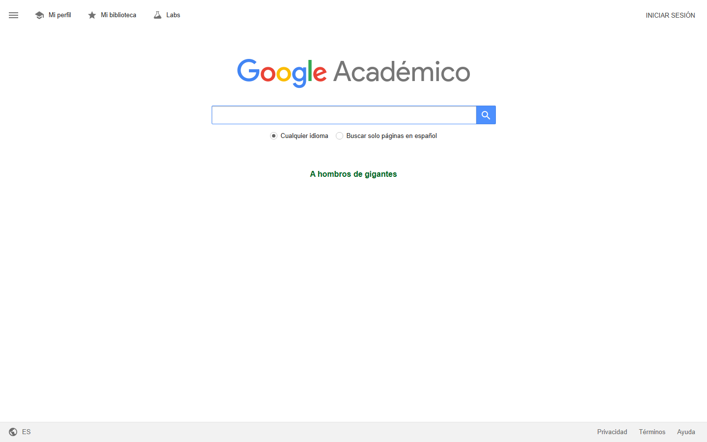

### GUIÓN DOCENTE — Sesión 04: Antecedentes y referentes (Fase I)

> **Uso:** guion de locución de **esta** clase. Léalo en voz alta casi literal.
> Estudie primero el Fundamento Teórico. **Duración: 60 minutos**.
> Logística de semestre → Presentación del Curso / Manual. **Sin fechas de periodo.**
> **PPTX:** `Clases/Sesion 04 - Antecedentes y referentes (Fase I)/Presentacion.pptx`

📌 **De esta sesión**
- **Sesión:** **04** · **Tema:** Antecedentes y referentes (Fase I)
- **Detalle:** Búsqueda en bases CUN.
- **PPTX estudiante:** `Clases/Sesion 04 - Antecedentes y referentes (Fase I)/Presentacion.pptx`
- **Meet (serie del curso):** [URL Meet — mismo enlace toda la serie · TRABAJO DE GRADO 2]

🗺️ **Slides de esta presentación** (tema de hoy — no es el mapa del curso)

| Slide | Título en el PPTX | Cuándo usarla |
| :---: | :--- | :--- |
| **1** | Portada — Sesión NN | Apertura |
| **2** | OBJETIVOS | Encuadre |
| **3** | CONTENIDO CLAVE | Exposición |
| **4** | ENFOQUE DE HOY | Anclaje |
| **5** | ACTIVIDAD / TALLER | Consigna |
| **6** | PARA CONTINUAR | Trabajo autónomo |
| **7** | Cierre | Despedida |

🎯 **Objetivos de la sesión**
1. **Lograr:** Construir antecedentes y referentes (Fase I).
2. **Producir** un avance observable en CDigital.
3. **Salir** con tarea autónoma clara.

---

📚 **Fundamento Teórico para el Docente** *(estudiar ANTES de la clase)*

> Sesión muy de "escritura académica". Aquí conviene apoyarse en la guía transversal `Guiones/Guía práctica - Herramientas de escritura y citación.md`, que trae el flujo Scholar → ZoteroBib → Docs paso a paso; no lo repita entero, remita a ella.

#### 1. Antecedentes ≠ marco teórico
Los **antecedentes** son estudios previos que ya abordaron un problema parecido al suyo: qué hicieron, cómo y qué encontraron. No son definiciones (eso es marco conceptual) ni teoría de fondo (marco teórico): son **precedentes**. Sirven para mostrar que su problema es real y para no repetir lo ya hecho.

#### 2. La ficha de antecedente
Cada antecedente se resume en una **ficha**: dato bibliográfico en APA, objetivo del estudio, método, hallazgo principal y —lo más importante— **qué aporta a mi proyecto**. Sin esa última línea, la ficha es decorativa.

| Campo de la ficha | Pregunta que responde |
| :--- | :--- |
| Referencia APA 7 | ¿De dónde es? |
| Objetivo del estudio | ¿Qué buscaban? |
| Método | ¿Cómo lo hicieron? |
| Hallazgo principal | ¿Qué encontraron? |
| Aporte a mi proyecto | ¿Para qué me sirve a mí? |

#### 3. Mezcla nacional e internacional
Un buen bloque de antecedentes combina fuentes **nacionales/locales** (que muestran pertinencia en el contexto colombiano) e **internacionales** (que traen el estado del arte global). Buscar solo en español limita; buscar solo en inglés desconecta del contexto.

#### 4. El párrafo puente
Las fichas no se pegan crudas en el documento: se hilan con un **párrafo puente** que dice qué tienen en común, en qué difieren y qué vacío dejan —vacío que su proyecto viene a llenar—. Ese párrafo es lo que convierte una lista en argumento.

#### Ejemplo modelo para clase
Ficha con la línea ‘qué me aporta’ + párrafo puente: ‘coinciden en X, difieren en Y, ninguno abordó una mesa de ayuda local → ahí entra mi proyecto’.

#### Errores frecuentes
| Error frecuente / pregunta trampa | Qué responde el docente |
| :--- | :--- |
| “Pego el resumen del paper tal cual.” | Haga la ficha con SUS palabras y agregue la línea ‘qué aporta a mi proyecto’. |
| “Solo busco en español (o solo en inglés).” | Combine nacional e internacional: local da pertinencia, global da estado del arte. |
| “Antecedentes y marco teórico son lo mismo.” | No: antecedentes son estudios previos parecidos; el marco es la teoría de fondo. |
| “Cito 8 estudios sin conectarlos.” | Agréguelos con un párrafo puente: qué comparten, en qué difieren, qué vacío dejan. |

---

🧭 **Plan de Clase por Fases** — *Total: 60 min*

| Fase | Minutos | Reloj sugerido (desde el inicio) |
| :--- | :---: | :--- |
| 1️⃣ Encuadre | 6 | min 00:00 – 06:00 |
| 2️⃣ Exposición del concepto | 14 | min 06:00 – 20:00 |
| 3️⃣ Modelación en vivo | 12 | min 20:00 – 32:00 |
| 4️⃣ Taller aplicado al proyecto | 20 | min 32:00 – 52:00 |
| 5️⃣ Cierre + autónomo | 8 | min 52:00 – 60:00 |

> **Suma:** **60 minutos** exactos.

---

#### 1️⃣ Encuadre (~6 min) — Slides 1–2
**Protagonista:** Docente.

**GUION LITERAL:**
> “Sesión 04. Ya tenemos el envase; hoy empezamos a llenarlo con lo primero del marco: los **antecedentes**. Es decir, quién ya trabajó algo parecido a lo suyo y qué encontró.”

> “**Slide 2 — OBJETIVOS.** Salir con al menos cuatro fichas de antecedentes bien hechas y un párrafo que las hile. Para el flujo de búsqueda y citación nos apoyamos en la **guía práctica de herramientas** que está en la carpeta Guiones; no repito todo el paso a paso de ZoteroBib, lo tienen ahí.”

#### 2️⃣ Exposición del concepto (~14 min) — Slides 3–4
**Protagonista:** Docente (exposición).

**GUION LITERAL:**
> “**Slide 3 — CONTENIDO CLAVE.** Cuidado con una confusión clásica: **antecedentes no es marco teórico**. Los antecedentes son **estudios previos** parecidos al suyo —qué hicieron, cómo y qué hallaron—. La teoría de fondo y las definiciones vienen después. Sirven para dos cosas: mostrar que su problema es real y no reinventar lo ya hecho.”

> “Cada antecedente se guarda en una **ficha**: referencia APA, objetivo, método, hallazgo y —la línea que nunca puede faltar— **qué aporta a mi proyecto**. Si esa línea no está, la ficha es adorno.”

> “**Slide 4 — ENFOQUE DE HOY.** Y busquen mezclando: algo **nacional o local**, que muestre pertinencia en Colombia, y algo **internacional**, que traiga el estado del arte. Usen Google Académico y las bases de la biblioteca CUN con su login. El flujo de citas en APA 7 lo tienen en la guía de herramientas.”

#### 3️⃣ Modelación en vivo (~12 min) — Modelación en pantalla
**Protagonista:** Docente (modela en pantalla).

**En pantalla (Google Académico + Google Docs):** una búsqueda y una ficha llenándose.

**GUION LITERAL:**
> “Modelo la búsqueda. En Google Académico escribo tres palabras de mi pregunta —‘clasificación tickets soporte’— con comillas en la frase exacta y filtro los últimos cinco años. Abro un resultado que se parezca a mi caso. No leo entero: leo el resumen y las conclusiones para ver si sirve.”

> “Ahora lleno la **ficha** en Google Docs: referencia (la genero en ZoteroBib como dice la guía), objetivo del estudio, método, hallazgo y la línea de oro: ‘me aporta el modelo de medición de tiempos que puedo adaptar’. Repito con una fuente internacional y una local. Y al final escribo el **párrafo puente**: ‘estos estudios coinciden en X, difieren en Y, y ninguno abordó una mesa de ayuda local —ahí entra mi proyecto—’.”

> **En pantalla:** Búsqueda con 3–5 palabras de la pregunta; comillas para la frase exacta; guardar 4 títulos (≥1 nacional, ≥1 internacional).

#### 4️⃣ Taller aplicado al proyecto (~20 min) — Slide 5
**Protagonista:** Estudiantes (taller) · Docente acompaña.

**GUION LITERAL (consigna):**
> “**Slide 5 — TALLER.** ~20 minutos. En `S04_Antecedentes_Apellido`: (1) busquen y elijan **4 antecedentes** —al menos uno nacional y uno internacional—; (2) hagan una **ficha** por cada uno con los cinco campos, sin copiar el resumen; (3) generen las referencias en APA 7 con ZoteroBib (guía de herramientas); (4) escriban un **párrafo puente** que las hile y muestre el vacío.”

> “Criterio de éxito: cada ficha tiene su línea de ‘qué me aporta’, y el párrafo puente convierte la lista en argumento.”

**Acompañamiento:**
| Si el estudiante… | Usted responde… |
| :--- | :--- |
| Copia el abstract literal | “Resúmalo con sus palabras y agregue ‘qué me aporta’.” |
| Solo halla fuentes en español | “Busque en inglés con términos técnicos; luego lo integramos.” |
| Confunde antecedente con teoría | “¿Es un estudio previo parecido? Entonces es antecedente.” |
| Deja las fichas sueltas | “Escriba el párrafo puente: común, diferencia, vacío.” |

> **En pantalla:** Convertir a APA 7 y pegar en Docs. Paso a paso: guía transversal de herramientas.

#### 5️⃣ Cierre + autónomo (~8 min) — Slides 6–7
**Protagonista:** Docente.

**GUION LITERAL:**
> “Cierre. Tres ideas: (1) antecedentes son estudios previos, no teoría de fondo; (2) cada ficha lleva ‘qué me aporta’; (3) el párrafo puente hila las fichas y muestra el vacío que su proyecto llena.”

> “**Slide 6 — PARA CONTINUAR.** Suban `S04_Antecedentes_Apellido` con las 4 fichas y el párrafo puente. La próxima sesión pasamos de los estudios previos a la **teoría de fondo**: el marco teórico organizado por constructos.”

> “**Slide 7 — Cierre.** Gracias; mismo Meet.”

---

🧩 **Entregable de hoy**
1. En Google Docs (`S04_Antecedentes_Apellido`): 4 fichas de antecedentes (≥1 nacional, ≥1 internacional) con los 5 campos + referencias APA 7 con ZoteroBib + párrafo puente. Flujo de citación: guía transversal de herramientas.
2. Archivo en CDigital: `S04_Antecedentes_Apellido` en CDigital.
3. Herramientas: gratis + nube (Docs, Scholar, ZoteroBib, Excalidraw, Padlet según aplique).
4. Pantallazos de apoyo en `Guiones/Capturas/` (y subcarpetas `Sesion NN/` / `Herramientas/`).

✅ **Checklist del docente antes de clase**
- [ ] Fundamento teórico leído
- [ ] PPTX `Clases/Sesion 04 - Antecedentes y referentes (Fase I)/Presentacion.pptx`
- [ ] Pantallazos de esta sesión abiertos (carpeta `Guiones/Capturas/`)
- [ ] Ejemplo modelo listo para compartir pantalla
- [ ] Espacio de entrega en CDigital
- [ ] Meet: [URL Meet — mismo enlace toda la serie · TRABAJO DE GRADO 2]

---
*Fin del Guión — Sesión 04. Autocontenido para dictar 60 minutos.*
