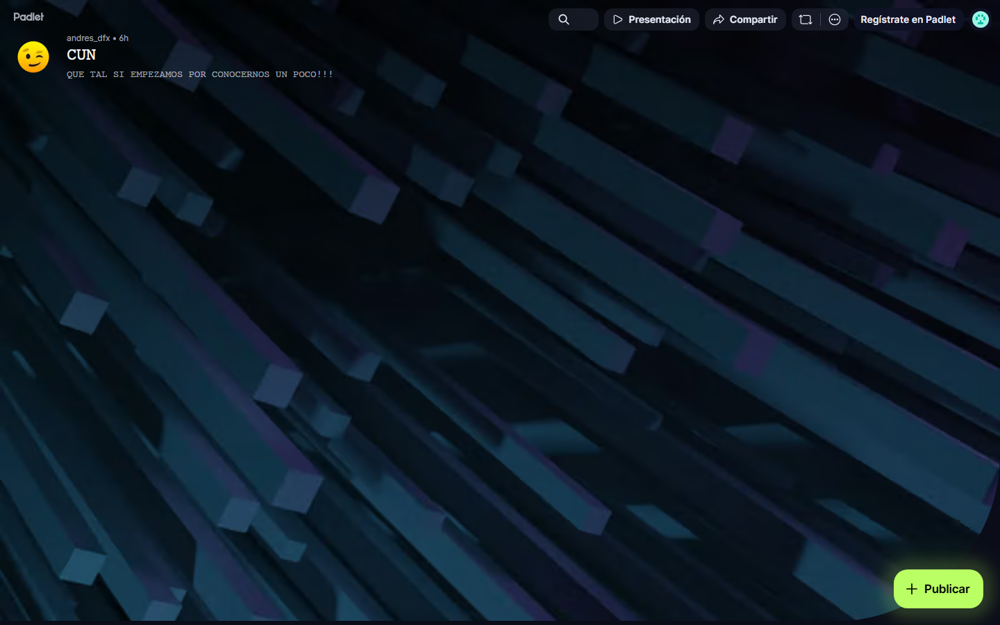

### GUIÓN DOCENTE — Sesión 15: Cierre administrativo · recepción (hasta 22 nov)

> **Uso:** guion de locución de **esta** clase. Léalo en voz alta casi literal.
> Estudie primero el Fundamento Teórico. **Duración: 60 minutos**.
> Logística de semestre → Presentación del Curso / Manual. **Sin fechas de periodo.**
> **PPTX:** `Clases/Sesion 15 - Cierre administrativo · recepción (hasta 22 nov)/Presentacion.pptx`

📌 **De esta sesión**
- **Sesión:** **15** · **Tema:** Cierre administrativo · recepción (hasta 22 nov)
- **Detalle:** Solo grupos 54466/54467 (26V04, cierre 22/11). El 54450 NO tiene esta fecha.
- **PPTX estudiante:** `Clases/Sesion 15 - Cierre administrativo · recepción (hasta 22 nov)/Presentacion.pptx`
- **Meet (serie del curso):** [URL Meet — mismo enlace toda la serie · TRABAJO DE GRADO 3]

🗺️ **Slides de esta presentación** (deck real: **24 slides** — no es el mapa del curso)

| Slide | Título en el PPTX |
| :---: | :--- |
| **1** | SESIÓN 15 — Cierre administrativo · recepción (hasta 22 nov) |
| **2** | Un trabajo excelente que no se cargó, no cuenta |
| **3** | Cierre administrativo ≠ cierre académico |
| **4** | Subir ≠ recibido: los cuatro puntos donde falla una entrega |
| **5** | Subir ≠ recibido: los cuatro puntos donde falla una entrega (cont.) |
| **6** | Checklist de recepción: entregable por entregable |
| **7** | Recepción y cierre: dos palabras que se confunden |
| **8** | Paso a paso de la verificación en CDigital |
| **9** | Paso a paso de la verificación en CDigital (cont.) |
| **10** | Ejemplo modelado: un recorrido de verificación real |
| **11** | Ejemplo modelado: un recorrido de verificación real (cont.) |
| **12** | La evidencia de envío: su respaldo cuando algo se discute |
| **13** | La evidencia de envío: su respaldo cuando algo se discute (cont.) |
| **14** | Errores frecuentes del cierre administrativo |
| **15** | Errores frecuentes del cierre administrativo (cont.) |
| **16** | Errores frecuentes del cierre administrativo (cont.) |
| **17** | TALLER — Verificación de recepción (20 minutos) |
| **18** | TALLER — Verificación de recepción (20 minutos) (cont.) |
| **19** | Checklist final de autoevaluación |
| **20** | Checklist final de autoevaluación (cont.) |
| **21** | Lo que queda cuando esto cierra |
| **22** | Lo que queda cuando esto cierra (cont.) |
| **23** | Cierre del curso |
| **24** | Cierre — Sesión 15 |

> Los **momentos** del plan de clase (Portada, OBJETIVOS, CONTENIDO CLAVE, TALLER, PARA CONTINUAR, Cierre) son los del guion, no números de slide: el deck real tiene más slides y su orden está en la tabla de arriba.

🎯 **Objetivos de la sesión**
1. **Desarrollar:** Cierre administrativo · recepción.
2. **Dejar** evidencia en CDigital.
3. **Preparar** el siguiente hito del artículo/sustentación.

---

📚 **Fundamento Teórico para el Docente** *(estudiar ANTES de la clase)*

> Sesión buffer de cierre. Solo aplica a los grupos que la tienen en calendario (26V04). Léalo completo. (Sin fechas de periodo en el guion; consulte la Presentación del Curso / Manual para plazos por grupo.)

#### 1. Cierre administrativo ≠ cierre académico
El trabajo académico ya terminó (artículo, sustentación, ajustes). El **cierre administrativo** es asegurarse de que **todo quedó cargado y fue recibido** en CDigital. Un excelente trabajo que no se cargó, o que se cargó mal, no cuenta. Esta sesión es la red de seguridad final.

#### 2. Subir ≠ recibido
El error silencioso: creer que "lo subí" equivale a "lo recibieron". Hay que **verificar la recepción**: que el archivo esté en el espacio correcto, con el nombre correcto, y —si el campus lo permite— guardar **evidencia de envío** (captura del estado "entregado").

| Entregable | ¿Cargado? | ¿Recibido/confirmado? | Evidencia |
| :--- | :---: | :---: | :--- |
| Artículo final (PDF) | | | Captura de envío |
| Póster | | | Captura |
| Anexos / evidencias | | | Captura |
| Autorización repositorio | | | Formato firmado |
| Constancia antiplagio | | | Según ruta CDigital |

#### 3. Diferencia recepción vs. cierre (por grupo)
"Recepción" (última fecha para recibir trabajos) y "cierre" (fin del periodo) **no son lo mismo** y varían por grupo. El guion **no lleva fechas**: remita siempre a la Presentación del Curso / Manual del Docente y al calendario del grupo, porque un grupo no tiene siquiera esta sesión y otros cierran en fechas distintas.

#### 4. Checklist de recepción como último filtro
El objetivo de hoy es que nadie pierda la nota por un tema logístico: recorrer el checklist, confirmar cada carga y guardar evidencia. Cerrar bien es parte de ser profesional.

#### Ejemplo modelo para clase
En pantalla, recorrer el checklist de recepción confirmando cada entregable en CDigital y capturando (si el campus lo permite) el estado 'entregado' como evidencia de envío.

#### Errores frecuentes
| Error frecuente / pregunta trampa | Qué responde el docente |
| :--- | :--- |
| “Ya lo subí, entonces ya está recibido.” | Subir no es recibido: verifique que esté en el espacio correcto y guarde evidencia de envío. |
| “Recepción y cierre son la misma fecha.” | No: recepción es la última fecha para recibir; cierre es fin de periodo. Varían por grupo. |
| “No guardo captura de que entregué.” | Si el campus lo permite, capture el estado 'entregado'; es su respaldo ante cualquier duda. |
| “Dejo un entregable sin cargar, luego lo subo.” | Recorra el checklist hoy: un entregable faltante puede costar la nota. |

---

🧭 **Plan de Clase por Fases** — *Total: 60 min*

| Fase | Minutos | Reloj sugerido (desde el inicio) |
| :--- | :---: | :--- |
| 1️⃣ Encuadre | 6 | min 00:00 – 06:00 |
| 2️⃣ Exposición / criterios | 14 | min 06:00 – 20:00 |
| 3️⃣ Modelación | 12 | min 20:00 – 32:00 |
| 4️⃣ Taller | 20 | min 32:00 – 52:00 |
| 5️⃣ Cierre | 8 | min 52:00 – 60:00 |

> **Suma:** **60 minutos** exactos.

---

#### 1️⃣ Encuadre (~6 min) — Portada y objetivos
**Protagonista:** Docente.

**GUION LITERAL:**
> “Sesión 15, la última. El trabajo académico ya está hecho: artículo, sustentación, ajustes. Hoy hacemos el **cierre administrativo**, que suena aburrido pero es la red de seguridad: verificar que **todo** quedó cargado y recibido en CDigital.”

> “**OBJETIVOS.** Recorrer el checklist de recepción, confirmar cada carga y guardar evidencia de envío. Recuerden: un trabajo excelente que no se cargó, o que se cargó mal, no cuenta. Tengan CDigital abierto.”

#### 2️⃣ Exposición / criterios (~14 min) — Exposición del concepto
**Protagonista:** Docente (exposición).

**GUION LITERAL:**
> “**CONTENIDO CLAVE.** Cierre administrativo no es lo mismo que cierre académico. Lo académico terminó; lo de hoy es asegurar que todo quedó **entregado y recibido**. Y ojo con el error silencioso: **subir no es igual a recibido**. Hay que verificar que el archivo esté en el espacio correcto, con el nombre correcto, y —si el campus lo permite— guardar la captura del estado 'entregado'.”

> “**ENFOQUE DE HOY.** Dos palabras que se confunden: **recepción** —la última fecha para recibir trabajos— y **cierre** —el fin del periodo—. No son lo mismo y **cambian según el grupo**. Por eso no doy fechas aquí: cada quien consulta la Presentación del Curso, el Manual y el calendario de su grupo. Hoy nos concentramos en que nadie pierda la nota por un tema logístico.”

#### 3️⃣ Modelación (~12 min) — Modelación en pantalla
**Protagonista:** Docente (modela la verificación en CDigital).

**En pantalla (CDigital + Google Docs):** el espacio de entregas y un checklist de recepción.

**GUION LITERAL:**
> “Modelo la verificación. Entro a CDigital y recorro cada espacio de entrega: artículo final —lo veo cargado, con el nombre correcto—; póster —cargado—; anexos —falta uno—; autorización —firmada y subida—; informe de similitud —sólo si el curso lo exige, según confirmó el Docente—. Voy marcando en el checklist: cargado y recibido.”

> “Y donde el campus lo permite, capturo el estado 'entregado': esa captura es su respaldo si más adelante hay cualquier duda sobre si entregaron o no. Cerrar bien y con evidencia es parte de ser profesional.”

> **En pantalla:** Recorrer entregables cargados; capturar evidencia de envío si el campus lo permite.

#### 4️⃣ Taller (~20 min) — Taller
**Protagonista:** Estudiantes (taller) · Docente acompaña.

**GUION LITERAL (consigna):**
> “**TALLER.** ~20 minutos. En `S15_CierreAdmin_Apellido`: (1) recorran el **checklist de recepción** —artículo, póster, anexos, autorización, antiplagio— marcando cargado y recibido; (2) capturen la **evidencia de envío** de cada entregable si el campus lo permite; (3) anoten cualquier **pendiente administrativo** que deban resolver antes de la recepción de su grupo.”

> “Criterio de éxito: cada entregable está confirmado como recibido (no solo subido) y con su evidencia; y no queda ningún pendiente sin anotar.”

**Acompañamiento (mientras trabajan):**
| Si el estudiante… | Usted responde… |
| :--- | :--- |
| Cree que subir = recibido | “Verifique el espacio y el estado; guarde la captura.” |
| Pregunta la fecha de cierre | “Consulte su grupo en la Presentación del Curso / Manual; varía.” |
| Le falta un entregable | “Cárguelo ahora; no lo deje para después de la recepción.” |
| No guarda evidencia | “Capture el 'entregado' si el campus lo permite; es su respaldo.” |

> **En pantalla:** 1 post de cierre/aprendizaje si el grupo aún usa el tablero; no obligatorio.

#### 5️⃣ Cierre (~8 min) — Cierre y trabajo autónomo
**Protagonista:** Docente.

**GUION LITERAL:**
> “Cierre del curso. Tres ideas: (1) el cierre administrativo asegura que todo quedó **recibido**, no solo subido; (2) recepción y cierre no son lo mismo y varían por grupo —consulten su calendario—; (3) guarden evidencia de cada envío.”

> “**PARA CONTINUAR.** Suban `S15_CierreAdmin_Apellido` a CDigital con su checklist y sus evidencias, y resuelvan los pendientes antes de la recepción de su grupo. Con esto culmina su trabajo de grado.”

> “**Cierre.** Felicitaciones: cierran un proceso largo con un artículo publicado y una defensa hecha. Gracias por el trabajo de este periodo.”

---

🧩 **Entregable de hoy**
1. Checklist de recepción + confirmación de cargas.
2. Archivo en CDigital: `S15_CierreAdmin_Apellido`.
3. Herramientas: gratis + nube (Docs, Scholar, ZoteroBib, Excalidraw, Padlet según aplique).
4. Pantallazos de apoyo en `Guiones/Capturas/` (y subcarpetas `Sesion NN/` / `Herramientas/`).

✅ **Checklist del docente antes de clase**
- [ ] Fundamento teórico leído
- [ ] PPTX `Clases/Sesion 15 - Cierre administrativo · recepción (hasta 22 nov)/Presentacion.pptx`
- [ ] Pantallazos de esta sesión abiertos (carpeta `Guiones/Capturas/`)
- [ ] Ejemplo modelo listo para compartir pantalla
- [ ] Espacio de entrega en CDigital
- [ ] Meet: [URL Meet — mismo enlace toda la serie · TRABAJO DE GRADO 3]

---
*Fin del Guión — Sesión 15. Autocontenido para dictar 60 minutos.*
